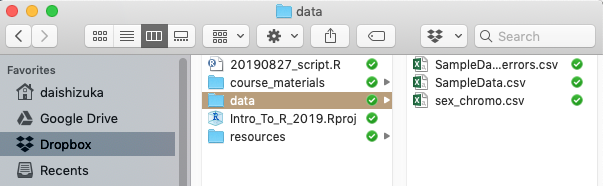

```{r setup, include=FALSE}
library(knitr)
#knitr::opts_chunk$set(out.width="3.5in")
```
##Overview
Most of you are looking to use R for data analysis, which of course requires learning how to import your data into R. This is maybe the big leap for people who are not used to programming.  

To import data into R, you will create an object that points to a dataset somewhere on your computer. R will then import that data as a **dataframe** object ([see Module 2](02.ObjectTypes.html)). 

***

##3.1 Importing Data: Overview

<br>

><span style="color:purple">**Do this before you start this section!**</span>
>
* Click on the following links to download three files: 
>(1) [SampleData.csv](data/SampleData.csv)
>(2) [SampleData_w_errors.csv](data/SampleData_w_errors.csv)
>(3) [sex_chromo.csv](data/sex_chromo.csv)
>* Save these files into a subfolder called "data" inside your working directory (i.e., the folder where you are keeping all of your course materials)
>

###3.1.1 File Formats: Use .csv (or .txt)

Many of us manage data by entering them into a spreadsheet using common software like Microsoft Excel. While we have all likely had headaches associated with Excel, it's undeniable that it is still the predominant way to compile our data.  

R can read several file formats, but the popular excel format (.xlsor .xlsx) is NOT one of them (unless you use a specialized package, e.g., `xlsx`). Instead, you will most often convert your excel sheet into one of two formats: ***tab-delimited files (saved as .txt)*** or ***comma-separated-values files (.csv)***. These are simple text files in which each entry is separated by a tab or comma (respectively). The huge advantage of these formats is that they are non-proprietary file formats that can be read by any text editor. One potential drawback is that you cannot keep any type of formatting (like highlighting of cells on a spread sheet) or special characters. 


If you use Excel or any other spreadsheet for data storage, you can easily convert those into one of these formats using `[Save as...]`  

***In this class, I will be using .csv files for almost all data importing tasks.***

***

##3.2 Five ways to import data from .csv (or .txt) files

No matter how you import the data, the final goal is the same: assign the imported data as an object. Here, we will assign the data into an object called `dat`. (tip: I would not use "data" as an object name because `data()` is a function name). Try out each of the following methods for importing a sample data set called "SampleData_1.csv".

***

###3.2.1. RStudio Project (recommended)

***RStudio Project*** is a convenient way to organize your projects. When you have your folder organized as a **project directory**, this creates a file called "<yourprojectname>.Rproj" in that folder. Then, if you open that file, it automatically sets that folder as the working directory. This makes the job of finding and importing data much easier than it would be otherwise (i.e., step 2).

Here is an image of how I might organize my course folder:
```{r, echo=FALSE, fig.align="center", out.width="75%"}

```

In this case, my data files are inside a subfolder called "data", so the pathname is `data/SampleData.csv`
Using this, I can read in the .csv file using a function called `read.csv()`, with the path name. ***Note that the path name needs to be inside quotes***.


```{r}
dat=read.csv("data/SampleData.csv")
```


One of the biggest benefits of this method is that the pathname is relative to the folder that the .Rproj file is in, which means that as long as the folder is organized in the same way, you can just transfer all the codes to someone else's computer and it will still work. In contrast, if you are using the full path name, you will always have to edit this for the computer that you are running the code on. This means that, if you simply share the entire folder including the .Rproj file, your collaborator can run your code seamlessly without having to alter the pathname or resetting the working directory.


***

###3.2.2. Entering the full path name
You can also use the full path name to import the data. This might be helpful if you are not using Rstudio Projects and/or saving your script in a folder separate from your data. 


***Finding the path to a file***
Here is how to get the path to the .csv file on your computer.

* ***For Windows***, you can get the path name of the file or folder by right-clicking it and click "Copy as Path"
* ***For Mac (or Windows)***, you can look for the file/folder in Finder, and then drag and drop the icon into the "Go to file/function" bar at the top of the RStudio window.  

As an example, say I made folder on my **desktop** called **Rcourse** and inside that folder, I made another folder called **Week_2**. If my data folder is inside that, this would be the path: `/Users/dshizuka/Desktop/Rcourse/Week_2/data`  
In turn, the path to a file inside that folder might be:  `/Users/dshizuka/Desktop/Rcourse/Week_2/data/SampleData.csv`

So in this case, your line of code to import the data would be:

```{r, eval=F}
dat=read.csv("/Users/dshizuka/Desktop/Rcourse/Week_2/data/SampleData.csv")
```

***Alternatively***, you can use `setwd()` to set your working directory, and then enter a simpler path name. This essentially breaks up the process into two lines:

```{r, eval=F}
setwd("/Users/dshizuka/Desktop/Rcourse/Week_2")
dat=read.csv("data/SampleData.csv")
```


***Remember: You will have to change the path inside the lines of code here to be where the file resides in your computer.***


><span style="color:purple">**Difference between options 1 and 2:**</span>
>
>Options 1 and 2 (using RStudio Project and Entering Full Path Name) are essentially the same thing in that you are telling R how to find the file on your computer that you want to import. It's just that RStudio Projects makes this much more straightforward and transferable because the pathname becomes relative to your working directory automatically.

***

###3.2.3. Use a url (recommended for data downloadable from the web)

Sometimes, you will be downloading a dataset that is accessible online, from a static website, a github page, a data repository (like Dryad or Figshare), or even a dropbox folder. In fact, if you can get a url of a data file, you can import it directly into R without having to first downloading it to your computer, saving it and then getting a path name. 

For example, if you right-click on the link up above to download the "SampleData.csv" file (under 3.1: Importing Data), you can "copy link address" and get this url:
`https://dshizuka.github.io/RCourse/data/SampleData.csv`

So, you can simply download that file using this url instead of the path name:

```{r}
dat=read.csv("https://dshizuka.github.io/RCourse/data/SampleData.csv")
```

Super useful! But **note:** only use this if you know that the url is going to be stable for a long time! If you need to be able to reproduce your analysis in the long term, it may pay off to download the data and save it on your computer and use Option 1. 

***

###3.2.4. Call 'choose file' prompt. 
You can also call a prompt that will let you choose the file. You can then find and choose the file you want to import. This is a convenient and quick way to import data. However, it is limiting because it takes time to click around to find the file, and more importantly, this step is not *reproducible*.
```{r, eval=FALSE}
dat=read.csv(file.choose())
```

***

###3.2.5. Using RStudio GUI
In RStudio, select `[File]`--`[Import Dataset]`--`[From CSV...]`
The first time you do this, you may be asked to install the `readr` package. 

**Note:** I actually do NOT recommend using this method for a variety of reasons (irreproducibility, takes time, saves the object as a special format).


***

><span style="color:purple">**Importing from .txt files:**</span>
>
>A more generic function is `read.table()`. This function allows you to read any kind of text file (including .csv files) while specifying the data is delimited. So, for example, you can use this function to import comma-separated files `dat=read.table(file.choose(), sep=",")`, or tab-delimited files `dat=read.table(file.choose(), sep="\t")`. So the `read.table()` function is more flexible in many ways.

***

##3.3 Working with imported data

<br>

###3.3.1 Looking at the data


Now that you have the data imported as an object called `dat`, let's look at it! You can do this simply by calling the object:

```{r}
dat
```

This data only has 13 rows, so it's manageable. But sometimes you have a much larger dataset, and you don't really want to see all of it, but you want to check that the correct data was imported. In that case, you can use a function called `head()` which will show you just the first 6 lines of an object. 

```{r}
head(dat)
```

Sometimes, you also want to double check that your data imported as the correct file type. To do this, you can use the function `class()` to look up the object class:
```{r}
class(dat)
```

Good. This is a data frame.

***

###3.3.2 Subsets and Subtotals

Many times, you will want to just look at subsets of the data: i.e., certain columns or rows that satisfy some condition.  
We already covered how to look at specific columns using either the `[]` or `$` operators. For example, let's try using the `$` operator to look at the sex of individuals in the sample data.

```{r, eval=T}
dat$sex
```
So this gives us just the column named "sex" as a character string

You can do the equivalent by using the `[]` operator.
```{r, eval=F}
dat[,2]
dat[,"sex"]
```

In contrast, there is no equivalent of the `$` for selecting rows. But we can specify the rows we want to look at using the first element within `[]`:
```{r, eval=F}
dat[2,] #get the second row of the dataset
```

If we want to look at all rows that fulfill some criteria, we can use the `==` operator. For example, let's look at all of the data for males:
```{r, eval=T}
dat[dat$sex=="male", ]
```
In this case, R interprets this command to pick out rows in the data where the answer to `dat$sex=="male"` is TRUE.  

You can use multiple criteria to subset the data. Use the `|` to mean "or" and the `&` operator to mean "and". For example:
```{r}
dat[dat$sex=="male"|dat$weight<60,] #give me the data for rows where sex is male OR weight is less than 60. This gives you all but two records. 
```
```{r}
dat[dat$sex=="male"&dat$weight<60,] #give me the data for rows where sex is male AND weight is less than 60. This gives you just one record of the male that is less than 60g. 
```

If you want to EXCLUDE data for certain rows, you can use the `!=` operator:
```{r}
dat[dat$sex!="male",] #this will give you the records for individuals that are NOT male (i.e., females)
```

####Using the `which()` function:

Another way to subset the data is to use the `which()` function, which is extremely useful. We will be using this function a lot as we go forward.  
Basically, `which()` allows you to get the element number of a vector that fits certain criteria. For example, these are the row numbers for males in the dataset:
```{r}
which(dat$sex=="male")
```
So you can use this command to subset the data in a similar way as above:
```{r}
dat[which(dat$sex=="male"), ] #don't forget the comma!
```


You can also look at a particular variable within a particular subset. Here are two ways to do the same thing--get the body size of males.
```{r}
dat[dat$sex=="male","size"]
dat$size[dat$sex=="male"]
```

***

###3.3.3 Summary data

Now that you know how to select variables and subset data you can, use this to calculate summary statistics. For example, let's look at the mean size of males vs. females using the function `mean()`

```{r}
mean(dat$size[dat$sex=="male"])
mean(dat$size[dat$sex=="female"])
```

A more elegant way to do this is to use either the `tapply()` or `aggregate()` functions.
For both of these functions, the first argument is the column to apply the calculation to, second argument is the categorical variable (in list format), and the third argument is the function name for the calculation you want to apply. Try these out for calculating the mean body size by sex:
```{r}
tapply(dat$size,dat$sex,mean)
```

```{r}
aggregate(dat$size,by=list(Sex=dat$sex),mean)
```

Note that the tapply() and aggregate() uses different formats as outputs—-`tapply()` returns an array, while `aggregate()` returns a dataframe.  
You can see this better when you calculate the means while splitting up the data by two different factors, like sex and age:
```{r}
tap=tapply(dat$size,list(dat$sex,dat$age),mean)
agg=aggregate(dat$size,by=list(Sex=dat$sex, Age=dat$age),mean)
class(tap)
class(agg)
tap
agg
```
You can see that the output of `tapply` is a matrix, and the output of `aggregate()` is a dataframe. So you can use one or other function depending on what you want to do with the output of the calculation you want to do. 

For example, you can use the same set of functions to calculate the sums of sizes for each sex x age combination:
```{r}
tapply(dat$size,list(dat$sex,dat$age),sum)
aggregate(dat$size,by=list(Sex=dat$sex, Age=dat$age),sum)
```

***

##3.4 Linking two data sets

There are a many instances in which you have two different datasets for the same subjects. For example, I might have one dataset from capturing and measuring a bunch of individual birds. At that point, I take a blood or tissue sample from each individual and I might later use loci linked to sex chromosomes to confirm sex the individual is (many birds are monomorphic and it can be difficult to tell the sexes apart). I now have two different spreadsheets containing different pieces of information about the same subjects, and I might want to combine this information. 
	You may have done something like this in the past using “lookup functions” in excel or database software (e.g., Microsoft Access, FileMaker, etc.). Now we will learn how to do this in R. 
	Let’s start by importing two different sets of data (one of them is the same as what we have been using so far). To get started, we will now import a second dataset called `sex_chromo.csv`, which should already be saved in your "data" subfolder.
	
```{r}
chromo=read.csv("data/sex_chromo.csv")
```

We now have two dataframes—dat and sex. This second dataframe has information of sex chromosomes that we have identified for each individual using molecular methods. 
	We now use a match() function to look up which rows correspond to the same individual:

```{r}
match(dat$Indiv.ID,chromo$Indiv.ID)
```
Here, the first value indicates which row in the dataframe chromo corresponds to the first row in dat? Remember that the order of the elements within the parentheses matter. You can confirm this by looking at both dataframes. 
	You can use this to lookup the sex chromosomes for each individual in the dataframe dat. 

```{r}
sex.chromo=chromo[match(dat$Indiv.ID,chromo$Indiv.ID),"chromosomes"]
sex.chromo
```

You can append this new vector, sex.chromo, to the dataframe dat using the function cbind():
```{r}
merged.dat=cbind(dat,sex.chromo)
merged.dat
```

Ok, now that I have shown you the hard way to do this, here is the easy way, using the function merge():
```{r}
merged.dat2=merge(dat,chromo,by="Indiv.ID")
merged.dat2
```
Note that you have to make sure that the variable names are identical in both dataframes for this to work! 


Lastly, try this code to see that (in this hypothetical dataset), the sex chromosomes match up with the gender scored in the field.
```{r}
table(merged.dat2$sex,merged.dat2$chromosomes)
```

***

