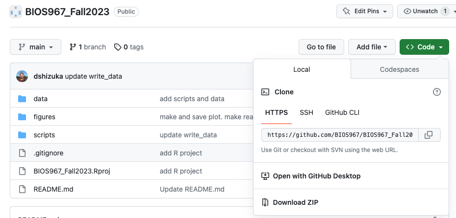
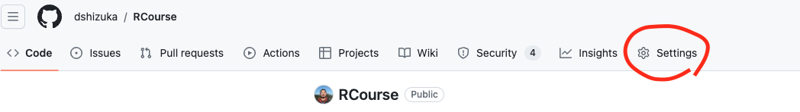
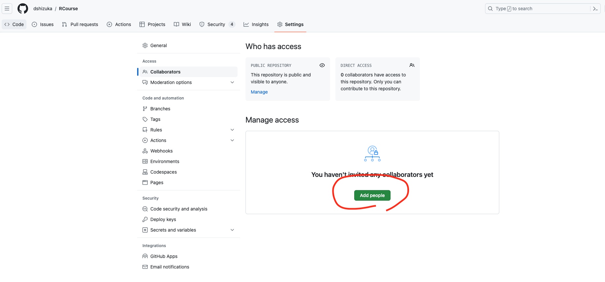

```{r setup, include=FALSE}
knitr::opts_chunk$set(echo = TRUE)
```

<br>

***Note: You can get a lot of this information from Hadley Wickham's "R for Data Science" book, Chapter 8: [here](https://r4ds.had.co.nz/workflow-projects.html), and the [https://happygitwithr.com/](https://happygitwithr.com/) tutorials.***

<br>

><span style="color:purple">**Do this before you start this section!**</span>
>
* Click on the following link to download this file:  [SampleData.csv](data/SampleData.csv)
* Save this file somewhere on your computer where you can find it. 
>


## 1. Navigating folders and files using absolute pathnames to read a file (but never do this again!)

As explained in the previous module, the Working Directory defines where R will look for files, or where it will save files that you generate. R uses pathnames to arrange these files (as do all programming languages). These are sometimes called "absolute paths". Once you understand how path names work, it can be really handy to be able to pull data in and out from wherever on your computer. However, this can quickly get cumbersome. Moreover, it makes it hard to port your scripts from one computer to another, since pathnames on different computers will end up being different. 

For example, if I were to create a new data file and save it as a .csv file on the desktop on my own computer (Mac), the path name might look like this:
`/Users/daishizuka/Desktop/data.csv`

But if I copy and paste the exact same file and save it on the desktop of one of my lab computers (Windows), the path name might look like this:
`C:\Users\ShizukaLab\Desktop\data.csv`

This means that if your code script references this dataset, you can't just run the same code to import data on different computers.

To demonstrate this, let's try importing the sample data file that you downloaded at the top of this page. 

* Find the file on your computer. 

* If you are on a Mac, Right-click (or Control-click) on the file to bring up a menu, then click "Option". This should give you a menu item that says "Copy 'sample.csv' as Pathname". Click on that. 

* If you are on Windows, Right-Click on the file and choose "Properties". In the Properties window, you will see the pathname under "Location". Copy the pathname.

* Now, run this code to read in the data file and look at it in R. Here, you are going to assign the data to an object called "dat". Note that inside the `read.csv()` function, the pathname has to be in quotes. You have to use the pathname for the file ON YOUR COMPUTER.

```{r}
#For my computer, it would be this. Remember to replace the pathname with how it appears on your computer.
dat=read.csv("/Users/daishizuka/Downloads/SampleData.csv")
```

Now let's look at the data, simply by running `dat`
```{r}
dat
```

Now, this might seem like a fine way to read your data file if you plan to do all of your analyses on your own computer, and you know where the file will always be on your computer. HOWEVER, this is a major hindrance to collaboration. Also, it is a major hindrance to me teaching this class, as I can't easily try out your code to help you troubleshoot. 

That's where RStudio Projects come in...

## 2. Using Rstudio Projects and organizing your files. {width=10%}

Rstudio projects facilitate a important "best practice" for developing code to facilitate your research, which is to make sure that ***for each project, create one folder that contains all of your data, scripts, outputs (e.g., plots) and other assets.*** 

Additionally, I highly recommend that this "project directory" folder includes a subfolder called "data" that contain all of the data files, and "figures" (or some other name) folder that will contain all of the output plots, etc. 

Setting up a project directory in this way allows you to keep everything organized and up to date, and it also helps with collaborations or sharing code, because it is easy to follow where things are. It is also nice for your "future self"--if you come back to a project after some time, it is easy to pick up where you left off without wondering where you left all of the relevant files. 

Finally, the more important reason to set up an Rstudio project folder is that it will allow anyone to run the code you are developing in this folder because you all of your pathnames will be "relative" to the parent directory. By using *relative path* names in your code, it becomes much more reproducible and enables collaboration. 

### 2.1. Setting up a new Rstudio project folder

Here is what I recommend for every project you start: 

1. Create a folder that will be your main "project folder".
  
*Try this out be creating a "trial" Folder somewhere in your computer.*

2. Next, in R Studio, click on "File" > "New Project" 

3. Click on "Existing Directory", click "Browse" and select the "trial" Folder you created, then click "Create Project"

4. Now, you will see that there is a new "trial.rproj" file in your folder.

5. Open that .rproj file. This will open up a new RStudio window. 

Now, whenever you create any file within this R Project, the files will automatically go into this folder. Also, if you want to import any files, you can just put in the file name instead of the whole path. 

Let's try this out:

* Go find the "SampleData.csv" file that you downloaded earlier and drop it into a subfolder called "data" in your "trial" project folder. 


* Now click on the "refresh" button  on the far right side of your "Files" window on the bottom-right part of your Rstudio window 

You should now see that there is a "data" folder in your project directory, and that "SampleData.csv" is in that folder. 

Now, you can use `read.csv()` again to read your file. But this time, you only need a *relative pathname*--that is, you only need to put in `"data/SampleData.csv"` to tell R to look for "SampleData.csv" inside the "data" folder, instead of the whole pathname on your computer.

Let's call this version of the data `dat2`
```{r}
dat2=read.csv("data/SampleData.csv")
```

```{r}
dat2
```

The beauty of this system is that, as long as the project directory structure is the same the computer, you can run this exact same code to import the data on any computer. In turn, that means that this entire project and code are portable in multiple ways. You could:

* send a collaborator your whole project directory, or

* copy the project directory on a thumbdrive, or

* sync the project directory on DropBox, OneDrive, or other cloud storage that syncs with multiple computers...

and you should be able to run the code as-is.

*However, the most elegant way to have your project run on multiple computers across multiple collaborators is to use a version control system, such as GitHub...*

<br>

## 3. Version control and collaboration using Git and GitHub {width=10%}

***Version control*** is a system by which you can keep track of changes to collaborative projects. One common example is Google Doc, which is an online document that multiple people can collaborate on. Importantly, Google Doc automatically saves versions of the document when changes are made, and users can revert back to earlier versions if they want. 

***Git*** is an open-source software that facilitates version control of files in *repositories* (which is another way of saying *project directory*).

***GitHub*** is a service that facilitates Git-based projects. There are other popular similar services, such as Bitbucket and GitLab 

<br>

### 3.1. Why are we using version control and GitHub

* For practical purposes, **this system will help me teach this class**. If we do this right, it will help tremendously with the process of troubleshooting your code when we get to independent projects! It will allow me to access your projects on my computer, help make edits, and keep track of those edits. 

* The larger reason is that **this will help you with your research**. You will no doubt be using R (and perhaps other coding languages) for your research, and this enables a workflow that is portable from one computer/collaborator to another. 

* It will expand the scope of your work. Once you make a project repository, you can make it private or public. If you make a public repository, then you can share it with colleagues. Likewise, you can *fork* any other public repository--this is increasingly the way people disseminate new software or packages for cutting-edge analysis techniques. 

* It could be a nice thing to add to your CV

<br>

### 3.2. Clone a GitHub repository and set it up to talk to Rstudio

*Here, we are following the directions on [Chapter 6-13 of the Happy git with R website, here](https://happygitwithr.com/)*

#### 3.2.1. Install Git

Here, I highly recommend following the directions on Chapter 6 of Happy Git with R: https://happygitwithr.com/install-git

To take from their directions: 

* If you are using Mac, download XCode from the App store or here: https://developer.apple.com/xcode/. This includes Git and also may come in handy later. 

* If you are using Windows, download [Git for Windows](https://gitforwindows.org/)

<br>

#### 3.2.2. Create a GitHub account

Go to [github.com](https://github.com/) and sign up for an account.

<br>

#### 3.2.3. Create a Personal Access Token on GitHub

When linking a GitHub repository with Rstudio, you will need to be able to authenticate your connection. To increase security, GitHub no longer supports access using a simple password. Instead, it requires you to authenticate using a personal access token. You need to generate a token, and then you will use this later to connect Rstudio with your repository. 

* Go to [https://github.com/settings/tokens](https://github.com/settings/tokens) and click “Generate token”. Your settings should include "repo", "user", "workflow", and I would set the expiration date to be at least the end of the semester (e.g., December 15th, 2023). **SAVE THIS TOKEN**. 

*(The longer way to go is to sign in to github, Click on your avatar on the top-right corner, then go to Settings > Developer settings (at the very bottom) > Personal access tokens > Tokens (classic))*

<br>

#### 3.2.4. Clone a repository

Go to the BIOS967 organization on GitHub: https://github.com/BIOS967

At the top of the page, click on "Repositories"

Click on "BIOS967_Fall2023" (for the Fall 2023 semester)

Now, click on the green button that says "<>Code"

Copy the clone URL to your clipboard. Use the HTTPS URL. 



In RStudio, start a new project:
File > New Project > Version Control > Git. In “Repository URL”, paste the URL of your new GitHub repository. 

Determine where your project will be saved locally. Be intentional. I have all of my GitHub repositories saved in my Documents folder in a subfolder called "GitHub". 

Check "Open in new session"

Click "Create Project".

**At some point in this process, you will be asked to authenticate. At that point, you will enter your GitHub account name, and then enter the Personal Access Token that you created in step 3.2.4.**

Congratulations! Now you have successfully cloned a GitHub repository on your computer.

This means that, whenever I make an update or create new files on this repository, you can download those changes by "pulling" this repository. 

Let's try that out. I'm going to make some change on the repository and upload ("commit" and "push") those changes up to GitHub. Then, I want you to "pull" those changes.

To pull changes from a GitHub repository, click on the "Git" tab on the top right window in Rstudio, and click the "Pull" button.

<br>

### 3.3. Working with GitHub: Pull, Stage, Commit, Push 

Once you have finished the set up process, you are ready to start your workflow!

First, notice that you should now have a tab called "Git" in the "Environment" window in RStudio (typically upper-right). If you click on that tab, it'll look like this:

{width=100%}

The Git workflow may feel a bit painful for you in the beginning because it seems a lot more manual and tedious than automated syncing that you may have gotten used to with Dropbox, Google Drive, etc. But really, it's no different than those systems--it's just that Git makes you much more intentional about when you update "local" vs. "remote" versions of your project files. 

Here are the 4 main actions that you will take whenever you work with your GitHub repository:

* **Pull:** When you open your project on your computer, I highly recommend that you always first click "Pull". This takes the version of your repository that is stored on GitHub remotely and pulls it to your local folder. Thus, you have synced your computer with whatever changes that other people (e.g., your instructor) has made on your repository. **Get used to pulling from your repository when you first open your project, even if you haven't made any changes since last time because I may have suggested changes for you!** 

* **Stage:** Whenever you make any changes on any files in your project directory, Git will "stage" those changes. This just means that the system recognizes that you've made those changes (e.g., add file, delete file, edit file) and it is ready for you to commit to those changes. 

* **Commit:** When you are done making a set of changes and you are ready to upload those changes to GitHub, you first need to **commit** those changes. When you do this, you will write a "commit message"--i.e., a brief description of the changes that you have made. Git will make you do this--it won't let you push those changes to GitHub unless you've written something. This will go in your change history, and it can be a nice way for you (and your collaborators) to understand what changes you have made. 

* **Push:** Once you have committed your changes, you are ready to **push** those changes onto your remote repository--i.e., the copy that is stored in GitHub. 

#### 3.3.1. Pull from the repository

First, click "Pull" in the Git window. This will pull any changes that are stored in the remote directory (i.e., on GitHub) that you don't already have on your local version.

{width=50%}

It will most likely say "You are already up to date". But again, get in the habit of doing this when you open your project. 

#### 3.3.2. Make some changes

Now you can make any change on your project. Let's just start by editing the readme file. 

On the bottom right window, click on the "Files" tab and select the readme.txt file. 

Add some text--e.g., "Here is the first change in my repository". 

Save the readme.txt file. 

Now go to the Git window (top right window). You should see the change reflected in the window. 

#### 3.3.3. Commit changes

Click on "Commit" in the Git window

A new window will pop out. Check all the boxes that represent each change you've made. 

Check the "Staged" box. Then, write a commit message. Something like, "add a line to readme file". 

Press "Commit". 

#### 3.3.4. Push changes to GitHub. 

Click "Push" to upload the changes to the remote repository on GitHub. 

<br>


### 3.5. Using a Git Client (as another option)

There are many Git clients out there. Personally, I just use [GitHub Desktop](https://desktop.github.com/) {width=10%}

Git Clients provide a graphical user interface (GUI) that facilitates the processes of committing, pushing, pulling and other tasks. It also allows you to see the history of changes to your repository.

To install GitHub Desktop, go to https://desktop.github.com/ and follow their directions.

<br>

#### 3.5.1. Opening your repository in GitHub Desktop 

Let's open a repository on GitHub Desktop. Here, we'll start by using a repository that you've already cloned onto your computer. Then, on the right-hand side, you will be able to push the commit(s) to GitHub. 

* Open GitHub Desktop and go to File > Add Local Repository. 

* When it asks for the local path, click Choose and find the folder for BIOS967_Fall2023 repository that you downloaded earlier (or equivalent for the semester you're in).


#### 3.5.2. Using a GitHub Desktop to Pull, Commit and Push.

Once the local repository is added, any changes you make to your local files that are not yet pushed to GitHub will appear on the right-hand side of the window, and a list of changes will appear on the left-hand side. You can choose all or some of the changes and write a commit message and commit. 

If you want to pull from GitHub, click "Fetch from Origin" on the top right-hand corner. If there are any changes to pull, then it will give you that option. 

If you try it, you might find that you like this interface better than pull-commit-pushing from within RStudio. You are free to do it this way. It's just that it will require to have both RStudio and GitHub Desktop apps open to update your codes. Ultimately, you should choose the way that makes the most sense to you.

<br>

## 4. Make a repository for your independent project on on GitHub and clone it to your computer.

* Log in to your GitHub account

* click on “Repositories” on the top ribbon

* Then click the big green “New repository” button

  * Repository name: `BIOS967_YourLastName` ***please follow this template for naming your repository--this allows me to easily find your repo on my end***
  
  * Preferably, select "Public". *But if you select "Private", you will then have to add me to the repository once you've created it!*
  
  * Initialize this repository with: Check Add a README file.

* Click on "Create Repository"

* Now, clone the repository on your computer following the directions in section 3.2.5 above. 

* Finally, add me as a collaborator on your project.

  * First, go to your repository and click on "Settings"



<br>

  * Then, click on "Collaborators" on the navigation panel on the left side


<br>

  * Click on "Add People" and add "dshizuka". 
  


<br>

Once you've created and cloned your repository, I suggest you make a "data" subfolder and "scripts" subfolder so that you can get organized with your files from the beginning!


