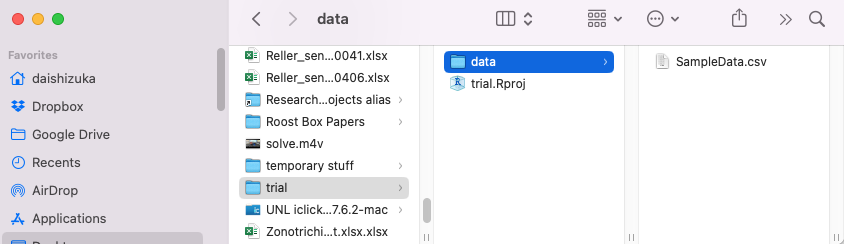

```{r setup, include=FALSE}
knitr::opts_chunk$set(echo = TRUE)
```

<br>

***Note: You can get a lot of this information from Hadley Wickham's "R for Data Science" book, Chapter 8: [here](https://r4ds.had.co.nz/workflow-projects.html).***
 
<br>

><span style="color:purple">**Do this before you start this section!**</span>
>
* Click on the following link to download this file:  [SampleData.csv](data/SampleData.csv)
* Save this file somewhere on your computer where you can find it. 
>

## 1. What we are talking about here and why. 

This module introduces the idea of organizing a workflow, which can involve importing data, generating (and saving) graphics, writing new data outputs, etc. Importantly, we want to do all of this **without relying on pull-down menus or clicking buttons**. Rather, we will do all of this by code. Why? Because code can be made to be reproducible--i.e., we can set up the code so that it works on any computer the same way. Thiw way, we can produce results that can be reproduced by anyone, every time, simply by running that code. On the other hand, button-clicks are not reproducible in the same way. Maybe you can re-create an entire routine of button-clicks by leaving yourself very detailed instructions... but leaving yourself reproducible code is much easier.

I admit that all of this will feel like it's overly cumbersome at the beginning. But trust me, this is going to pay off very quickly. After learning how to setup your workflow, you will be able to share code, results, and troubleshoot with collaborators (including your 'future self') much faster and reliably. Importantly for this class, it will also **help me help you better** in your independent project, because I will be able to run your code, reproduce your errors, and help you find fixes.

To do all of this, we need to be able to talk to the computer about **where to find files and where to put files**. This seems like a basic thing, but it is often the biggest first hurdle in learning computer programming. The computer can't think like you and intuit where the proper file might be, or where it should put it--it needs to be told explicitly.

#### Some terminology

* **directory:** Essentially, this is a folder on your computer. 

* **working directory:** This is the directory (folder) that computer treats as the default place to look for files, or to write (save) output files. 

* **pathname:** A string of directory and file names that specifies exactly where on your computer the particular file is located.

* **absolute path:** This is a string that specifies where a particular file is on your computer, starting from the root directory of your computer.

* **relative path:** This is a string that specifies where a particular file is *relative to your working directory* (i.e., instead of the root of your computer).

### 1.1 Intro to navigating your directories

You can figure out what your current working directory is using `getwd()`:

Say I was running this from my "Documents" folder, it would look like this:

```{r, eval=F}
getwd()
```


```{r, echo=F}
setwd("/Users/dshizuka2/Documents")
getwd()
```
You can get the whole list of folders and files that are in your working directory using `list.files()`:

```{r, eval=F}
list.files()
```

```{r, echo=F}
saved.wd=getwd()
setwd("/Users/dshizuka2/Documents")
list.files()
```


You can look inside a specific folder within your directory by specifying the file within the `list.files()` function. For example, to look in the "data" folder within my current working directory:

```{r, eval=F}
list.files("GitHub/")
```

```{r, echo=F}
setwd("/Users/dshizuka2/Documents")
list.files("GitHub/")
```

Notice that you are 


You can **go one level up** in your folder structure (aka the "parent directory") by using `..`

*I'm not going to share the results here because I don't really want to reveal the file structure of my personal computer on a public webpage...*

```{r, eval=F}
list.files("../")
```

***

#### Now, take a minute to try this out on your own computer. Start by running `list.files()`, and then see if you can navigate into and outside your folders. Develop a sense for how the computer navigates files and folders.

*** 


## 2. Navigating folders and files using **absolute pathnames** to read a file (but never do this again!)

As explained above, the Working Directory defines where R will look for files, or where it will save files that you generate. R uses pathnames to arrange these files (as do all programming languages). These are sometimes called "absolute paths". Once you understand how path names work, it can be really handy to be able to pull data in and out from wherever on your computer. However, this can quickly get cumbersome. Moreover, it makes it hard to port your scripts from one computer to another, since pathnames on different computers will end up being different. 

For example, if I were to create a new data file and save it as a .csv file on the desktop on my own computer (Mac), the path name might look like this:
`/Users/daishizuka/Desktop/data.csv`

or 

 `./Desktop/data.csv`
 
 
But if I copy and paste the exact same file and save it on the desktop of one of my lab computers (Windows), the path name might look like this:
`C:\Users\ShizukaLab\Desktop\data.csv`

This means that if your code script references this dataset, you can't just run the same code to import data on different computers.

To demonstrate this, let's try importing the sample data file that you downloaded at the top of this page. 

* Find the file on your computer. 

* If you are on a Mac, Right-click (or Control-click) on the file to bring up a menu, then click "Option". This should give you a menu item that says "Copy 'sample.csv' as Pathname". Click on that. 

* If you are on Windows, Right-Click on the file and choose "Properties". In the Properties window, you will see the pathname under "Location". Copy the pathname.

* Now, run this code to read in the data file and look at it in R. Here, you are going to assign the data to an object called "dat". Note that inside the `read.csv()` function, the pathname has to be in quotes. You have to use the pathname for the file ON YOUR COMPUTER.

```{r, eval=F}
#For my computer, it would be this. Remember to replace the pathname with how it appears on your computer.
dat=read.csv("/Users/daishizuka/Downloads/SampleData.csv")
```

```{r, echo=F}
dat=read.csv("data/SampleData.csv")
```

Now let's look at the data, simply by running `dat`
```{r}
dat
```

Now, this might seem like a fine way to read your data file if you plan to do all of your analyses on your own computer, and you know where the file will always be on your computer. HOWEVER, this is a major hindrance to collaboration. Also, it is a major hindrance to me teaching this class, as I can't easily try out your code to help you troubleshoot. 

That's where RStudio Projects come in...

## 3. Using Rstudio Projects and organizing your files. 


Rstudio projects facilitate a important "best practice" for developing code to facilitate your research, which is to make sure that ***for each project, create one folder that contains all of your data, scripts, outputs (e.g., plots) and other assets.*** 

Additionally, I highly recommend that this "project directory" folder includes a subfolder called "data" that contain all of the data files, and "figures" (or some other name) folder that will contain all of the output plots, etc. 

Setting up a project directory in this way allows you to keep everything organized and up to date, and it also helps with collaborations or sharing code, because it is easy to follow where things are. It is also nice for your "future self"--if you come back to a project after some time, it is easy to pick up where you left off without wondering where you left all of the relevant files. 

Finally, the more important reason to set up an Rstudio project folder is that it will allow anyone to run the code you are developing in this folder because you all of your pathnames will be "relative" to the parent directory. By using *relative path* names in your code, it becomes much more reproducible and enables collaboration. 

### 2.1. Setting up a new Rstudio project folder

Here is what I recommend for every project you start: 

1. Create a folder that will be your main "project folder".
  
*Try this out be creating a "trial" Folder somewhere in your computer.*

2. Next, in R Studio, click on "File" > "New Project" 

3. Click on "Existing Directory", click "Browse" and select the "trial" Folder you created, then click "Create Project"

4. Now, you will see that there is a new "trial.rproj" file in your folder.

5. Open that .rproj file. This will open up a new RStudio window. 

Now, whenever you create any file within this R Project, the files will automatically go into this folder. Also, if you want to import any files, you can just put in the file name instead of the whole path. 

Let's try this out:

* Go find the "SampleData.csv" file that you downloaded earlier and drop it into a subfolder called "data" in your "trial" project folder. 


* Now click on the "refresh" button  on the far right side of your "Files" window on the bottom-right part of your Rstudio window 

You should now see that there is a "data" folder in your project directory, and that "SampleData.csv" is in that folder. 

Now, you can use `read.csv()` again to read your file. But this time, you only need a *relative pathname*--that is, you only need to put in `"data/SampleData.csv"` to tell R to look for "SampleData.csv" inside the "data" folder, instead of the whole pathname on your computer.

Let's call this version of the data `dat2`
```{r, echo=T, eval=T}
dat2=read.csv("data/SampleData.csv")
```


```{r}
dat2
```

The beauty of this system is that, as long as the project directory structure is the same the computer, you can run this exact same code to import the data on any computer. In turn, that means that this entire project and code are portable in multiple ways. You could:

* send a collaborator your whole project directory, or

* copy the project directory on a thumbdrive, or

* sync the project directory on DropBox, OneDrive, or other cloud storage that syncs with multiple computers...

and you should be able to run the code as-is.

*However, the most elegant way to have your project run on multiple computers across multiple collaborators is to use a version control system, such as GitHub...*


