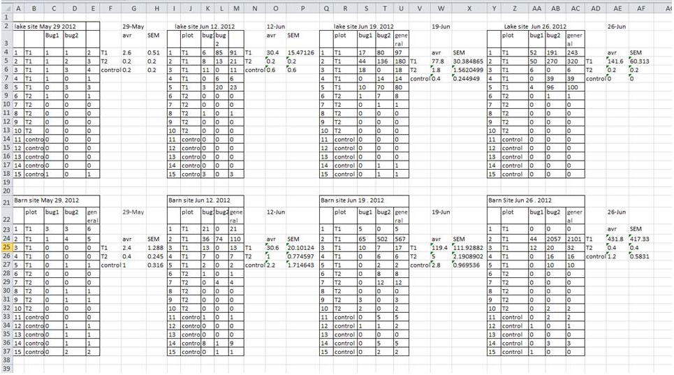

```{r setup, include=FALSE}
library(knitr)
#knitr::opts_chunk$set(out.width="3.5in")
```

In Module 3, we covered how to import and look at subsets of data. Here, we will deal with situations where you need to troubleshoot the data import process. Here in Module 4, we will deal with common issues that arise while importing data, as well as some best practices in data formatting. Finally, we will touch on how to change the formatting of your data set within R. 

***

##4.1 Formatting your data in spreadsheets

This first part is not necessarily about R. It is about managing your Excel sheet in a way that facilitates data analysis outside of Excel.

One of the reasons that many formatting problems arise while keeping data in spreadsheets is that the common software (e.g., Excel) is actually used for many different purposes. For example, people often use excel to generate templates for forms (e.g., purchasing forms). Best practices for those uses of Excel are completely different from what you should do when using spreadsheets for entering data. In this section, we will go over some dos and don'ts of spreadsheets for data management.

***Some of this material is from a free online resource from datacarpentry.org: ["Data Organization in Spreadsheets for Ecologists"](https://datacarpentry.org/spreadsheet-ecology-lesson/)

###4.1.1 Basic structure of a spreadsheet

1. First line (Header) are names of variables. Each variable is one column. Do not use values as column names.

2. Each subject (animal, plant, cell, etc.) should have an ID. This is useful if you have multiple spreadsheet where you have different information about the subject--if you have a common ID, you can link together datasets more easily.

3. Each row should be an observation. If you are observing a subject multiple times (e.g., repeated measures design), each observation should be a separate line, with the measurment time/place/trial/etc. as a separate column. 

```{r, echo=FALSE, fig.align="center", fig.cap="Example spreadsheet of data on egg size of American Coots", out.width="100%"}
knitr::include_graphics("images/eggdata_image.png")
```

###4.1.2 Spreadsheet dos and don'ts!

####1. Don't keep multiple tables in one sheet
This is one common way people have used excel sheets when your data comes from multiple sources (e.g., multiple plots). It also makes you feel like you have maximum information in the sheet. But in reality, this makes it impossible to do any global analysis. And R cannot read in this type of spreadsheet.

```{r, echo=FALSE, fig.align="center", fig.cap="example from https://datacarpentry.org/spreadsheet-ecology-lesson/02-common-mistakes"}

```


***The solution: Just keep one sheet. If you have multiple plots, treatments, etc., make that a column in your data.***


####2. Don't use special characters or commas. 

####3. Don't use formatting (i.e., highlighting) to convey information.

####4. Use good 'null values'

####5. Avoid keeping summary data along with raw data (i.e., don't make a "group means" column in your dataset). 


><span style="color:purple">***Key rule in reproducible research: Try not to mess with raw data! ***</span>
>
>Once you have collected data, it is best to try to keep that raw data ***raw***. If you find coding errors or you need to subset data for your analyses, it is best to do that with R once the data has been imported. This is because data-cleaning in R is reproducible. But once you start messing with raw data, it is way too easy to lose track of what you "fixed" and what you did not. Also, there are times when you later realize that you "fixed" the data incorrectly. If you have done all of that in excel, it is difficult to go back. But if you have done everything in script, everything is reversible. 


***

##4.2 Troubleshooting Data Import

You will often have some kind of problem reading in files. One of the big roadblocks to using R is dealing with these bugs. 

Some common problems:  

* **It won't import**
    + Are you sure you saved the file as a .csv file? 
    + Is the path and file name correct?
    + Is the path and file name inside quotes?
    
* **I get a weird column that has a bunch of `NA`**
    + You probably have a column in your spreadsheet that has a value in one of the cells that you forgot about.
    
* **I have a weird column at the bottom of my data that is just a bunch of `NA`**
    + You probably have a cell at the bottom of your spreadsheet with "hidden spaces".
    + Fix: In excel, do a "Find and Replace" to replace blank space with some character (e.g., a *) and then go and find and erase those characters.

* **Column is supposed to be numeric but it is showing up as factors.**
    + You probably have a cell value in the column that is non-numeric, e.g., "#N/A" or 'hidden space'
    + Fix: You can specify what kind of characters should be interpreted as `NA` using the `na.string=` argument (see above).

We will deal with some of these issues as well as how to prevent them in a separate section on best practices in data management. 

***