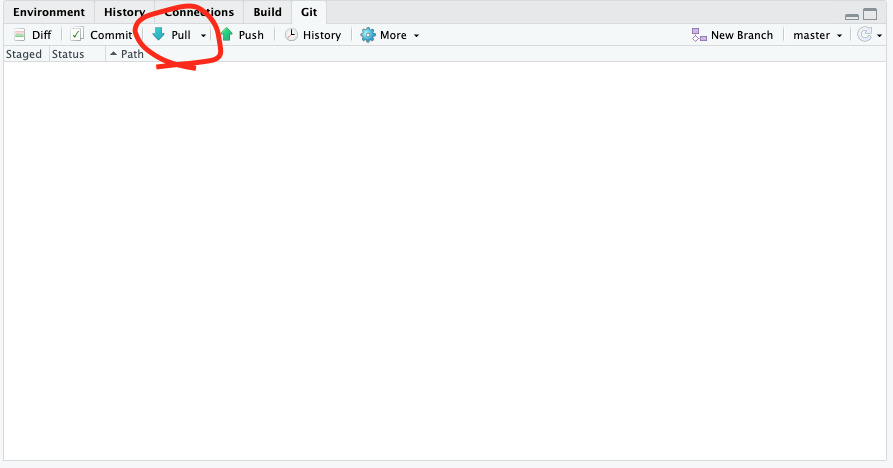

```{r setup, include=FALSE}
knitr::opts_chunk$set(echo = TRUE)
```

<br>

***Note: You can get a lot of this information from the [https://happygitwithr.com/](https://happygitwithr.com/) tutorials.***

<br>

><span style="color:purple">**Note that, for this module, I assume that you have already learned how to setup an RStudio Project.**</span>


## Version control and collaboration using Git and GitHub {width=10%}

***Version control*** is a system by which you can keep track of changes to collaborative projects. One common example is Google Doc, which is an online document that multiple people can collaborate on. Importantly, Google Doc automatically saves versions of the document when changes are made, and users can revert back to earlier versions if they want. 

***Git*** is an open-source software that facilitates version control of files in *repositories* (which is another way of saying *project directory*).

***GitHub*** is a service that facilitates Git-based projects. There are other popular similar services, such as Bitbucket and GitLab 

<br>

### Why are we using version control and GitHub

* For practical purposes, **this system will help me teach this class**. If we do this right, it will help tremendously with the process of troubleshooting your code when we get to independent projects! It will allow me to access your projects on my computer, help make edits, and keep track of those edits. 

* The larger reason is that **this will help you with your research**. You will no doubt be using R (and perhaps other coding languages) for your research, and this enables a workflow that is portable from one computer/collaborator to another. 

* It will expand the scope of your work. Once you make a project repository, you can make it private or public. If you make a public repository, then you can share it with colleagues. Likewise, you can *fork* any other public repository--this is increasingly the way people disseminate new software or packages for cutting-edge analysis techniques. 

* It could be a nice thing to add to your CV

<br>

## A note on how we are doing this in this class:

There are multiple ways to integrate Rstudio and GitHub. In fact, it is possible to have Rstudio talk to GitHub directly. **However, I much prefer using a Git Client.** This is a personal preference--I find it much easier to troubleshoot with a Git client like GitHub Desktop rather than Rstudio. So I am going to prefer that you do it this way in this class--mostly so that I can help you troubleshoot if something goes wrong. Below, I will show you both ways to setup your Rstudio so you can make a choice. 


*Here, we are following the directions on [Chapter 6-13 of the Happy git with R website, here](https://happygitwithr.com/)*

#### 3.2.1. Install Git

Here, I highly recommend following the directions on Chapter 6 of Happy Git with R: https://happygitwithr.com/install-git

To take from their directions: 

* If you are using Mac, download XCode from the App store or here: https://developer.apple.com/xcode/. This includes Git and also may come in handy later. 

* If you are using Windows, download [Git for Windows](https://gitforwindows.org/)

<br>

#### 3.2.2. Create a GitHub account

If you haven't already, go to [github.com](https://github.com/) and sign up for an account.

**Follow the directions to set up a passkey or other authentication methods. Make sure you can log in and out of github!!**

<br>


#### 3.2.3 Install a Git Client

There are many Git clients out there. Personally, I just use [GitHub Desktop](https://desktop.github.com/) {width=10%}

Git Clients provide a graphical user interface (GUI) that facilitates the processes of committing, pushing, pulling and other tasks. It also allows you to see the history of changes to your repository. For more info on Git clients, I recommend [this page](https://happygitwithr.com/git-client).


To install GitHub Desktop, go to https://desktop.github.com/ and follow their directions.

#### 3.2.4. Clone a repository


### 3.3. Working with GitHub: Pull, Stage, Commit, Push 

Once you have finished the set up process, you are ready to start your workflow!

First, notice that you should now have a tab called "Git" in the "Environment" window in RStudio (typically upper-right). If you click on that tab, it'll look like this:

{width=100%}

The Git workflow may feel a bit painful for you in the beginning because it seems a lot more manual and tedious than automated syncing that you may have gotten used to with Dropbox, Google Drive, etc. But really, it's no different than those systems--it's just that Git makes you much more intentional about when you update "local" vs. "remote" versions of your project files. 

Here are the 4 main actions that you will take whenever you work with your GitHub repository:

* **Pull:** When you open your project on your computer, I highly recommend that you always first click "Pull". This takes the version of your repository that is stored on GitHub remotely and pulls it to your local folder. Thus, you have synced your computer with whatever changes that other people (e.g., your instructor) has made on your repository. **Get used to pulling from your repository when you first open your project, even if you haven't made any changes since last time because I may have suggested changes for you!** 

* **Stage:** Whenever you make any changes on any files in your project directory, Git will "stage" those changes. This just means that the system recognizes that you've made those changes (e.g., add file, delete file, edit file) and it is ready for you to commit to those changes. 

* **Commit:** When you are done making a set of changes and you are ready to upload those changes to GitHub, you first need to **commit** those changes. When you do this, you will write a "commit message"--i.e., a brief description of the changes that you have made. Git will make you do this--it won't let you push those changes to GitHub unless you've written something. This will go in your change history, and it can be a nice way for you (and your collaborators) to understand what changes you have made. 

* **Push:** Once you have committed your changes, you are ready to **push** those changes onto your remote repository--i.e., the copy that is stored in GitHub. 

#### 3.3.1. Pull from the repository

First, click "Pull" in the Git window. This will pull any changes that are stored in the remote directory (i.e., on GitHub) that you don't already have on your local version.

{width=50%}

It will most likely say "You are already up to date". But again, get in the habit of doing this when you open your project. 

#### 3.3.2. Make some changes

Now you can make any change on your project. Let's just start by editing the readme file. 

On the bottom right window, click on the "Files" tab and select the readme.txt file. 

Add some text--e.g., "Here is the first change in my repository". 

Save the readme.txt file. 

Now go to the Git window (top right window). You should see the change reflected in the window. 

#### 3.3.3. Commit changes

Click on "Commit" in the Git window

A new window will pop out. Check all the boxes that represent each change you've made. 

Check the "Staged" box. Then, write a commit message. Something like, "add a line to readme file". 

Press "Commit". 

#### 3.3.4. Push changes to GitHub. 

Click "Push" to upload the changes to the remote repository on GitHub. 

<br>


<br>

#### 3.5.1. Opening your repository in GitHub Desktop 

Let's open a repository on GitHub Desktop. Here, we'll start by using a repository that you've already cloned onto your computer. Then, on the right-hand side, you will be able to push the commit(s) to GitHub. 

* Open GitHub Desktop and go to File > Add Local Repository. 

* When it asks for the local path, click Choose and find the folder for BIOS967_Fall2023 repository that you downloaded earlier (or equivalent for the semester you're in).


#### 3.5.2. Using a GitHub Desktop to Pull, Commit and Push.

Once the local repository is added, any changes you make to your local files that are not yet pushed to GitHub will appear on the right-hand side of the window, and a list of changes will appear on the left-hand side. You can choose all or some of the changes and write a commit message and commit. 

If you want to pull from GitHub, click "Fetch from Origin" on the top right-hand corner. If there are any changes to pull, then it will give you that option. 

If you try it, you might find that you like this interface better than pull-commit-pushing from within RStudio. You are free to do it this way. It's just that it will require to have both RStudio and GitHub Desktop apps open to update your codes. Ultimately, you should choose the way that makes the most sense to you.

<br>

## 4. Make a repository for your independent project on on GitHub and clone it to your computer.

* Log in to your GitHub account

* click on “Repositories” on the top ribbon

* Then click the big green “New repository” button

  * Repository name: `BIOS967_YourLastName` ***please follow this template for naming your repository--this allows me to easily find your repo on my end***
  
  * Preferably, select "Public". *But if you select "Private", you will then have to add me to the repository once you've created it!*
  
  * Initialize this repository with: Check Add a README file.

* Click on "Create Repository"

* Now, clone the repository on your computer following the directions in section 3.2.5 above. 

* Finally, add me as a collaborator on your project.

  * First, go to your repository and click on "Settings"


<br>

  * Then, click on "Collaborators" on the navigation panel on the left side


<br>

  * Click on "Add People" and add "dshizuka". 
  


<br>

Once you've created and cloned your repository, I suggest you make a "data" subfolder and "scripts" subfolder so that you can get organized with your files from the beginning!


