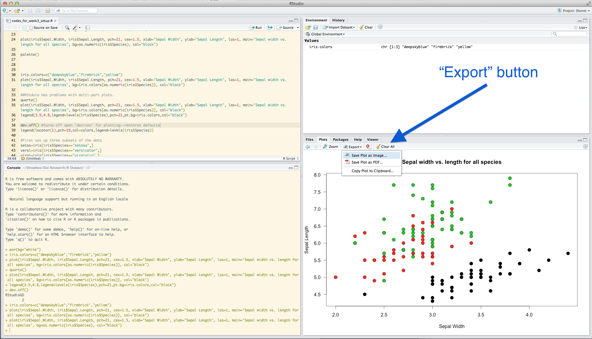

***
```{r setup, include=FALSE}
library(knitr)
#knitr::opts_chunk$set(out.width="3.5in")
```

R is amazing for graphics--i.e., visualizing data. Once you learn how to play around with the codes, it is almost infinitely customizable. In fact, R has become a major tool for graphics departments at major journalism outlets such as the [BBC](https://medium.com/bbc-visual-and-data-journalism/how-the-bbc-visual-and-data-journalism-team-works-with-graphics-in-r-ed0b35693535). There are also many wonderful resources for how to make compelling and clear visualizations of data [(e.g., this book by Claus Wilke)](https://serialmentor.com/dataviz/index.html)

But let's not get ahead of ourselves. In this module, we will cover the basics of the plotting functions in the base package of R. There are many additional packages that help you produce fancier plots (e.g., 'ggplot2' and 'lattice'). We may cover ggplot2 later in the course.

***

##First Question: What do you want to show?

There many, many different ways to visualize data (see [datavizproject.com](https://datavizproject.com/)). In fact, "data visualization" is an industry in and of itself at this point. What we need is some directory of different kinds of ways to visualize a given set of data. 

[The directory of visualizations presented in Claus Wilke's online version of his book](https://serialmentor.com/dataviz/directory-of-visualizations.html) is as good as any I've seen.

***

##5.1 The Basics
We will start with the generic `plot()` function. This function can produce a variety of basic plots. The function can take two different syntax:

* `plot(x , y)` – The Cartesian format will take two variables and plot the first element on the x-axis and the second element on the y-axis. The plot this produces will depend on the type of variables (i.e., numeric or factor) that you put in. 
* `plot(y~x)` is an alternative syntax (“formula” syntax) which will produce the same plot as above. In this case, you are plotting a relationship--i.e., `y` as a function of `x`

R will automatically detect the type of vector (variable) you are trying to plot. 

***

###5.1.1 Let's try it out:
Try plotting two numerical vectors (i.e., continuous variables) that we create:
```{r, eval=F}
a=seq(1,15, 1) #continuous variable 1
b=seq(16,30,1) #continuous variable 2
plot(a, b) #plot two continuous variables
```
```{r, eval=T, echo=F,fig.height=3, fig.width=4}
par(mar=c(4,4,1,2))
a=seq(1,15, 1) #continuous variable 1
b=seq(16,30,1) #continuous variable 2
plot(a, b) #plot two continuous variables
```

You can see that R automatically detects the two vectors (`a` and `b`) as continuous variables and creates a scatter plot.  
Now, let's create a fictitious factor vector (i.e., discrete variable) and plot one of the continuous variables against that.
```{r, eval=F}
fac=factor(c(rep("A", 5), rep("B", 5), rep("C", 5))) #a factor
plot(fac, a) #plot factor on x-axis and continuous variable on y-axis
```
```{r, eval=T, echo=F,fig.height=3, fig.width=4}
par(mar=c(4,4,1,2))
fac=factor(c(rep("A", 5), rep("B", 5), rep("C", 5))) #a factor
plot(fac, a) #plot factor on x-axis and continuous variable on y-axis
```

Here, R recognizes that we want to plot a factor on the x-axis and continuous variable on y-axis and defaults to a box plot.  

You can also plot using a *formula syntax*, using a `~`:
```{r, eval=F}
plot(a~fac) #formula syntax using "~"
```
Notice that, in the formula syntax, the order of the variables is different. Here, you are saying "plot `a` as a function of `fac`", so the first variable will show up on the y-axis and the second variable will be plotted on the x-axis. 

***

###5.1.2 A bit more on boxplots...
```{r, eval=F}
plot(a, fac) #output not shown
```

If you want to create a horizontal box plot, the correct way to do it is:
```{r, eval=F}
plot(fac, a horizontal=T) #output not shown
```

There is also another way to create a box plot, using the `boxplot()` function. For this, the input is different: You will put a series of numerical vectors as different elements. Try this:
```{r, eval=F}
boxplot(1:5, 6:10, 11:15, names=c("A", "B", "C"))
```
```{r, eval=T, echo=F,fig.height=3, fig.width=4}
par(mar=c(4,4,1,2))
boxplot(1:5, 6:10, 11:15, names=c("A", "B", "C"))
```

*What is actually happening when you use the `plot()` function is that when R runs different functions depending on your input format. Thus, if R detects that you want to plot a factor on the x-axis and numeric on the y-axis, it calls the `boxplot()` function and runs that function instead. A lot of functions in R work this way: it can call different functions depending on what your inputs look like. Functions like these are sometimes called "wrapper functions". You don't really need to know this...* 

***
###5.1.3 Line plots and others
If you have a timeseries, you sometimes want to create a **line plot**. You can do this simply by designating the plot 'type' inside the `plot()` function:

```{r, eval=F}
t=seq(1,10,1) # time sequence, from 1 to 10
response=c(1,5,4,2,3,9,6,7,8,10) # 10 random numbers
plot(t, response, type="l") #plot a line plot
```
```{r, eval=T, echo=F,fig.height=3, fig.width=4}
par(mar=c(4,4,1,2))
t=seq(1,10,1) # time sequence, from 1 to 10
response=c(1,5,4,2,3,9,6,7,8,10) # 10 random numbers
plot(t, response, type="l") #plot a line plot
```

You can plot the same figure using points, or both points and lines, and a few other formats (you can look these up using `?plot()`). Try these out (outputs not shown):
```{r, eval=F}
plot(t, response, type="p") #plot just points
plot(t, response, type="b") #plot both points and lines
plot(t, response, type="h") #Make a histogram-like plot with thin lines
plot(t, response, type="s") #Make stair steps
```

***


##5.2 Plotting data from a dataframe
Let's practice plotting data from a dataframe.  
First, we need some data to play with. For this exercise, we will use a dataset called `iris`, which is pre-loaded in R:
```{r, eval=FALSE}
iris #see all the data
str(iris) #see the structure of the iris dataset
?iris #learn more about the dataset
```
The basic structure of the dataset is that there are 4 continuous variables (length & width of sepals and Sepals) measured for individuals in 3 different species of iris (Figure 1). This dataset is useful for demonstrating the basics of plotting because it has both continuous and discrete variables.


Let's try plotting two continuous variables against each other:
```{r, eval=F}
plot(iris$Sepal.Length, iris$Sepal.Width)
```
```{r, eval=T, echo=F,fig.height=3, fig.width=4}
par(mar=c(4,4,1,2))
plot(iris$Sepal.Length, iris$Sepal.Width)
```

Compare this with what happens when you plot a continuous variable (sepal length) against a factor (iris species):
```{r, eval=F}
plot(iris$Species, iris$Sepal.Width)
```
```{r, eval=T, echo=F,fig.height=3, fig.width=4}
par(mar=c(4,4,1,2))
plot(iris$Species, iris$Sepal.Width)
```

You can also use the *formula syntax* to do the same thing. Try:
```{r, eval=F}
plot(iris$Sepal.Width~iris$Sepal.Length) #scatterplot
plot(iris$Sepal.Width~iris$Species) #box plot
```

One useful feature of the formula syntax is that it allows you to specify a dataframe you are using with the `data=` argument. Then, you can refer to the column name for that dataframe instead of specifying both the dataframe and column name with the `$` operator. This can simplify the code a little bit:
```{r, eval=F}
plot(Sepal.Width~Sepal.Length, data=iris)
```
```{r, eval=T, echo=F,fig.height=3, fig.width=4}
par(mar=c(4,4,1,2))
plot(Sepal.Width~Sepal.Length, data=iris)
```

***

## 5.3 Formatting the plot
R presents many many ways to customize the format of your plots. We will go through several of these, and then we will learn how to find out more.

####5.3.1 Axis labels and plot title
You can relabel the axes using the arguments `xlab=` and `ylab=`:
```{r, eval=F}
plot(Sepal.Width~Sepal.Length, data=iris, xlab="Sepal Length", ylab="Sepal Width")
```
```{r, eval=T, echo=F,fig.height=3, fig.width=4}
par(mar=c(4,4,1,2))
plot(Sepal.Width~Sepal.Length, data=iris, xlab="Sepal Length", ylab="Sepal Width")
```

Now add a plot title using `main=` and change re-orient the y-axis values to be horizontal using `las=`:
```{r, eval=F}
plot(Sepal.Width~Sepal.Length, data=iris, xlab="Sepal Length", ylab="Sepal Width", main="Length vs. width of sepals in Iris", las=1)
```
```{r, eval=T, echo=F,fig.height=3.5, fig.width=4}
par(mar=c(4,4,3,2))
plot(Sepal.Width~Sepal.Length, data=iris, xlab="Sepal Length", ylab="Sepal Width", main="Length vs. width of sepals in Iris", las=1)
```

You can change the x- and y-axis ranges by using `xlim=` and `ylim=`. These arguments each take a vector of two numbers representing the minimum and maximum values. Let's make the same plot, but with different axis limits:
```{r, eval=F}
plot(Sepal.Width~Sepal.Length, data=iris, xlab="Sepal Length", ylab="Sepal Width", main="Length vs. width of sepals in Iris", las=1, xlim=c(0,10), ylim=c(0,5))
```
```{r, eval=T, echo=F,fig.height=3.5, fig.width=4}
par(mar=c(4,4,3,2))
plot(Sepal.Width~Sepal.Length, data=iris, xlab="Sepal Length", ylab="Sepal Width", main="Length vs. width of sepals in Iris", las=1, xlim=c(0,10), ylim=c(0,5))
```

###5.3.2 Types of points
You can specify the types of points you want to use with the `pch=` argument. Try this:
```{r, eval=F}
plot(Sepal.Width~Sepal.Length, data=iris, xlab="Sepal Length", ylab="Sepal Width", las=1, pch=4)
```
```{r, eval=T, echo=F,fig.height=3, fig.width=4}
par(mar=c(4,4,1,2))
plot(Sepal.Width~Sepal.Length, data=iris, xlab="Sepal Length", ylab="Sepal Width", las=1, pch=4)
```

Here are what the symbols look like for 'pch' values ranging from 1 to 25. 
```{r, echo=F, fig.height=2, fig.width=10.5}
plot(1:25, rep(1, 25), pch=1:25, cex=1.2,yaxt="n", xaxt="n",ylab="", xlab="", main="Point Types (pch=)", bty="n")
axis(1, at=1:25, lty=0)
```

You can manipulate the sizes of points by using the argument `cex=`:
```{r, eval=F}
plot(Sepal.Width~Sepal.Length, data=iris, xlab="Sepal Length", ylab="Sepal Width", las=1, pch=1, cex=3)
```
```{r, eval=T, echo=F,fig.height=3, fig.width=4}
par(mar=c(4,4,1,2))
plot(Sepal.Width~Sepal.Length, data=iris, xlab="Sepal Length", ylab="Sepal Width", las=1, pch=1, cex=3)
```

***

##5.4 Colors!
You can specify the colors of the points using the argument `col=` inside the `plot()` function. This argument can take many different types of inputs:

* numerical values from 1:8
* names of colors (you need to know the specific name that R recognizes)
* hexadecimal RGB color specification
* create a color palette
* the `rgb()` function


###5.4.1 Using numerical values:
```{r, eval=F}
plot(Sepal.Width~Sepal.Length, data=iris, xlab="Sepal Length", ylab="Sepal Width",  las=1, pch=19, col=4)
```
```{r, eval=T, echo=F,fig.height=3, fig.width=4}
par(mar=c(4,4,1,2))
plot(Sepal.Width~Sepal.Length, data=iris, xlab="Sepal Length", ylab="Sepal Width",  las=1, pch=19, col=4)
```

However, using numerical values is pretty limiting. R only uses values of 1 through 8 to assign colors. Here are those colors:
```{r, echo=F, fig.height=2, fig.width=6}
plot(1:8, rep(1, 8), pch=19, col=1:8, cex=2,yaxt="n", xaxt="n",ylab="", xlab="", main="Point Colors (col=)", bty="n")
axis(1, at=1:8, lty=0)
```

###5.4.2 Using named colors:
You can also specify colors using just the names of colors as characters. For example, to make a plot with red dots:
```{r, eval=F}
plot(Sepal.Width~Sepal.Length, data=iris, xlab="Sepal Length", ylab="Sepal Width",  las=1, pch=19, col="red")
```
```{r, eval=T, echo=F,fig.height=3, fig.width=4}
par(mar=c(4,4,1,2))
plot(Sepal.Width~Sepal.Length, data=iris, xlab="Sepal Length", ylab="Sepal Width", las=1, pch=19, col="red")
```

There are infinite possibilities for color in R. Many colors have straightforward names (e.g., like “blue”), but there are also lots of crazy color names. Here is one useful page for named colors: [http://www.stat.columbia.edu/~tzheng/files/Rcolor.pdf](http://www.stat.columbia.edu/~tzheng/files/Rcolor.pdf)  

Here are some examples:
```{r, echo=F, fig.height=2, fig.width=10}
plot(1:8, rep(1, 8), pch=19, col=c("tomato", "firebrick", "goldenrod2", "chartreuse4", "darkviolet", "mediumorchid3", "slateblue", "mistyrose4"), cex=2,yaxt="n", xaxt="n",ylab="", xlab="", main="Some named colors", bty="n")
axis(1, at=1:8, labels=c("tomato", "firebrick", "goldenrod2", "chartreuse4", "darkviolet", "mediumorchid3", "slateblue", "mistyrose4"), lty=0)
```

###5.4.3 Using hexadecimal color specification:
You can use the standard hexadecimal color specification. For example, the hexadecimal code for green is #00FF00:
```{r, eval=F}
plot(Sepal.Width~Sepal.Length, data=iris, xlab="Sepal Length", ylab="Sepal Width",  las=1, pch=19, col="#00FF00")
```
```{r, eval=T, echo=F,fig.height=3, fig.width=4}
par(mar=c(4,4,1,2))
plot(Sepal.Width~Sepal.Length, data=iris, xlab="Sepal Length", ylab="Sepal Width", las=1, pch=19, col="#00FF00")
```

You can look up hex color codes here: [http://www.color-hex.com/](http://www.color-hex.com/)

###5.4.4 Creating a color palette:
There are several functions to create color palettes from a template. For example, we can use a `rainbow()` function. You can put the number of colors you want, and the function will pick three colors that are the most different from each other within the specified spectrum. 

Try it out by plotting 12 different colors:
```{r, eval=F}
my.colors=rainbow(12) #set up color palette of rainbow colors with n = 12
plot(1:12, pch=19, cex=2, col=my.colors) #plot dots, each with different colors
```
```{r, eval=T, echo=F,fig.height=3, fig.width=4}
par(mar=c(4,4,1,2))
my.colors=rainbow(12) #set up color palette
plot(1:12, pch=19, cex=2, col=my.colors) #plot dots, each with different colors
```


Other examples of color palettes include: `heat.colors()`, `terrain.colors()`, `topo.colors()` and `cm.colors()`
```{r, eval=F}
my.colors=topo.colors(12) #set up color palette of topo colors with n = 12
plot(1:12, pch=19, cex=2, col=my.colors) #plot dots, each with different colors
```
```{r, eval=T, echo=F,fig.height=3, fig.width=4}
par(mar=c(4,4,1,2))
my.colors=topo.colors(12) #set up color palette
plot(1:12, pch=19, cex=2, col=my.colors) #plot dots, each with different colors
```

Try the same with `heat.colors()`, `topo.colors()`, and `cm.colors()`.

You can get more color palettes from other R Packages such as RColorBrewer. 

###5.4.5 Using the rgb() to produce different colors

There are a couple of ways to create color gradients. First, you can use the `rgb()` function to create custom colors. This function takes four arguments: intensities of red, green, blue, and the alpha transparency value. Thus, you can create any color with any opacity. Here are some examples of colors that you can produce with the `rgb()` function. 
```{r, echo=F, fig.height=3, fig.width=6}

par(mar=c(2,1,1,1), mfrow=c(1,2))
col.vec=c(rgb(0,0,0,1),  rgb(1,1,0,1),  rgb(1,0,1,1),  rgb(0,1,1,1),  rgb(1,0,0,1),  rgb(0,1,0,1),  rgb(0,0,1,1) )

plot(rep(1, length(col.vec)), seq(1,5, length=length(col.vec)), pch=19, col=col.vec, cex=6, yaxt="n", xaxt="n",ylab="", xlab="", bty="n", ylim=c(0,6))
text(rep(1, length(col.vec)), seq(1,5, length=length(col.vec)), labels=c("rgb(0,0,0,1)",  "rgb(1,1,0,1)",  "rgb(1,0,1,1)",  "rgb(0,1,1,1)",  "rgb(1,0,0,1)",  "rgb(0,1,0,1)",  "rgb(0,0,1,1)" ), pos=4, offset=1.5)

col.vec2=c(rgb(0,0,0,0.5),  rgb(1,1,0,0.5),  rgb(1,0,1,0.5),  rgb(0,1,1,0.5),  rgb(1,0,0,0.5),  rgb(0,1,0,0.5),  rgb(0,0,1,0.5) )

plot(rep(1, length(col.vec2)), seq(1,5, length=length(col.vec2)), pch=19, col=col.vec2, cex=6, yaxt="n", xaxt="n",ylab="", xlab="", bty="n", ylim=c(0,6))
text(rep(1, length(col.vec)), seq(1,5, length=length(col.vec2)), labels=c("rgb(0,0,0,0.5)",  "rgb(1,1,0,0.5)",  "rgb(1,0,1,0.5)",  "rgb(0,1,1,0.5)",  "rgb(1,0,0,0.5)",  "rgb(0,1,0,0.5)",  "rgb(0,0,1,0.5)" ), pos=4, offset=1.5)
```

Let's try plotting the figure with enlarged points and transparent color:
```{r, eval=F}
plot(Sepal.Width~Sepal.Length, data=iris, xlab="Sepal Length", ylab="Sepal Width", las=1, pch=1, cex=3, col=rgb(1, 0, 0, 0.5))
```
```{r, eval=T, echo=F,fig.height=3, fig.width=4}
par(mar=c(4,4,1,2))
plot(Sepal.Width~Sepal.Length, data=iris, xlab="Sepal Length", ylab="Sepal Width", las=1, pch=19, cex=3, col=rgb(1, 0, 0, 0.5))
```

***

##5.5 Setting up the plotting region using `par()`

The `par()` function is used *before* the `plot()` function to set up aspects of the plotting region. For example, you can set the plotting region to be two columns and plot two different plots using `mfrow=` argument inside the `par()` function. 

```{r, eval=F}
par(mfrow=c(1,2)) #set up a plotting region with one row and two columns:
plot(Sepal.Width~Sepal.Length, data=iris, xlab="Sepal Length", ylab="Sepal Width",  las=1, pch=19, col="#00FF00") #first plot
plot(Sepal.Width~Sepal.Length, data=iris, xlab="Sepal Length", ylab="Sepal Width", las=1, pch=19, col="tomato") #secon plot
```
```{r, eval=T, echo=F,fig.height=3, fig.width=8}
par(mar=c(4,4,1,2))
par(mfrow=c(1,2)) #set up a plotting region with one row and two columns:
plot(Sepal.Width~Sepal.Length, data=iris, xlab="Sepal Length", ylab="Sepal Width",  las=1, pch=19, col="#00FF00") #first plot
plot(Sepal.Width~Sepal.Length, data=iris, xlab="Sepal Length", ylab="Sepal Width", las=1, pch=19, col="tomato") #secon plot
```

***

##5.6 How to learn more about `plot()` and `par()` functions

So we have learned some ways to customize plots in the sections above. As you might imagine, there are many, many more ways to customize plots. Most of the graphical parameters you need can be found by looking in the help file for the function `par()`. Take a look at this help file:
```{r, eval=F}
?par
```
Many of the arguments presented in this help file can be called within the `plot()` function or the `par()` function. However, as noted near the beginning of the "Details" section, there are several arguments that can only be called from the `par()` function, and there are also several argumnets that produce slightly different results based on whether they are called within the `plot()` or `par()` function.  
I have included an **Appendix** to this module that contains a table of all graphical parameters I know of and their usage. 

***

##5.7 Plotting data by factors and using legends
So far, we have plotted all items within a plot using the same symbols. Howevever, we may often want to display more information in a figure. For example, the `iris` dataset contains information about three different species. How about we plot data from different species in different colors?  
Let's think about how we might do this. Recall that the dataframe has a column for species:
```{r, eval=T}
head(iris$Species) #recall that head() shows the first three elements of a vector
```

So what we want to do is convert this information to colors. There are a couple of ways to do this. First, we can convert species into numbers, and then use that to assign colors... like this:
```{r}
as.numeric(iris$Species) #convert species into numbers.
```

So, we can use this trick to assign different colors to dots for different species.
```{r, eval=F}
plot(Sepal.Width~Sepal.Length, data=iris, xlab="Sepal Length", ylab="Sepal Width", las=1, pch=19, col=as.numeric(iris$Species))
```
```{r, eval=T, echo=F,fig.height=3, fig.width=4}
par(mar=c(4,4,1,2))
plot(Sepal.Width~Sepal.Length, data=iris, xlab="Sepal Length", ylab="Sepal Width", las=1, pch=19, col=as.numeric(iris$Species))
```

You can look above to where we discussed colors and see that col=1 is black, col=2 is red, and col=3 is green.  

However, you may want to assign your own custom color sets to the plots. If so, what you need to do is come up with three colors that you want to use, say from the `topo.colors()` function. Then, we can use `as.numeric(iris$Species)` (remember: these values range from 1 to 3) as the index to point to the color that will correspond to the species. Try this:
```{r}
colorset=rainbow(3) #create a palette of 3 colors
pt.cols=colorset[as.numeric(iris$Species)] #This is now a vector of colors for each point
```

Now, you can use this new set of colors, `pt.cols`, for the plot.

```{r, eval=F}
plot(Sepal.Width~Sepal.Length, data=iris, xlab="Sepal Length", ylab="Sepal Width", las=1, pch=19, col=pt.cols)
```
```{r, eval=T, echo=F,fig.height=3, fig.width=4}
par(mar=c(4,4,1,2))
plot(Sepal.Width~Sepal.Length, data=iris, xlab="Sepal Length", ylab="Sepal Width", las=1, pch=19, col=pt.cols)
```

Of course, if you start using different colors for different information, you need to add a legend. You can do that with the `legend()` function. Take a quick look at the help file by using `?legend`. This function has arguments to assign the location (either using a keyword or x-y coordinates) within the plotting region where you want to put the legend, what the legends are, and several parameters to assign the symbols. Here is an example:
```{r, eval=F}
plot(Sepal.Width~Sepal.Length, data=iris, xlab="Sepal Length", ylab="Sepal Width", las=1, pch=19, col=pt.cols)
legend("bottomright", legend=c("I. setosa", "I. versicolor", "I. virginica"), pch=19, col=colorset)
```
```{r, eval=T, echo=F,fig.height=3, fig.width=5}
par(mar=c(4,4,1,2))
plot(Sepal.Width~Sepal.Length, data=iris, xlab="Sepal Length", ylab="Sepal Width", las=1, pch=19, col=pt.cols)
legend("bottomright", legend=c("I. setosa", "I. versicolor", "I. virginica"), pch=19, col=colorset)
```

Here, I just told R to plot the legend on the bottom right, but you can also tell it the x-y coordinates of the top left corner of the legend. Often, just using the key words ("bottomright", "bottom", "bottomleft", "left", "topleft", "top", "topright", "right" or "center") works well. 

Ok, the legend looks good, but it's on top of some of the points. What I would really like to do is plot the legend outside of the plot. To do this, I have to do two things to set up the plotting region using the `par()` function: Tell it to allow me to plot something outside the axes (`xpd=TRUE`), and expand the margins of the plotting region, especially to the right of the plot. This can be specified using the `mar=` argument (see `?par` for details). Then, you can set the legend plotting region to be outside the plot (say at x = 8.2 and y = 3):
```{r, eval=T, echo=T,fig.height=3, fig.width=5}
par(mar=c(4,4,1,7), xpd=TRUE) #make the margin wider, and allow me to plot outside the box.

plot(Sepal.Width~Sepal.Length, data=iris, xlab="Sepal Length", ylab="Sepal Width", las=1, pch=19, col=pt.cols)

legend(8.2, 3, legend=c("I. setosa", "I. versicolor", "I. virginica"), pch=19, col=colorset)
```

***

##5.8 Adding more elements to existing plots
Sometimes, you want to add extra things like special points or lines to an existing plot. You can do this using the `points()`, `lines()`, `text()` and `abline()` functions. When you get comfortable with adding elements to plots, you can start to create really nice plots with lots of information.  

To start, let's assign the plot the we created above (without the legend) to an object. This will save us from having to run the plotting function each time we add an element. To do this, we generate the plot, and then use the `recordPlot()` function to save it as an object (output not shown):
```{r, eval=F}
plot(Sepal.Width~Sepal.Length, data=iris, xlab="Sepal Length", ylab="Sepal Width", las=1, pch=19, col=pt.cols) #make the plot again without the legend

example.plot=recordPlot() #save the plot as an object called 'example.plot'
```
```{r, eval=T, echo=F, fig.show='hide'}
par(mar=c(4,4,1,2))
plot(Sepal.Width~Sepal.Length, data=iris, xlab="Sepal Length", ylab="Sepal Width", las=1, pch=19, col=pt.cols) #make the plot again without the legend
example.plot=recordPlot() #save the plot as an object called 'example.plot'
```

Now, let's say we want to add some information about the average Sepal length and width for each species here. We will first calculate those average values using the `tapply()` function:
```{r}
mean.Sepal.length=tapply(iris$Sepal.Length, iris$Species, mean)
mean.Sepal.width=tapply(iris$Sepal.Width, iris$Species, mean)
mean.Sepal.length
mean.Sepal.width
```

We will now use the `points()` function to add "x" at the mean values for all three species:
```{r, eval=F}
example.plot
points(x=mean.Sepal.length, y=mean.Sepal.width, pch="x", cex=2) #add an "x" at the mean Sepal length & width for all three species
```
```{r, eval=T, echo=F,fig.height=3, fig.width=4}
par(mar=c(4,4,1,2))
example.plot
points(x=mean.Sepal.length, y=mean.Sepal.width, pch="x", cex=2) #add an "x" at the mean Sepal length & width for all three species
```

We can add text too. The `text()` function takes arguments for where the text should be centered, but you can specify whether the text goes below, left, above or right of the point (using the `pos=` argument), and how far it should be offset from the point (`offset=` argument):
```{r, eval=F}
example.plot
points(x=mean.Sepal.length, y=mean.Sepal.width, pch="x", cex=2)
text(x=mean.Sepal.length, y=mean.Sepal.width, labels=c("setosa", "versicolor", "virginica"), pos=1, offset=0.5) #add text below each of the "x" (pos=1), and how far it should be offset (offset = 0.5)
```
```{r, eval=T, echo=F,fig.height=3, fig.width=4}
par(mar=c(4,4,1,2))
example.plot
points(x=mean.Sepal.length, y=mean.Sepal.width, pch="x", cex=2) #add an "x" at the mean Sepal length & width for all three species
text(x=mean.Sepal.length, y=mean.Sepal.width, labels=c("setosa", "versicolor", "virginica"), pos=1, offset=0.5)
```

You can also add lines to plots. There are two functions to add lines: `abline()` and `lines()`. The `abline()` function is a bit more straightforward. This function can be used to draw a line that is vertical, horizontal, or with a specific slope and intercept. Let's use this function to draw a vertical line at the mean Sepal length for *I. setosa* using the `v=` argument within the function. We will use the `lty=3` argument to make a dotted line. 
```{r, eval=F}
example.plot
abline(v=mean.Sepal.length, lty=3) #add a vertical lines at the mean Sepal length for each species. 
```
```{r, eval=T, echo=F,fig.height=3, fig.width=4}
par(mar=c(4,4,1,2))
example.plot
abline(v=mean.Sepal.length, lty=3) #add a vertical lines at the mean Sepal length for each species. 
```

We can also add lines for the mean Sepal widths, and make the line colors correspond to the point colors:
```{r, eval=F}
example.plot
abline(v=mean.Sepal.length, lty=3, col=colorset) #add vertical lines at the mean Sepal lengths for each species. 
abline(h=mean.Sepal.width, lty=3, col=colorset) #add horizontal lines at the mean Sepal widths for each species.
```
```{r, eval=T, echo=F,fig.height=3, fig.width=4}
par(mar=c(4,4,1,2))
example.plot
abline(v=mean.Sepal.length, lty=3, col=colorset) #add a vertical lines at the mean Sepal length for each species. 
abline(h=mean.Sepal.width, lty=3, col=colorset) #add a vertical lines at the mean Sepal length for each species. 
```

***

##5.9 Saving Plots
Of course, you will want to sometimes save the figures you generated. There are two simple ways to do that: using the RStudio interface, or using a command. 

####4.5.1 Using the RStudio interface
Use the “Export” button under “Plots”. I would recommend saving the file as a pdf. Or, if you are just looking to quickly embed a plot in a word file, you can just copy to the clipboard and paste.

```{r, echo=FALSE, fig.align="left", out.width=500}

```

####4.5.2 Using R command
You can save graphics in many different formats using R commands. 
This procedure takes three steps:  
1. open up a 'graphical device' using a function (e.g., `pdf()` or `png()`)  
2. plot a figure into that graphical device   
3. close the graphical device   

Only after you 'close' the graphical device can you see the output. 
For example, to save a figure as a pdf, you will follw these three lines of code:
```{r, eval=F, results='hide'}
pdf(file="exampleplot.pdf") #open up a pdf 'graphical device'
plot(Sepal.Width~Sepal.Length, data=iris, xlab="Sepal Length", ylab="Sepal Width", las=1, pch=19, col=pt.cols) #draw the plot
dev.off() # close the graphical device
```

***
##Appendix: Useful Graphical Parameters

Argument |	How To Call	| Default |	Effect
---------|------------|-----------|-------------------------------------------------------
adj|	`par()` or `plot()`|	0.5 (center)	|text justification
ann|	`par()` or `plot()`	|TRUE	|axis label on or off
ask|	`par()`	|FALSE	|ask before plotting
bg |	`par()` or `plot()`**	|white	|if called in `par()`: background of plot; if called in `plot()`: background of symbol, only if pch=21 through 25 (filled symbols)
bty	| `plot()`	| o	| the type of box around the plot. Select from "o", "l", "7", "c", "u" or "]"
cex	| `par()` or `plot()`**	| 1 |	character size expansion (i.e., magnification). If called in `par()`: magnifies both symbols and text; if in `plot()`: magnifies symbols only
cex.axis |	`par()` or `plot()`	| 1	| axis magnification
cex.lab	| `par()` or `plot()` |	1	| axis label magnification
cex.main |	`par()` or `plot()`	| 1	| title magnification
cex.sub	| `par()` or `plot()`	| 1	| subtitle magnification
col	| `par()` or `plot()`**	|black	| color. If in `par()`: color of symbols and box; in plot: color of symbols
col.axis	| `par()` or `plot()`	| black	| color of axis values
col.lab |	`par()` or `plot()`	| black	| color of axis labels
col.main	| `par()` or `plot()`	| black	| color of main title
col.sub	| `par()` or `plot()`	| black	| color of sub-title
family |	`par()` or `plot()`	| ""	| font family: can be "serif", "sans", "mono", "symbol"
fg |	`par()` or `plot()`	| black	| foreground color. | If called in `par()`: the box and symbols, in `plot()`: just box
fig	| `par()`	| |	set region of the display device in which to plot. Use vector of form c(x1,x2,y1,y2), with values ranging from 0 to 1. E.g., par(fig=c(0,0.5,0,0.5)) will put the subsequent plot in the lower left corner of the plotting window. You need to also specify new=TRUE to add more plots to the same window.
fin |	`par()`	|	| Same as fig=, but in inches
font |	`plot()`	| 1 |	font type: 1 = plain text, 2 = bold, 3 = italic, 4 = bold italic
font.axis	| `par()` or `plot()`	| 1	| font type of axis values
font.lab	| `par()` or `plot()`	| 1	| font type of axis labels
font.main	| `par()` or `plot()`	| 2	| font type of main title
font.sub	| `par()` or `plot()`	| 1	| font type of sub-title
las	| `par()` or `plot()`	| 0	| axis annotation type: 0 = parallel to axis, 1 = horizontal, 2 = perpendicular to axis, 3 = vertical
log	| `plot()`	|| can set axes to be log by log="x", log="y" or log="xy"
lty	| `par()` or `plot()`	| 1 |	line type. Specify by integer (0=blank, 1=solid, 2=dashed, 3=dotted, 4=dotdash, 5=longdash, 6=twodash) or character ("blank", "solid", "dashed", "dotted", "dotdash", "longdash", or "twodash")
lwd	| `par()` or `plot()`	| 1	| line width. If called in `par()`: include line width of symbols & box. In `plot()` or lines(): only line width of plotted lines
mai	| `par()`	||	margin size in inches. Use vector form c(bottom, left, top, right)
mar	| `par()`	| c(5,4,4,2)+0.1	| margin size in number of lines of text
mfcol	| `par()`	| c(1,1)	| specify number of rows and columns to split the plotting device in the form c(nrow,ncol). Will plot in order by columns
mfrow	| `par()`	| c(1,1) | Same as above, but will plot in order by rows
mfg	| `par()`		| set the order of figures to be plotted from an array
mgp	|`par()` or `plot()`	| c(3,1,0)	| margin lines for axis title, label and line
new	| `par()`	| FALSE	| if TRUE, plot the next plot over the pre-existing one
oma	| `par()`	|	| set outer margin size in lines of text c(bottom, left, top, right)
omd |	`par()`	|	set outer margin in "device coordinates" (values of 0 to 1): form c(x1, x2, y1, y2)
omi	| `par()`	|	set outer margin in inches
pch	| `par()` or `plot()`	|	1 |symbol type. See class notes
tck	| `par()` or `plot()`	| -0.05	| length of tick marks. If tck=1, shows grid lines
xaxp |	`plot()` ||	can set cordinates of extreme tick marks and intervals.
xaxt |	`par()` or `plot()`	||	if xaxt="n", suppresses plotting x-axis
xlim |	`plot()`	||	set the x-axis limits by c(x1,x2)
xpd	| `par()` |	FALSE	| plot clipping. If FALSE, clips to plot region. if TRUE, clips to figure region, if NA, clips to device region
yaxp |	`plot()`	||	can set cordinates of extreme tick marks and intervals.
yaxt	| `par()` or	`plot()` ||if "n", suppresses plotting y-axis by c(y1,y2)
ylim |	`plot()`	|	set the y-axis limits by c(y1,y2)