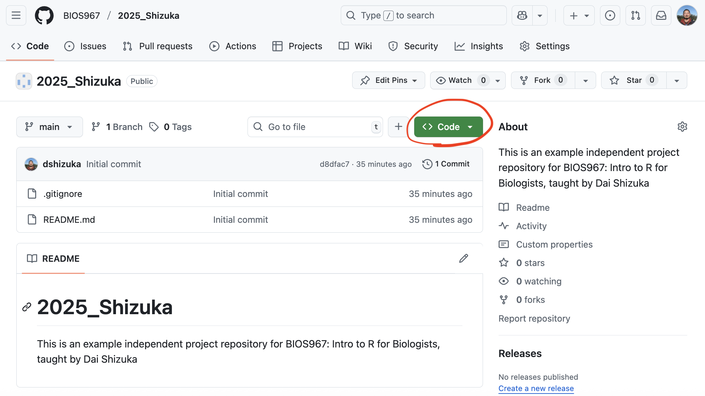
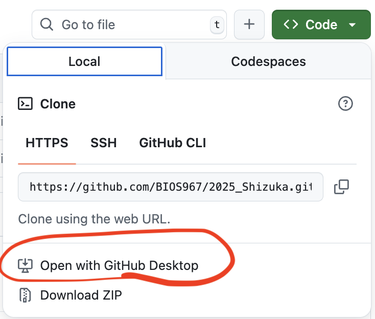
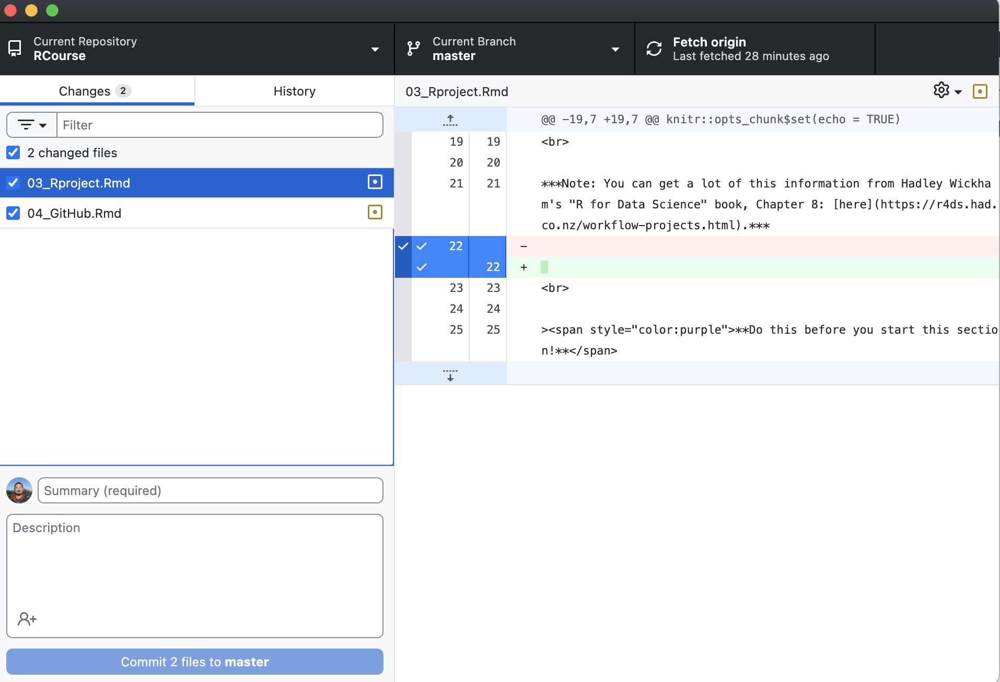
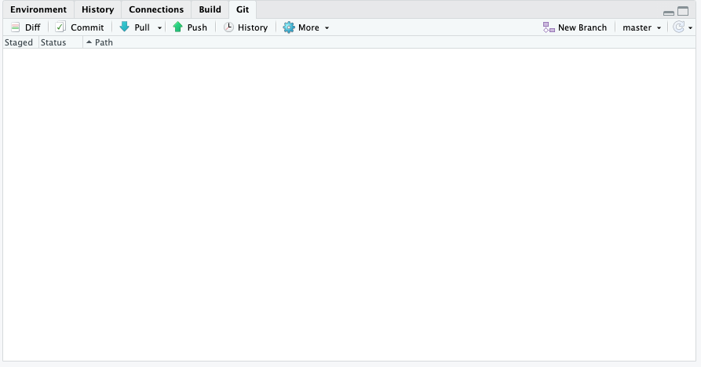

```{r setup, include=FALSE}
knitr::opts_chunk$set(echo = TRUE)
```

<br>

***Note: You can get a lot of this information from the [https://happygitwithr.com/](https://happygitwithr.com/) tutorials.***

<br>

><span style="color:purple">**Note that, for this module, I assume that you have already learned how to setup an RStudio Project.**</span>

{width=10%}

## 1. Intro to Version control and collaboration using Git and GitHub 

***Version control*** is a system by which you can keep track of changes to collaborative projects. One common example is Google Doc, which is an online document that multiple people can collaborate on. Importantly, Google Doc automatically saves versions of the document when changes are made, and users can revert back to earlier versions if they want. 

***Git*** is an open-source software that facilitates version control of files in *repositories* (which is another way of saying *project directory*).

***GitHub*** is a service that facilitates Git-based projects. There are other popular similar services, such as Bitbucket and GitLab 

<br>

### Why are we using version control and GitHub

* For practical purposes, **this system will help me help you with your independent project**. If we do this right, it will help tremendously with the process of troubleshooting your code when we get to independent projects! It will allow me to access your projects on my computer, help make edits, and keep track of those edits. 

* The larger reason is that **this will help you with your research**. You will no doubt be using R (and perhaps other coding languages) for your research, and this enables a workflow that is portable from one computer/collaborator to another. 

* It will expand the scope of your work. Once you make a project repository, you can make it private or public. If you make a public repository, then you can share it with colleagues. Likewise, you can *fork* any other public repository--this is increasingly the way people disseminate new software or packages for cutting-edge analysis techniques. 

* It could be a nice thing to add to your CV

<br>

### A note on how we are doing this in this class:

There are multiple ways to integrate Rstudio and GitHub. In fact, it is possible to have Rstudio talk to GitHub directly. **However, I much prefer using a Git Client.** This is a personal preference--I find it much easier to troubleshoot with a Git client like GitHub Desktop rather than Rstudio. So I am going to prefer that you do it this way in this class--mostly so that I can help you troubleshoot if something goes wrong. Below, I will show you both ways to setup your Rstudio so you can make a choice. 


*Here, we are following the directions on [Chapter 6-13 of the Happy git with R website, here](https://happygitwithr.com/)*


*** 

## 2. Let's start using GitHub!

### 2.1 Install Git

Here, I highly recommend following the directions on Chapter 6 of Happy Git with R: https://happygitwithr.com/install-git

To take from their directions: 

* If you are using Mac, download XCode from the App store or here: https://developer.apple.com/xcode/. This includes Git and also may come in handy later. 

* If you are using Windows, download [Git for Windows](https://gitforwindows.org/)

<br>

### 2.2. Create a GitHub account

If you haven't already, go to [github.com](https://github.com/) and sign up for an account.

**Follow the directions to set up a passkey or other authentication methods. Make sure you can log in and out of github!!**


***If you are in the BIO967 course, you will then send me the account name and email to me and then wait for instructions!!***

<br>


### 2.3 Install a Git Client

There are many Git clients out there. Personally, I just use [GitHub Desktop](https://desktop.github.com/) {width=10%}

Git Clients provide a graphical user interface (GUI) that facilitates the processes of committing, pushing, pulling and other tasks. It also allows you to see the history of changes to your repository. For more info on Git clients, I recommend [this page](https://happygitwithr.com/git-client).


To install GitHub Desktop, go to https://desktop.github.com/ and follow their directions.

### 2.4. Create a repository for your independent project (and add me as a collaborator).

* Log in to your GitHub account

* On the top-right corner, click on the icon for your profile. A navigation panel will appear. Click on "Your Organizations"

* **Don't skip this step:** Under Organizations, you should see "BIOS967". Click on that. 

* click on “Repositories” on the top ribbon

* Then click the big green “New repository” button

  * Repository name: `BIOS967_2025_YourLastName` ***please follow this template for naming your repository--this allows me to easily find your repo on my end***
  
* Under "Configuration":

  * Select "Public" or "Private"--your choice.
  
  * Add README: select "On"
  
  * Add .gitignore: Click on the pull-down menu and select "R". 
  
  * Initialize this repository with: Check Add a README file.

* Click on "Create Repository"

Now you have created your first GitHub repository. One special thing you did was to create the repository under the "BIOS967" organization, which means that all of the project repositories for this class can be found in one place. This makes everything MUCH easier for me. You will be able to transfer your repository to your own profile at the end of the course. 

### 2.5. Clone a repository to your computer using the GitHub Desktop

Now, I am going to have you ***clone*** a repository. This means that you will download all contents of a project on GitHub to your computer. 

Go to the repository you created on GitHub.

It will look something like this. 

```{r, echo=F, out.width="75%", fig.align="center"}

```

Now click on the green "clone" button circled in red:

```{r, echo=F, out.width="50%", fig.align="center"}

```

Now, click on "Open with GitHub Desktop", circled in red above. 

It will then ask you if you want to open the GitHub Desktop app. Click "Open GitHub Desktop App".

Then, the application will open, and you will get this window:

```{r, echo=F, out.width="50%", fig.align="center"}
knitr::include_graphics("images/Clone_part2.png")
```
The "Repository URL" will show you which GitHub repository you are cloning. 

The "Local Path" shows you where the **local version** of the repository will be stored on your computer. On Mac, this will typically create a "GitHub" folder within the "Documents" folder. 

I recommend that you use the default location. Also, I recommend that you keep all cloned GitHub repository that you might clone in this new "GitHub" folder. 

Go ahead and click "Clone".

Now, navigate to the "Local Path" folder that was indicated when you cloned the repository. If you can't find it, you can search for the folder with your repository name on your computer.

### What just happened?

A repository is a collection of folders and files--i.e., a remote directory--that is stored remotely by GitHub. When you clone the repository, what you have done is create a local directory--a version of this repository on your computer. This allows you to make changes--e.g., create, edit, delete codes and files on your computer. The rest of the work then is to deliberately decide to keep or discard these changes and keep it all in sync with the remote directory.


***

## 3. Working with GitHub: Pull, Stage, Commit, Push with GitHub Desktop


***
```{r, out.width="75%", echo=F}
knitr::include_graphics(path="https://miro.medium.com/v2/resize:fit:1386/format:webp/1*pEduJdPky05DeojVGVtPpQ.jpeg")

```


Once you have finished the set up process, you are ready to start your workflow!

The Git workflow may feel a bit painful for you in the beginning because it seems a lot more manual and tedious than automated syncing that you may have gotten used to with Dropbox, Google Drive, etc. But really, it's no different than those systems--it's just that Git makes you much more intentional about when you update "local" vs. "remote" versions of your project files. 

Here are the 3 main actions that you will take whenever you work with your GitHub repository:

* **Pull:** When you open your project on your computer, I highly recommend that you always first click "Pull". This takes the version of your repository that is stored on GitHub remotely and pulls it to your local folder. Thus, you have synced your computer with whatever changes that other people (e.g., your instructor) has made on your repository. **Get used to pulling from your repository when you first open your project, even if you haven't made any changes since last time because I may have suggested changes for you!** 

* **Commit:** When you are done making a set of changes and you are ready to upload those changes to GitHub, you first need to **commit** those changes. When you do this, you will write a "commit message"--i.e., a brief description of the changes that you have made. Git will make you do this--it won't let you push those changes to GitHub unless you've written something. This will go in your change history, and it can be a nice way for you (and your collaborators) to understand what changes you have made. 

* **Push:** Once you have committed your changes, you are ready to **push** those changes onto your remote repository--i.e., the copy that is stored in GitHub. **Remember to always push your changes after you're done with a session of work**

### 3.1. Pull from the repository

First, click "Fetch Origin" in the top navigation panel on the GitHub Desktop window. This will check to see if there are any changes on the remote directory. If there are any changes, it will then show a "Pull" option. 

Clicking this will pull any changes that are stored in the remote directory (i.e., on GitHub) that you don't already have on your local version.

It will most likely say "You are already up to date". But again, get in the habit of doing this when you open your project. 

### 3.2. Make some changes

Now you can make any change on your project. Let's just start by editing the readme file. 

On the bottom right window, click on the "Files" tab and select the readme.txt file. 

Add some text--e.g., "Here is the first change in my repository". 

Save the readme.txt file. 

Now go to GitHub Deskop window. You should see the list of files that have changed in the left panel. The panel on the right shows you the specific changes that have been made in the file that is selected.


```{r, echo=F, out.width="75%"}

```

### 3.3. Commit changes

You can see that, below the list of files that have changed, there is a place to write the summary of changes and a textbox for detailed description. This is where you document the changes that have been made. Only the summary is required, and the summary can be something pretty simple when the changes are routine or self explanatory (e.g., "added new modules"). But in some cases, you may want to note some details about what has been changed. This may become more important when you are collaborating with others on developing code or making fine changes in analyses, and this is the main channel of communication. For now, it's ok to keep it simple. 

Once you write something in the summary section, the blue button that says "Commit XX files to XX" will be available to click. 

Press "Commit" when you are done documenting the changes. 

### 3.4. Push changes to GitHub. 

Once you've committed the changes, you will now see that the "Push Origin" button appears on the top right corner (and also as a blue button on the right). Clicking this will now sync the changes you've made on the local version of the repository (i.e., the version on your computer) with the remote directory. This will update the files that is on GitHub. All users of the repository can now "pull" these changes to their own local version.  

***

## 4. Set up your repository with RStudio Project and file structure

Follow the same process as section 3 in the ["Directories, Pathnames, and RStudio Projects"](https://dshizuka.github.io/RCourse/03_Rproject.html) module to set up your repository folder as an RStudio Project. 

***

## 5. Working together: Branches and Pull Requests


***

## 6. Alternative setup: working with GitHub directly with RStudio

As you may have heard, you CAN set up your RStudio to talk directly with GitHub. Maybe you've heard that this is super easy and the best way (I have my doubts). So, if you elect to go this route, here is the quick version of how to do it. For more details, I recommend chapters 12 and 13 from the Happy Git with R website: https://happygitwithr.com/rstudio-git-github

### 6.1. Clone repository using RStudio

Go back up to section 2.4, where you were looking at a repository on GitHub. Click the green "Clone" button. This time, instead of opening it with GitHub Desktop, **copy the URL.** It should be something like "https://github.com/BIOS967/RCourse_2025.git"

Now, in RStudio, go to File > New Project > Version Control > Git. 

Now paste the GitHub url into the "Repository URL" section. Specify where you want the local directory to be stored on your computer if you want it to be something other than the default (e.g., the "GitHub" folder in your Documents folder on a Mac).

This will then clone the repository and open up RStudio as a new RStudio project.

### 6.2. Pull, Commit, and Pull with RStudio

First, notice that you should now have a tab called "Git" in the "Environment" window in RStudio (typically upper-right). If you click on that tab, it'll look like this:

{width=100%}


First, click "Pull" in the Git window. This will pull any changes that are stored in the remote directory (i.e., on GitHub) that you don't already have on your local version.

{width=50%}

Make some changes to any file that is on the repository (or create one if there are no files).

Now go to the Git window (top right window). You should see the change reflected in the window. 

Click on "Commit" in the Git window

A new window will pop out. Check all the boxes that represent each change you've made. 

Check the "Staged" box. Then, write a commit message. Something like, "add a line to readme file". 

Press "Commit". 

Click "Push" to upload the changes to the remote repository on GitHub. 

## 7. Troubleshooting

Let me be straight with you: You WILL encounter problems with version control when you are first working with it. But this is because keeping track of changes and versions is hard. Here are a few of the most common issues:

* **Forgetting to Pull before making changes to the local version**. You always want to start your code editing process by pulling from the remote directory. Maybe this isn't such a problem if you are the only one working with the code, and you are only using one computer. But this will become a problem if other people (e.g., me) are trying to work with you on the code. At some point in the independent project process, I will want to take a look at your code, and I may even make edits to it (I will communicate to you what edits I made).


