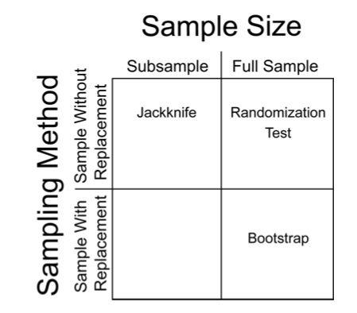

```{r setup, include=FALSE}
knitr::opts_chunk$set(echo = TRUE, digits=4)
```

***

In this module, we will introduce several functions that are useful for randomization and sampling from distributions. These techniques are broadly used for both statistics as well as simulations, and they are super useful toolkits for you to have in your arsenal for research.

## 1. Random number generators

`sample()` and `rnorm()`. These are two examples of functions that help you generate random numbers from some probability distributoin. But if you think about it, there is an infinate number of ways to sample a random set of numbers[^1]. Understanding these functions can be really useful in crafting randomization tests, bootstrapping, and simulations.

Let's consider some options:

### 1.1 Sampling from a given set of numbers with or without replacement. 
We often want to generate a set of random number given some distribution. Say, for example, we want to sample randomly from a set of numbers. For example, let's sample 5 integer between 1 and 10. 

```{r}
sample(1:10, 5, replace=F) #5 random numbers between 1 and 10
```
You will probably notice that you have generated a *different* set of random numbers than what is shown here. This makes sense, but it makes it difficult to make this code *reproducible*. What we can do is to use `set.seed()` to make this process repeatable:

```{r}
set.seed(2) #you can put whatever number inside set.seed()
sample(1:10, 5, replace=F) #5 random numbers between 1 and 10s
```
When you run the code like this, you should always get "2, 7, 5, 10, 6"  
Try changing the number inside the `set.seed()` and see what you get. 

Note that we have used **`replace=F`** to indicate that, once we choose a number, we want to avoid choosing it again. This is akin to physically picking 5 cards out of a set of 10 at the same time. We can do that up to the sample size, but no more. So, this will work:

```{r}
set.seed(2)
sample(1:10, 10, replace=F) #10 random numbers between 1 and 10
```
But this will NOT work:
```{r, error=T}
sample(1:10, 11, replace=F) #11 random numbers between 1 and 10
```

In the first iteration, you have simply shuffled the order of the numbers. But you cannot shuffle 11 cards out of a deck of 10. 

Compare this to the case when we set `replace=TRUE`:
```{r}
set.seed(2)
sample(1:10, 10, replace=T) #10 random numbers between 1 and 10
```
You will notice that we have chose some numbers multiple times ("2" appears three times, "10" and "6" appear twice). When you set `replace=TRUE`, we are basically simulating a situation where we choose a card, write down the number, ***and then put it back before picking up another card***. This process is the essence of a simulation procedure called **bootstrapping**. 

A quick recap:

* `sample(x, n)` allows you to randomly sample *n* numbers from the set `x`.
* `replace=F` (default) means once you sample one number, you will not sample it again. You can use this to shuffle the order of numbers (generally called *randomization*)
* `replace=T` allows for sampling a number more than once. You can use this to resample a set of numbers with equal probability (generally called *bootstrapping*)

***

### 2.2 Sampling from probability distributions

Rather than sampling from a discrete set of numbers, we might want to sample numbers from a given hypothetical distribution. 
As an illustration, let's sample a set of 100 numbers from a normal distribution with mean of 0 and standard deviation of 1
```{r}
set.seed(2)
rn=rnorm(10, mean=0, sd=1)
rn
```

You can see that it generates numbers with 8 digits. 
We can generate a **histogram** and check to see if the output of the `rnorm()` function really looks like a normal distribution. Let's do it with 1,000 numbers so that we reduce sampling error.

```{r, out.width='50%'}
set.seed(2)
hist(rnorm(1000, mean=0, sd=1), freq=F)
```

Looks about right.

Now let's try the same thing but with a **uniform distribution** of numbers ranging from 0 to 1
```{r, out.width='50%'}
set.seed(2)
runif(10, min=0, max=1)
hist(runif(1000, min=0, max=1), freq=F)
```


### 2.3 Coin-flips
We can use the `rbinom()` function to simulate coin-flips, i.e., generating 0s and 1s randomly.

(1) Flipping the coin 100 times, keeping track of result each time.
```{r}
set.seed(2)
coin=rbinom(100, 1, prob=0.5) #100 trials of a single flip of the coin
coin
table(coin) #generate a table of results
sum(coin)/length(coin) #calculate probability of 1
```

(2) Flipping the coin 100 times, but with skewed probability
```{r}
set.seed(2)
flip=100
coin4=rbinom(100, 1, prob=0.25)
table(coin4)
```

(3) 10 trials of 100 fair coin flips
```{r}
set.seed(2)
flips=100
coin2=rbinom(10, flips, prob=0.5)
coin2
```

### 1.4 Table of probability distributions
Distribution | Function to generate numbers
--------|-------------
Beta  | `rbeta()`
Binomial | `rbinom()`
Chi-square | `rchisq()`
Exponential | `rexp()`
Gamma | `rgamma()`
Geometric | `rgeom()`
Logistic | `rlogis()`
Log Normal | `rlnorm()`
Negative Binomial | `rnbinom()`
Normal | `rnorm()`
Poisson | `rpois()`
Uniform | `runif()`
Weibull | `rweibull()`


## 2. Resampling Techniques: Randomization, Bootstrapping, and Jackknifing

In statistics, "resampling" techniques are often used to overcome limitations in inference if you are not sure if your result is due to sampling error. In brief: when we collect data, we end up with the dataset that we have. But what if you conducted the same study again: how likely would you be to get the same answer? Broadly speaking, you can ask this question (to some degree) by "resampling" your data. There are three basic flavors of resampling:

* **Randomization, or Permutation** is when you resample all of the data that you have, but in randomized order. 

* **Bootstrapping** is when you randomly resample all observed values, but *with replacement*. This procedure essentially simulates sampling error and is useful when you can make the assumption that your sample generally represents the true distribution, but you want to account for sampling error. It is often used when you just have one set of samples, but you want to simulate a situation where you had a large set of samples with the same underlying distribution of values (but with different sampling error).

* **Jackknifing** is when you randomly subsample some of your observations. This procedure is useful when you have a sufficiently large dataset, but you want to test the stability of your metric (i.e., what is the range of values might your estimate take if you were missing some data). For example, you might use this procedure to generate a confidence interval around your metric of interest.

```{r, echo=F, fig.cap="2x2 classification of resampling strategies, from Rodgers 1999 [^2]", fig.align='center'}

```

### 2.1. Correlation test with randomization/permutation

To demonstrate how one might use a permutation test, let's try to compare P-values generated from a Pearson product-moment correlation test vs. a permutation test.

#### 2.1.1. Pearson correlation example using trees data

As an example, let's use the `trees` dataset from base R. This dataset contains girth (diameter), height and volume estimates for 31 black cherry trees.

```{r}
head(trees)
```
We can plot the relationship between tree girth and height:

```{r}
plot(Height~Girth, data=trees, pch=19)
```
It seems like there is some correlation there... Let's do a Pearson's correlation test to look at the correlation coefficient and the P-value from this test:

```{r}
cor.test(trees$Girth,trees$Height)
```

The correlation coefficient = 0.52. Based on the product-moment correlation test, the  **P-value = 0.0028**

***

#### 2.1.2. Now calculate P-value with randomization/permutation test

To do this, we are going to first save the observed correlation coefficient.

```{r}
obs.cor=cor(trees$Girth,trees$Height)
obs.cor
```

Now, we want to figure out how to get a correlation coefficient after permuting the data. To do this, let's run on iteration of the resampling of tree height data. We can do this using the `sample()` function. 

Here's the raw tree height data:
```{r}
trees$Height
```

Here is one iteration of permutation of the tree height data 
```{r}
sample(trees$Height, length(trees$Height), replace=F)
```

To get a correlation coefficient with permuted data, we just put that resampled data inside the `cor()` function:
```{r}
cor(trees$Girth, sample(trees$Height, length(trees$Height), replace=F))
```

Now, we run this whole routine a large number of times (10,000 times)

```{r}
rep=10000
rand.cor=vector(length=rep)
for(i in 1:rep){
  rand.cor[i]=cor(trees$Girth, sample(trees$Height, length(trees$Height), replace=F))
}
```

Here, we plot a histogram of the correlation coefficient from the permutations, and a red line to indicate the observed correlation coefficient.
```{r}
hist(rand.cor, xlim=c(-1,1))
abline(v=obs.cor, lty=2, col="red")
```


Now, we can calculate a P-value from a randomization test in two ways: A one-tailed test, or two-tailed test. A **one-tailed test** tests the hypothesis with a specific directionality of an effect. For example, that the observed correlation coefficient is specifically MORE POSITIVE than random expectation. In contrast, a **two-tailed test** would test the hypothesis that the absolute value of the observed correlation coefficient is larger than the distribution of absolute values generated by random chance. The standard Pearson's correlation test above generates the P-value for the two-tailed test. Here, we can do either:

```{r}
p.onetail=length(which(rand.cor>=obs.cor))/rep
round(p.onetail, digits=3)
```

```{r}
p.twotail=length(which(abs(rand.cor)>=abs(obs.cor)))/rep
p.twotail
```

We should get a very similar P-value to the original correlation test (P = 0.0028)

***

### 2.2. Resampling with bootstrapping vs. jackknifing

Now, let's do a quick example of a bootstrapping and jackknifing test. Start with loading tidyverse. 
```{r, message=F}
library(tidyverse)
```

#### 2.2.1. The `co2` dataset

We'll use the `co2` dataset in base R. This is a timeseries of atmospheric $CO_2$ levels measured at Manua Loa since January 1959 to December 1997.  
```{r, eval=F}
co2
```

Since this is a "timeseries" object, the first thing I want to do is convert it into a data frame (manually). 

To do this, I will first create objects for months (1 through 12) and years (1959 through 1997). Then, I can use a nifty function called `expand.grid()` that will create a two-column matrix of all possible combinations of month x year. 
```{r}
years=1959:1997
months=1:12
expand.grid(months, years)[1:20,] #just showing the first 20 rows of this.
```

So we can use this to create a data frame with columns for month, year, and $CO_2$ levels. Then I'll name the columns. 
```{r}
co2.dat=data.frame(expand.grid(months, years), as.numeric(co2))
names(co2.dat)=c("month", "year", "value")
head(co2.dat)
```

#### 2.2.2. Get annual averages

Now, I will use `group_by()` and `summarise()` to create an annual avearage dataset. 
```{r}
co2.annual=co2.dat %>% group_by(year) %>% summarise(year.mean=mean(value))
co2.annual
```

I can plot the change in annual average $CO_2$ over time. 
```{r}
ggplot(co2.annual, aes(x=year, y=year.mean))+ geom_line() + geom_point()
```

Calculate slope of this relationship from observed data:
```{r}
lm.fit=(lm(year.mean~year, data=co2.annual))
summary(lm.fit)
obs.slope=summary(lm.fit)$coefficients[2,1]
obs.slope
```

#### 2.2.3. Bootstrap monthly temperature data 

We can test how robust the estimate of the slope is to sampling error of the monthly measurements. One way to do this is to use a bootstrapping procedure.

One iteration of a bootstrap procedure:

```{r}
co2.boot=co2.dat %>% group_by(year) %>%
  summarise(mean.boot=mean(sample(value, 12, replace=T)))

ggplot(co2.boot, aes(x=year, y=mean.boot))+ geom_line() + geom_point()
```

Do this 1,000 times to generate confidence interval for the slope:
```{r}
times=1000
boot.fits=list()
for(i in 1:times){
  co2.boot=co2.dat %>% group_by(year) %>%
    summarise(mean.boot=mean(sample(value, 12, replace=T)))
  boot.fits[[i]]=lm(mean.boot~year, data=co2.boot)
}

boot.slopes=sapply(boot.fits, function(x) summary(x)$coefficients[2,1])

hist(boot.slopes)
ci.slopes.boot=quantile(boot.slopes, probs=c(0.025, 0.975))
ci.slopes.boot
```

#### 2.2.4. Jackknife monthly measurements

Now do the same with a jackknife procedure:
```{r}
times=1000
jk.fits=list()
for(i in 1:times){
  co2.jk=co2.dat %>% group_by(year) %>%
    summarise(mean.jk=mean(sample(value, 6, replace=F)))
  jk.fits[[i]]=lm(mean.jk~year, data=co2.jk)
}

jk.slopes=sapply(jk.fits, function(x) summary(x)$coefficients[2,1])

hist(jk.slopes)
ci.slopes.jk=quantile(jk.slopes, probs=c(0.025, 0.975))
ci.slopes.jk
```

In both cases, the confidence interval of the slope estimate is quite robust to sampling error (as would expected for such a strong relationship).


***
[^1]: Strictly speaking, we can only generate pseudo-random numbers--the computer can use an algorithm that generates numbers that are indistinguishable from random, but it is not truly random as long as we are using some algorithm to generate it. 

[^2]: Rodgers, J. L. (1999). The bootstrap, the jackknife, and the randomization test: A sampling taxonomy. Multivariate behavioral research, 34(4), 441-456.