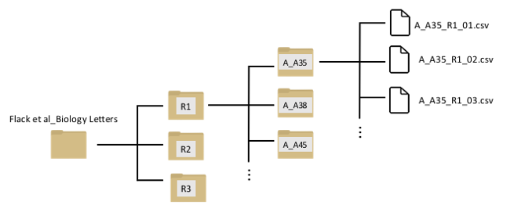
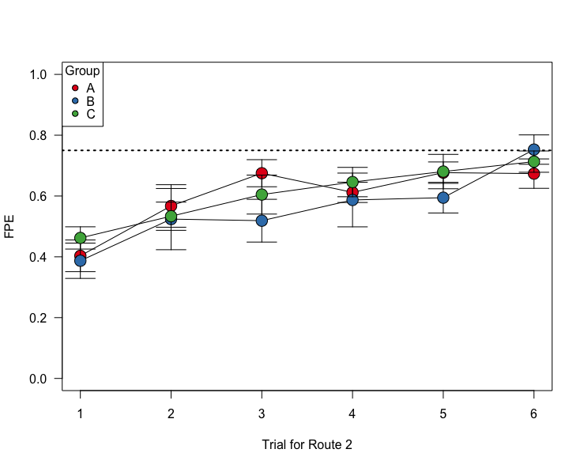
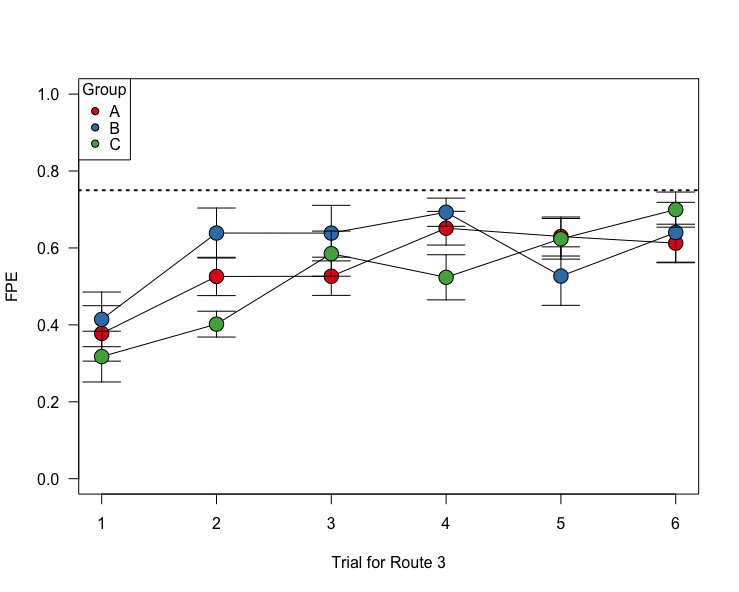

```{r setup, include=F}
library(knitr)
opts_chunk$set(tidy.opts=list(width.cutoff=75),tidy=TRUE, fig.pos="h")
```
***


\

Today, we will be using a study from **Flack, Guilford and Biro (2014)** called *Learning multiple routes in homing pigeons* <http://dx.doi.org/10.1098/rsbl.2014.0119>. You can also download the paper as pdf [here](pdfs/Flack2014.pdf).   

In this study, the researchers trained pigeons to home from three different release sites. Each individual was trained on each route 6 times. There were three different training methods: (A) 'sequential site training': each individual gets released 6 consecutive trials at each release site, (B) 'rotation training': each individual is relased at different sites sequentially, and rotating through the three sites, and (C) 'random training': individual is released at different sites in semi-random order. The goal was to determine if these training regimes had different effects on the route learning speed of individuals.

I have chosen this study because (1) it's super interesting and (2) the complete associated data on each trial for each individual has been made available. This will make for a great exercise on how to batch process multiple data files in R.

***


##12.1 Download the data files

* Go to the Dryad database for the associated data files: <http://dx.doi.org/10.5061/dryad.j444n>.

* Go ahead and download the entire .zip file to your data folder.

* Save the folder as "Flack2014"

Here is a visualization of the folder structure of the data inside your data subfolder:



You can see that there is a nested set of folders. The first three folders (R1, R2, and R3) represents the three routes that each individual was trained on. Inside each of these folders, there are separate folders for each individual bird. The first letter of the foler represents the training regime (e.g., "A_A35" means that individual went through protocol "A": the sequential-site training). Inside that folder are separate data files for each trial.

Now, we will learn how to navigate through this type of folder structure and import sets of data. 

##12.2 Navigating the data folders

First, load all the libraries we will need. If you don't have some of these, install them using `install.packages()`
```{r packagess, message=FALSE}
library(RColorBrewer)
library(ggplot2)
library(ggmap)
library(mapproj)
library(dplyr)
```


\

The `list.dirs()` function lists the *paths of all folders (aka directories)* that are contained within the working directory (in this case, your Rproject folder)
```{r, eval=F}
list.dirs()
```
*I'm not showing the results because it's very long*

\


The `list.files()` function lists just the *names of the files or folders contained within the working directory.*
```{r}
list.files()
```
*Your output will look different from mine. But it should include the "Flack et al_Biology Letters" folder.*  
The files are named with the extnsion that indicates the file format (e.g., .pdf or .R).If the name does not end with an extension name, that means the item is a folder. 

\

You can specify which files/folders to return by giving the command a "pattern" argument. For example, let's list only the .R script files.
```{r}
list.files(pattern=".R")
```
*This will only list a file if you have a .R script file in your folder*

\

You can list the files inside a subdirectory (folder) within the working directory. For example:
```{r}
list.files("data/Flack et al_Biology Letters")
```


Use this to list the files inside the "R1" folder, which is another set of folders that contain the performance of individuals at Route 1. 
```{r}
list.files("data/Flack et al_Biology Letters/R1")
```

Or, we can go inside the "R1" folder and list only the individuals in experimental treatment "A"
```{r}
list.files("data/Flack et al_Biology Letters/R1", pattern="A_")
```

\

Let's list all of the .csv files from individual A_A35 for Route 1:
```{r}
list.files("data/Flack et al_Biology Letters/R1/A_A35/", pattern=".csv")
```
*In this specific case, there are only .csv files in this folder, so it will return all files. However, specifying the file type is often useful when you are extracting data from folders that contain a bunch of ther files.*

Finally, we can get the full path for these files by specifying "full.names=T"
```{r}
list.files("data/Flack et al_Biology Letters/R1/A_A35", pattern=".csv", full.name=T)
```

We will use variations on this function to import data in batches below. 

*** 
##12.3 Extracting information from file names using `substr()` and assembling metadata

In a well-organized data set, the file names often contains useful information that can be interpreted when reading in the files. For example, let's look at the file names of the R1 results from individual A35 again:
```{r start 12.3}
list.files("data/Flack et al_Biology Letters/R1/A_A35")
```

We can see that we can get four pieces of information here:

1. The experimental treatment ("A")
2. Individual ID ("A35")
3. Route ("R1")
4. Trial number ("01", "02", etc.)

Let's extract this information and organize it as a dataframe.  
The first step is to use the `substr()` function to extract pieces of the file names. This function takes a character string and returns the characters given at the specified positions. The syntax is `substr(x, start, stop)`

For example, to get the treatment group, simply get the first character of the file name:
```{r}
group=substr(list.files("data/Flack et al_Biology Letters/R1/A_A35"), 1,1)
group
```

Now get the rest of the info and assemble a dataframe:
```{r}
id=substr(list.files("data/Flack et al_Biology Letters/R1/A_A35"), 3,5)
route=substr(list.files("data/Flack et al_Biology Letters/R1/A_A35"), 7,8)
trial=substr(list.files("data/Flack et al_Biology Letters/R1/A_A35"),10,11)
metadata=data.frame(group=group, id=id, route=route, trial=trial)
metadata
```

Now let's do this for ALL individuals in the R1 folder. To list all of the files in all folders within "R1", we can nest the `list.file()` function within another `list.file()` function:
```{r, eval=F}
list.files(list.files("data/Flack et al_Biology Letters/R1/", full.name=T))
```
*result not shown because it's too long*

So we can assemble the whole metadata for Route 1 as:
```{r}
all.files=list.files(list.files("data/Flack et al_Biology Letters/R1/", full.name=T))
group=substr(all.files, 1,1)
id=substr(all.files, 3,5)
route=substr(all.files, 7,8)
trial=substr(all.files,10,11)
metadata.R1=data.frame(group=group, id=id, route=route, trial=trial)

```

```{r, eval=F}
metadata.R1
```
*results not shown because it's too long...*


##12.4 Analyzing performance of individuals over repeated trials

###12.4.1 Importing data for each individual for each route
Now that we have learned a bit about how to deal with file names, we are ready to import datasets in batches!  
First, let's try importing all of the data for a given bird on a given route. This means we will import all 6 .csv files within an individual folder within the "R1" folder, like this. To do this, we can use the `lapply()` function, and we just need to use the .csv file paths as the elements:

```{r start 12.4}
dats.R1A35=lapply(list.files("data/Flack et al_Biology Letters/R1/A_A35", full.name=T), function(x) read.csv(x))
summary(dats.R1A35)
```
You can see that the `dats.R1A35` object now contains 6 data frames with 10 columns each. Let's look at the first of those data frames:

```{r}
head(dats.R1A35[[1]])
```

You can see that each of those data frames contain the GPS position (Latitude and Longitude) of each individual each second during the trial. Thie means that we have the complete data for each individual down to the second! 


###12.4.2 Plotting the routes for successive trials

With the data we have organized, we can draw the route that the bird took in each trial using these latitudes and longitudes. Let's try that:

#### with base R plotting
```{r 12.4.2, fig.height=5, fig.width=4}
# Use RColorBrewer color set that "PuBu" (purple to blue)
new.palette=brewer.pal(length(dats.R1A35), "PuBu")

#set the extremes of the plotting ranges: 0.01 degrees beyond the starting and ending points
lats=c(min(dats.R1A35[[1]]$Latitude)-0.01, max(dats.R1A35[[1]]$Latitude)+0.01)
longs=c(min(dats.R1A35[[1]]$Longitude)-0.01, max(dats.R1A35[[1]]$Longitude)+0.01)

#establish empty plot, and then draw line for each trajectory
plot(longs, lats, type="n", las=1, xlab="Longitude", ylab="Latitude")
for(i in 1:length(dats.R1A35)){
  points(dats.R1A35[[i]]$Longitude, dats.R1A35[[i]]$Latitude, type="l", col=new.palette[i])
}
legend("topright", legend=1:6, title="Trial", lty=1, lwd=2, col=new.palette, cex=0.8)
```

#### with ggplot

To make the same plot using ggplot2, we need to first combine the dataframes in the list into a single dataframe (i.e., all data for that individual for that route). To do this, we will use the function `do.call()`, which takes a function as input and then executes it on a list as a whole. The only time I've ever used this function is to use it to collapse a list of data frames into a single data frame:

```{r}
all.dat.R1A35=do.call("rbind", dats.R1A35)
```

Now, we can use the `geom_path()` function (Note: NOT geom_line()) in ggplot2 to plot longitude on x-axis, latitude on y-axis, grouping the data by Date, and coloring the lines using those dates on a scale from "gold" to "red".
```{r, fig.height=5, fig.width=6}
p = ggplot() + geom_path(aes(x=Longitude, y=Latitude, group=Date, colour=as.numeric(Date)), data=all.dat.R1A35) +scale_colour_gradient(low="gold", high="red")
p
```

#### with ggmap

We can make this even fancier, and overlay these results on a terrain map using the package 'ggmap':
```{r, eval=T}
#use the get_map() function to download a map centered on the mean long/lat position of the bird, with a given zoom factor
location = c(long=mean(longs), lat=mean(lats))
map=get_stamenmap(location, bbox=c(left=-1.5, bottom=51.7, right=-1.2, top=51.9), zoom=10, source="stamen", maptype="terrain-background", filetype="png")
#now add this map as the base, and then plot the geom_path on top of it.
map_lines=ggmap(map) + geom_path(aes(x=Longitude, y=Latitude, group=Date, colour=as.numeric(Date)), data=all.dat.R1A35) +scale_colour_gradient(low="gold", high="red")
map_lines
```

* Note: You used to be able to directly plot onto a google map, but this now requires an API key. It's possible to do this for free but I'm not going to go through this in this tutorial.

###12.4.3 Calculating the distance traveled over successive trials

Now let's get down to the data. The main focus here is to figure out how pigeons improve the efficiency of their route over successive attempts. In this study, they use a metric they call "Flight Path Efficiency" (FPE), defined as the straight path distance divided by the travelled distance.  
For Route 1, we know that the straight path distance = 10.4km, or 10,400m (from text). What we need to know is how many meters the pigeon travelled during each trial.

Now, we COULD calculate the distance travelled each second from just the change in GPS position of the bird at each time step... but the authors have been kind enough to actually include that data in their .csv files. This is the "Distance" column in their data set, and the unit is meters.

```{r}
head(dats.R1A35[[1]])
```

So, we simply need to sum the values of this column to get the actual distance travelled:

```{r}
sum(dats.R1A35[[1]]$Distance)
```

Now, we just need to calculate the sum of the distance for each data set in the list `dats.R1A35`. We can use the `sapply()` function for this!
```{r, fig.height=4, fig.width=5}
dist.R1A35=sapply(dats.R1A35, function(x) sum(x$Distance))
plot(dist.R1A35/1000, pch=19, type="o", las=1, xlab="Trial", ylab="Distance Travelled (km)")
```

We can plot this as FPE, using 10.4km as the straigh-line distance:
```{r, fig.height=4, fig.width=5}
fpe.R1A35=10400/dist.R1A35
plot(1:6, fpe.R1A35, pch=19, type="o", las=1, xlab="Trial", ylab="FPE")
```

###12.4.4 Calculate and plot FPE across trials for all individuals for Route 1

Ok, here is where it gets challenging. Now what we want to do is calculate the total distance travelled for each bird for each trial on Route 1. For reasons that will become clearer later, we are going to do this as a list of a list, which will replicate the file structure of the dataset we are playing with:

```{r 12.4.4, eval=F}
all.files.R1=list.files(list.files("data/Flack et al_Biology Letters/R1/", full.name=T), full.name=T)
all.R1=lapply(all.files.R1, function(x) read.csv(x))
```

```{r, echo=F}
load("data/all.R1.Rdat")
```


```{r}
distances=sapply(all.R1, function(x) sum(x$Distance))
head(distances)
```

We can simply add this data to the `metadata.R1` data frame we created in Section 12.3.3. We can also calculate that FPE based on those distances.
```{r}
metadata.R1$distance=distances
metadata.R1$fpe=10400/metadata.R1$distance
head(metadata.R1)
```


Now, it's just a matter of plotting these FPE values by group.

#### Plot all individuals by group
Here is one way:

```{r plot individuals, fig.width=2.5, fig.height=6}
groups=c("A", "B", "C")
layout(matrix(1:3, ncol=1))
par(mar=c(4,4,2,4))
for (i in 1:3){
  plot(fpe~as.numeric(trial), data=subset(metadata.R1, group==groups[i]), cex=2, pch=21, bg=gray(0.5, 0.5), ylim=c(0,1), las=1, ylab="FPE", xlab="Trial", main=paste("Group", groups[i]))
}
```

This is essentially what is plotted in panels (g)-(i) in Figure 1.

#### Plot group means and standard errors
Here, we will plot a slightly different from of Figure 1 panels (d)-(f).
To do this, we first have create summary data--for each group and trial, we will calculate the mean and s.e.m. of FPE (flight path efficiency). 
```{r}

se=function(x) sqrt(var(x)/length(x))
summ.dat=metadata.R1 %>% group_by(group, trial) %>% summarise(mean.fpe=mean(fpe), se.fpe=se(fpe))
summ.dat$trial=as.numeric(summ.dat$trial)
head(summ.dat)
```

Then, we can plot these data in a single plot. The following code is annotated:
```{r, fig.width=5, fig.height=4}
#set up groups and colors
groups=c("A", "B", "C")
colors=brewer.pal(3, "Set1")

#generate empty plot with the appropriate axes (1 through 6 on x-axis, 0 to 1 on y=axis). Draw a dotted line along FPE = 0.75 for comparison purposes
plot(1:6, seq(0, 1, length=6), type="n", las=1, ylab="FPE", xlab="Trial for Route 1")
abline(h=0.75, lty=3, lwd=2)

#using a loop function, subset the data by treatment group, then plot the standard error bars and means. Use different colors for different treatment groups.
for (i in 1:3){
use.dat=subset(summ.dat, group==groups[i])
arrows(use.dat$trial, use.dat$mean.fpe-use.dat$se.fpe, use.dat$trial, use.dat$mean.fpe+use.dat$se.fpe, angle=90, code=3, length=0.1)
points(mean.fpe~trial, data=use.dat, type="o", cex=2, pch=21, bg=colors[i])
}

#add legend
legend("topleft", legend=c("A: Sequential", "B: Rotation", "C: Random"), pch=21, pt.bg=colors, title="Group", cex=0.8)
```

What's really interesting here is that Treatements B & C perform better than Group A by the 5th and 6th release. By that point, the individuals in groups B and C have the same experience with this particular route as individuals in group A, but they have experienced more releases overall.

This result doesn't necessarily hold up for Routes 2 and 3 though, possibly because the "group A" birds have had enough general practice in finding homing routes. 

{width="40%"}
{width="40%"}
