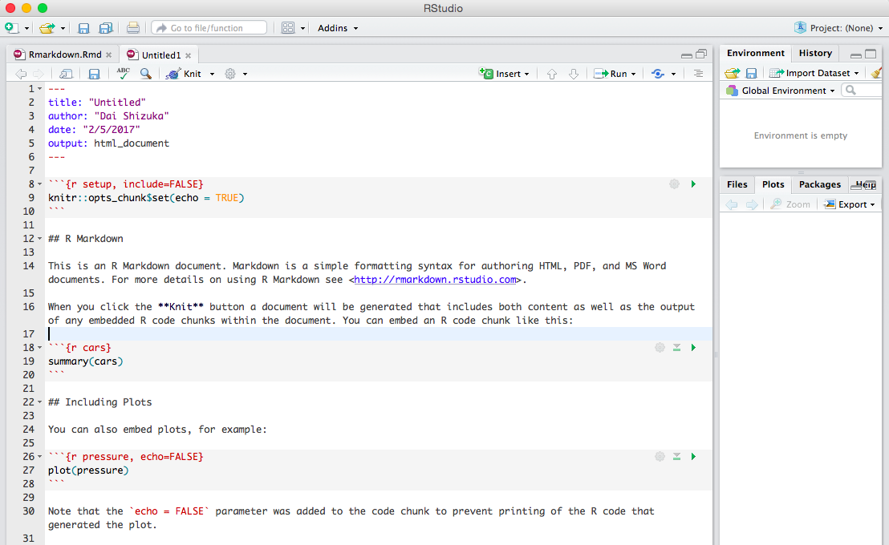

```{r setup, include=FALSE}
knitr::opts_chunk$set(echo = TRUE)
```
***

##Before we start:
1. You will need to make sure your computer can run a LaTex engine:

    * For Windows: Go to <https://miktex.org/howto/install-miktex> and follow directions to install MikTex.
    * For Mac: Go to <https://tug.org/mactex/mactex-download.html> and follow directions to install MacTex.

2. You should download this "R Markdown Reference Guide" <https://www.rstudio.com/wp-content/uploads/2015/03/rmarkdown-reference.pdf>

3. In your R Studio preferences, go to "R Markdown", and set "Show Output Preview in" to **Viewer Pane**.
  
  ***
  
## 6.1 Why R Markdown?

***R Markdown*** is a formatting syntax that allows you to use plain text to combine text + R codes and apply custom formatting to generate reproducible reports. R Markdown can be implemented in R Studio. 
(For more details on using R Markdown see <http://rmarkdown.rstudio.com>)

The main reason to use R Markdown is that it allows you to produce **reproducible reports** using plain text. That is, someone else could take your code and re-create the report exactly.Moreover, you can flexibly *render* these reports in different formats including html, pdf and word documents. You can also use it to make websites or slides for presentations. This can all accomplished without using any special formatting from proprietary software. What R Studio does is facilitate the production of this text.

To render HTML documents, R Markdown uses Markdown, a simple formatting syntax (aka *markup language*) that can then be converted to HTML. To render PDF documents, R Markdown will use LaTex, a different markup language used to format manuscripts. 

To use R Markdown, you will open a new **.Rmd** file in RStudio. **Go to `File->New File->R Markdown`.** Give the document a title, and Select "HTML" as the output option. When you open a new .Rmd file, you will get a document that looks like this:

{ width=50% }\
\
Now, press **`Command-Shift-K`** or the **"Knit"** button at the top of the R Studio window to generate an HTML document. You see that the document includes formatted text, codes and plot. 
\
The output should look like [this](http://rpubs.com/rcourse998/rmd-example).This shows you the basics of how R Markdown works.  

**Now, let's learn a bit more about the components of this .Rmd document.**

***

## 6.2 Components of R Markdown

There are three components to an R Mardown document (.Rmd): 

1. **YAML Header**
2. **Text** 
3. **Code chunks**


### 6.2.1 YAML Header
The document starts with the YAML header, which looks like this:
```
---
title: "Title"
author: "Dai Shizuka"
date: "2/4/2017"
output: html_document
---
```
The YAML Header specifies how the document will be formatted. For example, in this case, we have specified that the output will be an HTML document.

Try changing the output type as below and render the document using **`Command-Shift-K`** or clicking the **Knit** button.
```
---
title: "Title"
author: "Dai Shizuka"
date: "2/4/2017"
output: pdf_document
---
```
You will see a pdf document preview pop up. You will also see that the .pdf document now exists in the folder alongside the .Rmd file. 

Now change the output type to "html_notebook" and "knit" the document. 
```
---
title: "Title"
author: "Dai Shizuka"
date: "2/4/2017"
output: html_notebook
---
```

###6.2.2 Text
Now look below the header. You will see text that looks like this:
```
## R Markdown

This is an R Markdown document. Markdown is a simple formatting syntax for authoring HTML, PDF, and MS Word documents. For more details on using R Markdown see <http://rmarkdown.rstudio.com>.

When you click the **Knit** button a document will be generated that includes both content as well as the output of any embedded R code chunks within the document. You can embed an R code chunk like this:
...
```

This is main text that will appear in your document. The text formatting has been marked up using the "Markdown" syntax. For example, the double-hashtag (##) specifies that this line will be a header (of certain size). The words in between double-asterisks (**) shows up as bold. 

The text formatting follows *Pandoc Markdown*, i.e., a version of the "Markdown" syntax that is used by the document converter employed by R Studio (which is called Pandoc). You can get most of the formatting syntax from the R Markdown Reference Guide you downloaded. You can get even more detail [here](http://rmarkdown.rstudio.com/authoring_pandoc_markdown.html#pandoc_markdown).


###6.2.3 Code Chunks
**R code chunks** can be embedded within the document. These lines of code will be run, and the outputs of the code can be displayed or hidden. This means that you can generate plots within the .Rmd file using code and the output code will show up in the rendered document. 

R code chunks are delimited by three backticks: "```", like so:
  
  
<pre><code>```{r, echo=TRUE}
summary(cars)  
```</code></pre>

Rendering the document with this code chunk will result in this:

```{r, echo=TRUE}
summary(cars)  
```

Now try changing the code chunk option to `echo=FALSE`:
<pre><code>```{r, echo=FALSE}
summary(cars)  
```</code></pre>
```{r, echo=FALSE}
summary(cars)  
```

You can see that `echo=FALSE` means that the actual line of code will not be displayed, but the result will be displayed.

Or you can do this:
<pre><code>```{r, echo=TRUE, results="hide"}
summary(cars)  
```</code></pre>
```{r, echo=TRUE, results="hide"}
summary(cars)  
```
So `results="hide"` hides the output of the R code inside the chunk

If you run two lines of code that each produce outputs using the default chunk options, your result might look like this:

```{r}
mean(cars$speed)
mean(cars$dist)
```


If you want the two results to be displayed together, you can set `collapse=TRUE`:
<pre><code>```{r, echo=TRUE, collapse="TRUE"}
mean(cars$speed)
mean(cars$dist)
```</code></pre>
```{r, collapse=TRUE}
mean(cars$speed)
mean(cars$dist)
```


From here on out, the code chunks presented will have the default chunk options unless otherwise noted.

***

## 6.3 Including Plots & Images

There are two ways to include images in the document:
1. You can import images
2. You can generate images using embedded R code

###6.3.1 Importing images

You can import images like this:
```

```

If you are going to be adding an external image to your document, the best thing to do is have a subfolder inside your working directory that stores images (name it something like "images"). Then, you can just refer to the image name inside that subfolder.

To try this out, go download any image (e.g., <https://www.rstudio.com/wp-content/uploads/2014/07/RStudio-Logo-Blue-Gradient.png>) and save it to the "images" subfolder you created. 

Now include this in your .Rmd file and "knit" to render.
```

```


\

You can control the size of the image like this:
```
{width=30%}
```

{width=30%}

\

You can also embed images straight from a url:
```
{width=30%}
```

{width=30%}

### 6.3.2 Embedding plots generated from R code
You can also embed plots that you produce using R code, for example:


<pre><code>```{r carsplot, echo=TRUE}
plot(cars$speed, cars$dist, xlab="Speed", ylab="Distance traveled until stop")
```</code></pre>
Will give you:
```{r, echo=TRUE}
plot(cars$speed, cars$dist, xlab="Speed", ylab="Distance traveled until stop")
```

####Adjusting the plot dimensions versus the output size

You can change the size of the figure output in a couple of ways.  
First, you can adjust the size of the plotting region using `fig.height=` and `fig.width`:

<pre><code>```{r carsplot, echo=TRUE, fig.width=3, fig.height=3}
plot(cars$speed, cars$dist, xlab="Speed", ylab="Distance traveled until stop")
```</code></pre>
```{r, echo=TRUE, fig.width=3, fig.height=3}
plot(cars$speed, cars$dist, xlab="Speed", ylab="Distance traveled until stop")
```

Or, you can change the size of the output using `out.width` or `out.height`. This preserves the aspect ratio by default. 
<pre><code>```{r carsplot, echo=TRUE, out.width='50%'}
plot(cars$speed, cars$dist, xlab="Speed", ylab="Distance traveled until stop")
```</code></pre>

```{r, echo=TRUE, out.width='50%'}
plot(cars$speed, cars$dist, xlab="Speed", ylab="Distance traveled until stop")
```


