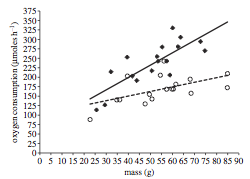
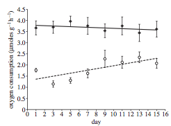

***
```{r setup, include=FALSE}
library(knitr)
knitr::opts_chunk$set(tidy.opts=list(width.cutoff=70),tidy=TRUE)
```

##1. The Study

{width="20%"}

Today, we will recreate some aspects of a study (Wales et al. 2013)[^1] on the effect of anthropogenic noise on the metabolic rate of the shore crab, *Carcinus maenas*. You can download the pdf [here](https://drive.google.com/open?id=0B7ZHgNYjckioMzR3N21WeWpFQVU). 

\

The study is summarized by these two figures:
  



* **Figure 1**, on the left, shows the relationship between mass and oxygen consumption for individuals exposed to 15 minutes of ambient noise (open circles, dotted line) and individual exposed to ship noise (filled diamonds, solid line).

* **Figure 2**, on the right, shows the relationship for sets of individuals that were exposed to repeated playbacks (8 trials of 15 minutes each, each trial separated by 48 hours) of ambient noise (open circles, dotted line) and ship noise (filled diamonds, solid line). Sample sizes were n=11 individuals for each treatment. 

***

##2 The Data
The data are publicly accessible on Dryad: <http://datadryad.org/resource/doi:10.5061/dryad.36f65> 
The data are saved in two separate "worksheets" within .xlsx file. We will need to save the two sheets separately as individual .csv files. Follow these steps:

1. Save the "Wale et al_data file.xlsx" in your working directory folder for the week.
2. Save the first sheet ("Single exposure experiment") as a .csv file named "single.csv"
3. Delete the measurement units for "Oxygen consumed"
4. Save the second sheet ("Multiple exposure experiment") as a .csv file names "multiple.csv"

Let's load the datasets into R and take a quick a look to check that the dataframes look correct.
```{r, out.width="50%"}
single=read.csv("data/single_exposure.csv")
head(single)

mult=read.csv("data/multiple_exposure.csv")
head(mult)
```

***

##3 Testing the relationships between mass, noise, and physiology
####(Testing the interaction between a continuous variable and a factor)
\
A central question here is whether the sound environment affects the physiology of crabs. However, we also know that physiological measures are often affected by body size. Thus, we would like to know whether the relationship between mass and oxygen consumption differ across treatments.  

Let's break this down. We are interested in the relationships between 3 measures:

1. Oxygen consumption (continuous variable)
2. Body mass (continuous variable)
3. Experimental treatment (discrete factor w/ two levels: ambient vs. ship noise)

###3.1 Plotting Figure 1

We can plot the relationships between these three things this way:

```{r, out.width='50%', echo=T, fig.cap="*Figure 1: The relationship between body mass and oxygen consumption in shore crabs. Individuals in the 'Ambient' treatment shown in open circles, individuals in 'Ship' treatment shown in filled diamonds.*"}
# Run two regression analyses: one for each treatment
mod1=lm(Oxygen.consumed~Crab.mass, 
        data=subset(single, single$Playback.treatment=="Ambient"))
mod2=lm(Oxygen.consumed~Crab.mass, 
        data=subset(single, single$Playback.treatment=="Ship"))

# set up the x and y coordinates for the regression lines
xv=c(min(single$Crab.mass), max(single$Crab.mass))
yv1=predict(mod1, list(Crab.mass=xv))
yv2=predict(mod2, list(Crab.mass=xv))

#Figure 1
plot(Oxygen.consumed~Crab.mass, data=single,    
     pch=c(1, 18)[Playback.treatment], cex=1.5, las=1, xlim=c(0,90), ylim=c(0,375))
lines(xv, yv1, lty=2, lwd=1.5)
lines(xv, yv2, lty=1, lwd=1.5)
```


So, what should we take away from this figure? There are three relationships shown here:

1. There seems to be a positive relationship between mass and oxygen consumption

2. Crabs that were exposed to ship noise (filled diamonds) seem to have higher oxygen consumption than those exposed to ambient noise (open circles)

3. The crabs that were exposed to ship noise seem to have a steeper relationship between mass and oxygen consumption

How do we test these relationships statistically?
When we have a continuous dependent variable (Oxygen consumption) and two independent variables--one continuous (mass) and one discrete (playback treatment), we conduct an *Analysis of Covariance*, or **ANCOVA**.[^2] 

###3.2 Running an ANCOVA

You can run an ANCOVA in R in two different ways. First, you could build a linear model and then compute the analysis of variance table. Second, you could run use the `aov()` wrapper for a linear model and then just look at the output using a summary function. 

####ANCOVA Option 1: `lm()` and `anova()`
```{r, results='hide'}
mod=lm(Oxygen.consumed~Playback.treatment*Crab.mass, data=single)
anova(mod)
```

####ANCOVA Option 2: `aov()` and `summary()`
```{r}
aov.mod=aov(Oxygen.consumed~Playback.treatment*Crab.mass, data=single)
summary(aov.mod)
```

####So what does this result tell us?  
This model has a significant *interaction effect* (*F* = 6.8, *P* = 0.014). In this case, this means that the slopes of the relationship between mass and oxygen consumption are different between treatments. We can see this in the figure above: In both treatments, oxygen consumption increases with body mass, but heavier individuals increase their consumption rate more when they are exposed to ship noise.

**Technically speaking**, you don't really want to interpret the other single-variable results (i.e., the effect of mass and treatment on oxygen consumption independently) because they are NOT independent. If you want to look at the effect of mass per se on oxygen consumption, you need to do that within each treatment (because we know that the relationship is different depending on the treatment!). Likewise, if you want to look at the relationship between treatment and oxygen consumption, you should do a simple ANOVA to compare differences between treatments. You can do those like this (outputs not shown):
```{r, eval=F}
#The effects of mass on oxygen consumption within each treatment
summary(lm(Oxygen.consumed~Crab.mass, data=subset(single, single$Playback.treatment=="Ambient")))
summary(lm(Oxygen.consumed~Crab.mass, data=subset(single, single$Playback.treatment=="Ship")))
#The effect of playback treatment, regardless of mass
summary(aov(Oxygen.consumed~Playback.treatment, data=single))
```

###3.3: Table of basic statistical tests
Here is a table with some of the most common statistical tests

Dependent Variable | Independent Variable(s) | Test | function 
-----------|------------|----------------|-------------
continuous | continuous | Linear Regression | `lm()` |
continuous | categorical | ANOVA or t-test | `aov()` or `t.test()` |
categorical| categorical | Fisher's exact test or contingency table |`fisher.test()` or `chisq.test()` |
continuous | continuous + categorical | ANCOVA | `lm()` or `aov()` |
continuous | categorical + categorical | two-way ANOVA| `aov()` |
continuous | continuous + continuous | multiple regression| `lm()` |
binary (e.g., yes/no) | continuous |  logistic regression | `glm()` |
counts or proportions | continuous | poisson regression | `glm()` |


***

##4 Examining the effect of repeated exposure to noise
The second part of the study uses a *repeated* playback of ambient or ship noise to look at cumulative effects of noise on the physiology of shore crabs. 

In this part of the study, each individual was exposed to repeated trials of noise playbacks, and their oxygen consumption was measured each time. 

We have already import the data for this part of the study at the beginning of this module. Let's refresh our memory about what this looks like.
```{r, results='markup'}
head(mult)
```

Ok, what you can see here is that the data is stored with each individual as a row, and each trial as a separate column. We will refer to this format as the "wide-format". To conduct a repeated-measures analysis on this data, we actually need to reformat this data so that each row represents a trial--i.e., each individual measured on a given day of the experiment. We will call this the "long-format". Let's see how to use R to manipulate the format of the data:

###8.4.1: Re-formatting the data using the `tidyr` package

The 'tidyr' package is an R package designed for re-arranging data in a flexible way. It can be a really nice way to reshape your data or 
First, if you have not installed the package on your computer yet:
```{r, eval=F}
install.packages('tidyr')
```

We will proceed in two steps:

1. Create a column for individual ID (which we simply assign as a unique number)
2. `gather()` the data using these attributes:
  * This function will take all columns (unless indicated by "-") and arrange them into a long-format, with the former column headers arranged in a single column, and the values arranged in a second column. 
  * "key=" to give a name you want for the column of variables 
  * "value=" to give a name you want for the column of values
  * The columns indicated prepended by "-" will be kept as-is. This will be your "ID" and the variables that are unique to that ID. 

Let's try this with our dataset! We will name the "key" variable as "day_txt" (for reasons that will become clearer below), and the "value" variable as "oxy" (for oxygen consumption).
```{r}
library(tidyr) #remember to load the package
mult$ID=1:nrow(mult)
mult_long=gather(mult, key=day_txt, value=oxy, -ID, -Playback.treatment)
head(mult_long)
#mult_long$day_txt=as.ordered(mult_long$day_txt)
```

You can use the `spread()` function to re-arrange the data back to a "wide-format". 
```{r}
mult_wide=spread(mult_long, key=day_txt, value=oxy)
head(mult_wide)
```
However, note that this will sort the days incorrectly because "Day11" comes after "Day1" when sorting these values alphabetically. This is another reason to keep your data in long-format and keep days as a separate numerical vector...

In any case, we will only be dealing with the long-format data from here on out.

###4.2 Conducting the repeated-measures ANOVA

Now, we are ready to conduct our *repeat-measures two-way ANOVA* analysis.  

* ***"Repeated-measures"*** means you have multiple measurements taken for each subject--in this case, you measured the oxygen consumption rate for a crab at Days 1, 3, 5, 7, 9, 11, 13, and 15. 
* ***"Two-way ANOVA"*** means you have a continuous dependent variable and two categorical (discrete) independent variable (i.e., days are treated as discrete factors here)

Running a two-way ANOVA is easy: you simply add two dependent variables and an interaction term using "*" as with the ANCOVA. To add a repeated-measures term, you add what is called an "Error()" term, which indicates which variable is the "ID" or "subjects" that is being repeatedly sampled. 
```{r}
aov.mod=aov(oxy~Playback.treatment*day_txt + Error(ID), data=mult_long)
summary(aov.mod)
```

This gives us the result that there is a significant interaction between playback treatment and the changes in the crab's response to the playback experiment across days. Graphically, we can see from Figure 2 in the paper that oxygen consumption increases for the control treatment ("Ambient"") but not the "Ship" treatment. 
As with the single-exposure treatment, we really shouldn't be interpreting the "general" relationship between day and oxygen consumption nor the treatment and oxygen consumption...

###4.3: A little bit of a correction on the paper:

Ok, thus far we have re-created the analyses that were conducted and presented in the paper. Here, I would like to point out a couple of minor but significant-enough errors in this analysis.

1. First, in the two-way repeated-measures ANOVA presented above, the "ID" variable needs to be assigned as a **factor**, i.e., a categorical variable that has no order. Currently, this variable is an integer, and as such it is interpreted as something that has rank-order (i.e., individual with ID = 1 has some quantitity that is lower than an individual with ID = 10). This is not correct. 

2. The days are currently not interpreted as factors--categorical variables without any order. Clearly, days are ordered, and we are interested in the change in values across days. One could argue about whether "days" should be treated as a *continuous variable*. 

Let's fix the first problem first. This is easy to do--we just need to tell R that "ID" is a factor within the `aov()` function:
```{r}
aov.mod=aov(oxy~Playback.treatment*day_txt 
            + Error(factor(ID)), data=mult_long)
summary(aov.mod)
```
You can see that this immediately increases the all of the effects observed here. This is because when "ID" was coded as an integer, it was creating "noise" that is irrelevant. Thus, the interaction effect is actually much stronger than is reported in the paper. 

To fix the second problem (Days are not being interpreted as an ordered variable), we need to first re-code the "day" variable so that they are numbers rather than text. But we don't have to re-type this data or anything--the information is within the character strings. We just need a way to change "Day1" into "1" and "Day3" to "3", etc. Here, we can use a function called `substr()` (for substring) to extract certain characters from a character string. In this case, we just want the 4th through 5th character of the "day_txt" column. Try this (output not shown):
```{r, results='hide'}
substr(mult_long$day_txt, 4, 5)
```
So we want to use this code to make a new column in the dataframe and make sure that it is interpreted as a number. Let's do that and look at the first few lines of the revised dataset.
```{r}
mult_long$day_num=as.numeric(substr(mult_long$day_txt, 4, 5))
head(mult_long)
```

Now, we can use this new "day_num" variable as the variable of interest in our two-way repeated-measures ANOVA to see how the results might differ when days are treated as a continuous variable:
```{r}
aov.mod2=aov(oxy~Playback.treatment*day_num + Error(factor(ID)), data=mult_long)
summary(aov.mod2)
```

Now you see that the interaction effect is even stronger, although the results don't really change qualitatively. I suspect that most of the difference comes simply from the change in degrees of freedom when days are treated as a continuous variable rather than categorical variables. 


###4.4: Accounting for repeated measures using a ***linear mixed-effects model***

An alternative to using the repeated-measures ANOVA here is to use assign "ID" as a ***random effect***. In very general terms, a random effect is a way to assign a hierarchical model in which you are exploring the relationships between a dependent variable and a set of ***fixed effects*** within categories (assigned as the random effect). It is a complicated concept, but it is widely applicable in ecological and biological statistics. There are number of R packages that can handle mixed-effects models, including `nlme`, `lme4`, `MCMCglmm` and others. Here is an example using the `nlme` package:
If you don't have this installed on your computer yet, run:
```{r, eval=F}
install.packages('nlme')
```

Here is the syntax to use to structure a mixed-effects model with "oxy" (oxygen consumption) as the dependent variable, "Playback.treatment" and "day_num" as fixed effects, and "ID" as the random effect:
```{r}
#mixed-model using ML
library(nlme)
lme.mod=lme(oxy~Playback.treatment*day_num, random=~1|ID, data=mult_long)
anova(lme.mod)
```
You should see that the result is actually the same as the last version of the two-way repeated-measures ANOVA that we ran (with days as continuous variable and ID as factor). Thus, these are two viable alternative methods for doing the same thing.  
More generally, linear mixed-effects models, and its extension, the *Generalized Linear Mixed Model (GLMM)* can be powerful tools for statistical analysis. 

Mixed-models are very complicated, and different packages deal with them in different ways. You need to sit down and really learn how to deal with them. Here are a couple important references:

* Bolker et al. (2009) Generalized linear mixed models: a practical guide for ecology and evolution, *TREE*, 24: 127-135.[link](http://www.cell.com/trends/ecology-evolution/fulltext/S0169-5347(09)00019-6)

* Zurr et al. (2009) *Mixed Effects Models and Extensions in Ecology with R.* Springer.

***

##5 Figure 2

Let's play around with different versions of Figure 2. For all of these, we will need to calculate the standard error, so first, the custom function for calculating standard error:
```{r}
se=function(x) sqrt(var(x)/length(x))
```

###5.1 The old way
```{r, out.width="50%"}
#step 1: create a summarized dataset with means and standard errors
d1=aggregate(mult_long$oxy, list(mult_long$day_num,mult_long$Playback.treatment), mean)
ses=aggregate(mult_long$oxy, list(mult_long$day_num,mult_long$Playback.treatment), se)
d1$se=ses[,3]
names(d1)=c("day", "treatment", "mean", "se")

#plot blank plot, populate with dots & lines & standard error bars
plot(1:15, seq(0,5,length=15), type="n", xlab="", ylab="", las=1)
points(mean~day, data=subset(d1, treatment=="Ambient"), type="b",pch=21, bg="white")
points(mean~day, data=subset(d1, treatment=="Ship"), type="b",pch=21, bg="black")
arrows(d1$day, d1$mean-d1$se, d1$day, d1$mean+d1$se, code=3, angle=90, length=0.1)
```

###5.2 A fancier way to summarize data using `dplyr`
There are a couple of packages that help us accomplish complex tasks in fewer keystrokes or in a more organized way. Hadley Wickham <http://hadley.nz/> is an R whiz that has created a series of groundbreaking R packages including `tidyr`, `dplyr` and `ggplot2`. These packages enhance your R skills. However, the downside is that it takes a little bit of additional learning curve to understand how to use these tools. We have already touched on `tidyr`. Here, I will introduce you very briefly to `dplyr`, which is a package for manipulating data, and `ggplot2`, an popular package for graphics. 

Here is how to make the summarized dataset (mean and standard error) using `dplyr`. You can find a more complete guide on this package here: <https://cran.rstudio.com/web/packages/dplyr/vignettes/introduction.html>
```{r, results='hide', message=FALSE}
library(dplyr)
```
```{r}
d2 = mult_long %>%
  group_by(Playback.treatment, day_num) %>%
  summarise(mean=mean(oxy), se=se(oxy))
head(d2)
```

###5.3 Plotting the figure with `ggplot2`

See this page for details on how to use `ggplot2`: <http://docs.ggplot2.org/current/>

```{r, , out.width="50%"}
##make figure 2 with ggplot2
library(ggplot2)
p = ggplot(d2)
p = p + geom_errorbar(aes(x=day_num, ymax=mean+se, ymin=mean-se, width=0.5))
p = p + geom_point(aes(x=day_num, y=mean, colour=Playback.treatment), size=5)
p
```

##5.4 Figure 2 as bar plots

We can display Figure 2 as a series of paired bar plots. 
```{r, message=FALSE, out.width="50%"}
#make it bar plots
tab.mean=xtabs(mean~Playback.treatment+day_num, data=d2)
tab.se=xtabs(se~Playback.treatment+day_num, data=d2)

bp=barplot(tab.mean, beside=T, ylim=c(0, max(tab.mean)+max(tab.se)))
arrows(bp, tab.mean-tab.se, bp, tab.mean+tab.se, angle=90, code=3, length=0.05)
```

We can do the same using `ggplot2`
```{r, fig.width=8, fig.height=4}
p = ggplot(d2, aes(x=day_num, y=mean, group=Playback.treatment))
p = p + geom_bar(aes(fill=Playback.treatment), stat="identity", position='dodge')
p = p + geom_errorbar(aes(ymax=mean+se, ymin=mean-se), position='dodge', stat="identity")
p
```


[^1]:Wale, M.A., Simpson, S.D., & Radford, A.N. (2013) Size-dependent physiological responses of shore crabs to single and repeated playback of ship noise. *Biology Letters* 9: 20121194

[^2]: The paper calls this analysis a "Two-way ANOVA" (in Results section), but this is technically wrong. A two-way ANOVA is when there is a continuous dependent variable and two discrete independent variables.


