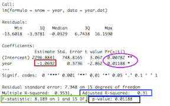

***
```{r setup, include=FALSE}
library(knitr)
knitr::opts_chunk$set(tidy.opts=list(width.cutoff=60),tidy=TRUE)
```
####Things you will learn in this module:

* **More tricks to plotting**
* **Using publicly available datasets**
* **Implementing a simple statistical analysis (simple linear regression)**
* **Creating a simple custom function**
* **Repeating a routine with a custom function**

## 5.1 Using data associated with published papers
Today, we will learn a bit more about plots by trying to re-create a plot from a recent publication. I find playing with open-access data and re-creating analyses & figures to be a very fruitful exercise because you get to learn codes, but you also get to really understand the studies much better. 

For this exercise, I have chosen a paper by Bowden et al. (2015) in *Biology Letters*.[^1] This study used a 17-year dataset on wing lengths of two butterfly species in Greenland to show that both species follow the "temperature-size" rule, which posits that higher temperatures generally select for smaller adult body size.  


Aside from it being an interesting story, I chose this paper as an example for several reasons. First, the data are pretty straightforward--wing lengths of individuals, sex of individuals, and a few climatic data such as snowmelt day, average spring temperature and average spring/summer temperature of the previous year. More importantly, the authors made the raw data publicly available through the Dryad data repoistory ([datadryad.org](datadryad.org)).
Here is the link to the raw data for this particular study:  [http://dx.doi.org/10.5061/dryad.43gt3](http://dx.doi.org/10.5061/dryad.43gt3) (you can find this information under "Data accessibility", right before References).

You can see that there is a link to an excel file (in .xlsx format) that contains the wing length data. In this case, there is no associated readme file (though it is encouraged by Dryad to include one), but the data are self-explanatory enough. **Go ahead and download the data file and open it in Microsoft Excel.**  

What you will see is a single worksheet with both species data. For each species, there are 9 columns: year, site, sex, WL (wing length), DOY (day of year of capture), snow (day of snowmelt), snow.1 (day of snowmelt in the previous year), mayjun (average May-June temperature), mayaug.1 (Average May-Aug temperature of previous year).  

Now, since R will have a hard time reading this data, let's manually create two separate data files and save them as .csv files. **Follow these directions:**

1. Select and copy the 9 columns of data for *Boloria chariclea*
2. Open a New Workbook (command-N) and paste the data
3. Save the file as "boloria.csv" in your folder for this week.
4. Do the same for Colias hecla, and save that file as "colias.csv"

Now, let's import these data to R:
```{r}

#import the data
boloria=read.csv("data/boloria.csv")
colias=read.csv("data/colias.csv")
str(boloria) #look at one of the dataframes
```

Now, we can proceed with our exercise. 

##5.2 Recreating Figure 1: Scatterplot with fit line

The first thing we will try is to re-create Figure 1, which has three panels and shows how the snowmelt dat, average May-June temperature, and average May-August temperature (of the previous year) has changed across the study period. They present this as a scatterplot and a simple linear regression fit line.


**Alright, let's try to re-create this!**  

###5.2.1 Multi-panel scatterplot
First thing we'll do is re-create the scatterplot of Figure 1a: The date of snowmelt by year. Close reading of the supplemental methods section tells us that this is the first day of the year that less than 50% of the site was covered in snow. 

The dataset we have downloaded is organized by individual butterflies that were caught during the study. However, the snowmelt and temperature information are the same for all rows for a given year (and this info is the same for both species of butterfly). So we can actually extract all of the information we need for this figure from this data. All we need to do is to summarize the snowmelt and temperature data for each year. To do this, we will use the `aggregate()` function. To review, we can use this function to just get the day of snowmelt for each year:

```{r}
snow.years=aggregate(boloria$snow, list(boloria$year), mean) #take mean of snowmelt day for each year. Since all values for a given year is the same, taking the mean just returns that value
head(snow.years) #just show the first 6 lines. 
```
So this results in a dataframe with two columns: the first column is the year and the second column is the snowmelt day. 

Let's expand on this and create a single dataframe that has all of the information we need: year, snowmelt day, average May-June temperature of that year, and average May-August temperature of the previous year. We can do this by using the `aggregate()` function with the first argument as the columns of the original dataset that we want to extract:

```{r}
year.dat=aggregate(boloria[c("snow", "mayjun", "mayaug.1")], list(year=boloria$year), mean)
#note:"year=boloria$year" inside the list() function just allows us to name the output column when creating it.
head(year.dat) #look at first 6 lines
```

Great! So we can now just create the scatter plot for Figure 1a:
```{r, eval=F, echo=T}
plot(year.dat$year, year.dat$snow, pch=19, xlab="year", ylab="snowmelt (DOY)", las=1, ylim=c(130, 170), yaxp=c(130, 170, 4), xlim=c(1995, 2015), xaxp=c(1995, 2015, 4))
```
```{r, eval=T, echo=F, fig.height=2.7, fig.width=3}
par(mar=c(4,4,2,2))
plot(year.dat$year, year.dat$snow, pch=19, xlab="year", ylab="snowmelt (DOY)", las=1, ylim=c(130, 170), yaxp=c(130, 170, 4), xlim=c(1995, 2015), xaxp=c(1995, 2015, 4))
```
  
  
In fact, it is pretty straightforward to re-create all 3 panels in Figure 1. We just need to use the `par()` function to create 

```{r, eval=T, echo=T, fig.height=6, fig.width=2}
par(mar=c(4,4,2,2), mfrow=c(3,1))
plot(year.dat$year, year.dat$snow, pch=19, xlab="", ylab="snowmelt (DOY)", las=1, ylim=c(130, 170), yaxp=c(130, 170, 4), xlim=c(1995, 2015), xaxp=c(1995, 2015, 4))

plot(year.dat$year, year.dat$mayjun, pch=19, xlab="", ylab="average temp t", las=1, ylim=c(-3, 0.5), yaxp=c(-3, 0, 3), xlim=c(1995, 2015), xaxp=c(1995, 2015, 4))

plot(year.dat$year, year.dat$mayaug.1, pch=19, xlab="year", ylab="average temp t-1", las=1, ylim=c(0.5, 4.5), yaxp=c(1, 4, 3), xlim=c(1995, 2015), xaxp=c(1995, 2015, 4))
```


We won't worry about the minutiae of the axis labels. Let's move on to the regression line. 

***

###5.2.2 Simple linear regression using `lm()`

The first thing we need to learn is the function for conducting the simplest form of a linear regression. 
So, what is a linear regression? A lot of people think that linear regression (or *linear model*) means that the relationship between two variables is defined by a straight line. This is not quite correct. More properly, linear model is a class of statistic models in which the value of interest is described by a linear combination of a series of parameters (regression slopes and intercept). This can actually include curvilinear relationships between the dependent and independent variables.

My aim here is not to provide a thorough lesson on statistics. For that, I suggest you take a proper statistics class or consult a statistics textbook. 

Here, we will just tackle the problem of fitting a ***simple linear regression*** with one continuous dependent variable ($y$) and one continuous independent variable ($x$). Thus, we want to fit the linear function
$$y=a+bx$$
where $a$ is the intercept and $b$ is the slope of the line. 

To fit this model, we use a model formula syntax inside the appropriate statistical function. In this case, the appropriate formula is  
`y~x`  

Notice that we replace the equal sign (=) with a tilde (~) and remove the paramters ($a$ and $b$). All R needs to understand our statistical model is the dependent variable(s) ($y$ in this case) and the independent variable(s) ($x$ in this case). We will address the formula syntax for more complex statistical models later.  

Now, let's use the simple linear regression to ask the question: what is the relationship between snowmelt date (dependent variable) and year (independent variable).[^2]
To do this, we will create an object using the `lm()` function and then see what the resulting object looks like:

```{r, results='hold'}
fit.snow=lm(snow~year, data=year.dat)
class(fit.snow)
```
So, you can see that the `lm()` function creates an 'lm object'. The `fit.snow` object actually contains much more information. To see all of the components of this model object, see:

```{r, eval=F, echo=T}
str(fit.snow) #output not shown
```
This will yield a very long output that details all of the components of the model fitting results that we might want. Ok, so how do we extract the information we want from this statistical analysis? One convenient function is the `summary()` function:

```{r}
summary(fit.snow)
```
So this gives us a good overview of the statistical outpu, but it gives us a lot of information, and you have to know what to look for. Let's look at these values closely:

```{r, echo=FALSE, fig.align="left", out.width="50%"}

```


The values reported in the caption of Figure 1 of the paper are in the rectangles:

* "Estimate" for the independent variable (year) is the **slope parameter $b$** (red rectangle). The intercept parameter $a$ is above that.
* **F-statistic** (green rectangle): Ratio of Mean of squares. Compares the amount of variation explained by the regression model and the "left-over variation" (residual sum of squares). The associated **degrees of freedom (DF)**--i.e., how many independent observations we have of a given variable that can be used to estimate a statistical parameter--are the "regression degrees of freedom"" (# parameters -1) and the "residual degrees of freedom" (sample size - # of parmeters - 1)
* **P-value**: Calculated by comparing the F-ratio with expected distribution of this value. 

***NOTE:*** There are also t-statistics and P-values associated with each parameter (in purple circle). These are P-values associated with the null hypotheses that the intercept and slope are equal to 0. This is different than the P-value for the test for the fit of the linear regression model to the data. Thus, those circled values are NOT relevant for us right now.

**Now compare these values in the rectangles to the values presented in the figure captions to Figure 1 in the paper. Do you notice that they are slightly different? Can you figure out why they are slightly different?[^3]**

***

><span style="color:purple">***Extra Exercise: ***</span> 
>Conduct linear regression analyses for the following relationships:
>
>* May-June temperature across years
>* May-August temperature from the previous year, across years. 

***

###5.2.3 Fit line using `abline()`
Now, let's use the output of the linear regression model to plot a 'best fit' regression line on the scatterplot of data. There are at least two ways to do this. We will start with the simpler method: using the `abline()` function. This function can take the output of the `lm()` function directly and plot a regression fit line. This function needs to be called after the plot already exists. 

```{r, eval=F, echo=T}
plot(year.dat$year, year.dat$snow, pch=19, xlab="year", ylab="snowmelt (DOY)", las=1, ylim=c(130, 170), yaxp=c(130, 170, 4), xlim=c(1995, 2015), xaxp=c(1995, 2015, 4))
abline(fit.snow)
```
```{r, eval=T, echo=F, fig.height=3, fig.width=3.5}
par(mar=c(4,4,0,2))
plot(year.dat$year, year.dat$snow, pch=19, xlab="year", ylab="snowmelt (DOY)", las=1, ylim=c(130, 170), yaxp=c(130, 170, 4), xlim=c(1995, 2015), xaxp=c(1995, 2015, 4)) #plot the snowmelt data
abline(fit.snow) #plot the regression line that results from the regression fit (from section 5.2.2)
```

What the `abline()` function essentially does is extract the intercept and slope parameters from the regression fit and draws that line. This is very convenient and generally gives us what we want. However, the problem with this method is that the line is not confined to the dataset (i.e., the line extrapolates beyond the data we have). 

***

###5.2.4 Fit line using `predict()`
To draw a proper regression fit line, we want to confine the line to the range of points on the x-axis. To do this, there are three steps:

1. Decide the range of x-values that we want to plot
2. Generate predicted y-values based on the model fit for that range of x-values
3. Use the `line()` function to plot this "predicted" relationship (i.e., the best-fit line)

For this example, step 1 is easy: we want to fit a line to the data ranging from 1996 to 2013. 
To accomplish step 2, we will use the `predict()` function. This function allows us to take any statistical model, feed it a range of x-values and get the y-values based on the parameters. 
The syntax of the function is: `predict(model_object, list(dependent_variable_name=range_of_x_values))`  
So, to get the predicted y-values based on the years 1996-2013:
```{r}
xv=seq(1996, 2013, 1) #The range of x-values that I want to fit the line to
predict.snow=predict(fit.snow, list(year=xv)) #predicted values that correspond to those x-values.
predict.snow
```

We can then use these values to draw a fit line on the plot:
```{r, eval=F, echo=T}
plot(year.dat$year, year.dat$snow, pch=19, xlab="year", ylab="snowmelt (DOY)", las=1, ylim=c(130, 170), yaxp=c(130, 170, 4), xlim=c(1995, 2015), xaxp=c(1995, 2015, 4))
lines(xv, predict.snow)
```
```{r, eval=T, echo=F, fig.height=3, fig.width=3.5}
par(mar=c(4,4,0,2))
plot(year.dat$year, year.dat$snow, pch=19, xlab="year", ylab="snowmelt (DOY)", las=1, ylim=c(130, 170), yaxp=c(130, 170, 4), xlim=c(1995, 2015), xaxp=c(1995, 2015, 4))
lines(xv, predict.snow)
```

**Note** Since we are fitting a simple straight line, we technically only need two x-values to accomplish this. So, the following codes would produce the same figure (output not shown).
```{r, eval=F, echo=T}
xv2=c(1996, 2013) #just the minimum and maximum values on the x-axis
predict.snow2=predict(fit.snow, list(year=xv))
plot(year.dat$year, year.dat$snow, pch=19, xlab="year", ylab="snowmelt (DOY)", las=1, ylim=c(130, 170), yaxp=c(130, 170, 4), xlim=c(1995, 2015), xaxp=c(1995, 2015, 4))
lines(xv, predict.snow)
```
However, if you were to fit a more complext model fit, you would want to predict many points along the spectrum of x-values. We may eventually tackle this type of problem later in the course. 

Ok, now let's plot all three panels of Figure 1 in one fell swoop:
```{r, fig.height=6, fig.width=2.5}
###Regression models
fit.snow=lm(snow~year, data=year.dat) #regression fit for snowmelt date
fit.mayjun=lm(mayjun~year, data=year.dat) #regression fit for May-June temp
fit.mayaug.1=lm(mayaug.1~year, data=year.dat) #regression fit for May-Aug temp from last year.

#set up fit line x- and y-values
xv=seq(1996, 2013, 1)
predict.snow=predict(fit.snow, list(year=xv))
predict.mayjun=predict(fit.mayjun, list(year=xv))
predict.mayaug.1=predict(fit.mayaug.1, list(year=xv))

#plot multi-panel figure
par(mfrow=c(3,1), mar=c(4,4,1,2))

plot(year.dat$year, year.dat$snow, pch=19, xlab="year", ylab="snowmelt (DOY)", las=1)
lines(xv, predict.snow)

plot(year.dat$year, year.dat$mayjun, pch=19, xlab="year", ylab="Average Temperature", las=1)
lines(xv, predict.mayjun)

plot(year.dat$year, year.dat$mayaug.1, pch=19, xlab="year", ylab="Average Temperature Last Year", las=1)
lines(xv, predict.mayaug.1)

```

We can add a bunch of arguments to the plotting function to really make it close to the Figure if we want to make it a real publication-quality figure. (I won't walk through all of the arguments)
```{r, fig.height=7, fig.width=3}
par(mfrow=c(3,1), xpd=T)
par(mar=c(4, 5, 1, 2))
plot(year.dat$year, year.dat$snow, pch=19,  ylab="snowmelt (DOY)", las=1, ylim=c(130, 170), yaxp=c(130, 170, 4), xlim=c(1995, 2015), xaxp=c(1995, 2015, 4), xlab="", xaxt="n", cex=1.5)
axis(side=1, labels=FALSE)
lines(xv, predict.snow)
text(1990, 170, substitute(italic("(a)")))
par(mar=c(4, 5, 1, 2))
plot(year.dat$year, year.dat$mayjun, pch=19, ylab=expression(paste("Average Temperature"["t"]," ", (~degree*C))), las=1, ylim=c(-3, 0.5), yaxp=c(-3, 0, 3), xlim=c(1995, 2015), xaxp=c(1995, 2015, 4), xlab="", xaxt="n", cex=1.5)
axis(side=1, labels=FALSE)
lines(xv, predict.mayjun)
text(1990, 0.5, substitute(italic("(b)")))
par(mar=c(4, 5, 1, 2))
plot(year.dat$year, year.dat$mayaug.1, pch=19, xlab="year", ylab=expression(paste("Average Temperature"["t-1"]," ", (~degree*C))), las=1, ylim=c(0.5, 4.5), yaxp=c(1, 4, 3), xlim=c(1995, 2015), xaxp=c(1995, 2015, 4), cex=1.5)
lines(xv, predict.mayaug.1)
text(1990, 4.5, substitute(italic("(c)")))
```

***

##5.3 Recreating Figure 2

Now, we will work on re-creating Figure 2, which is a 4-panel figure with the average wing length of males and females (and error bars) for each species (panels *a* and *b*), and the relationship between average wing length and the average May-August temperature of the previous year (panels *c* and *d*). 


***

###5.3.1 Panels (a) and (b): Plotting the mean wing lengths by year, species and sex

First thing we need to do to construct this figure is to calculate the mean wing lengths for each year for each species and sex. We can do this with the `aggregate()` function that we used in a previous module:

Let's start with *Colias hecla* since that is the first panel.
```{r}
wl.colias=aggregate(WL~year+sex, data=colias, mean) #calculate the mean of WL by year and sex for the colias dataset.
head(wl.colias)
```
Ok, so now we have the data that we need to plot the means for each year. 

Since the column called 'WL' actually represents the mean values, let's change the column names to reflect that:
```{r}
names(wl.colias)=c("year", "sex", "mean")
```
Let's start building panel *a*. What we want to do is plot the data for one sex (say female), and then add the points for the second sex (male) on that same plot. To do this, a useful function is `subset()`, which allows us to easily specify a subset of data. 
Try this to plot the data for just the females:
```{r, eval=F, echo=T}
plot(mean~year, data=subset(wl.colias, sex=="f"), type="b", pch=19)
```
```{r, eval=T, echo=F, fig.height=3, fig.width=4}
par(mar=c(4,4,1,2))
plot(mean~year, data=subset(wl.colias, sex=="f"), type="b", pch=19)
```

Ok, so now what we have to do is plot this with the proper axis limits and then add the male data:
```{r, eval=F, echo=T}
plot(mean~year, data=subset(wl.colias, sex=="f"), type="b", pch=19, ylim=c(21,24), xlim=c(1996,2013), las=1)
points(mean~year, data=subset(wl.colias, sex=="m"), type="b", pch=1)
```
```{r, eval=T, echo=F, fig.height=3, fig.width=4}
par(mar=c(4,4,1,2))
plot(mean~year, data=subset(wl.colias, sex=="f"), type="b", pch=19, ylim=c(21,24), xlim=c(1996,2013), las=1)
points(mean~year, data=subset(wl.colias, sex=="m"), type="b", pch=1)
```

Notice that there is one problem here, which is that the plot connects the dots between the years 2009 and 2011, even though the data for 2010 is missing. The figure in the publication correctly omits this line. We will address this later.

***

###5.3.2 Creating a custom function to calculate standard error of the mean
Figure 2(a) and 2(b) have standard error bars associated with each mean value. Let's work on adding those.  The base package in R famously does not have a built-in function for calculating standard error of the mean, but it is very easy to calculate it. 

So, what is standard error? Simply, it is the standard deviation $\sigma$ divided by the square-root of the sample size $n$:
$$SE = \frac{\sigma}{\sqrt n}$$
In turn, standard deviation $\sigma$ is simply the square-root of the variance $\sigma^2$. Thus, 
$$SE = \sqrt{\frac{\sigma^2}{n}}$$
So, to calculate the standard error of the mean of a vector, say WL, we simply need to do:
```{r}
sqrt(var(colias$WL)/length(colias$WL)) #the standard error of the mean of WL for the entire sample of Colias butterflies. 
```

So, what we need to do is figure out an easy way to do this calculation for each year-species-sex. The best way to do this is to ***build a custom function*** to calculate the standard error, and then use this function within the `aggregate()` function (like we did to calculate the means)!

To create a custom function, we need to use `function()`. Inside the parentheses, we designate some variable(s). Here, we will call this variable `x`. Then, we use curly brackets `{}` to tell R what this function will do. Here is how to build a custom function called `se()` that will calculate the standard error of the mean:

```{r}
se=function(x) {sqrt(var(x)/length(x))} #create a new function called se() that will take a vector, x, and divide the variance of the vector by its length, then take its square-root.
```

Now, let's implement this function to the global sample of wing lengths in *Colias*:
```{r}
se(colias$WL)
```

This should give us the same value as our manual calculation above. 

Now, we can calculate the standard error for each year, species and sex:

```{r}
wl.se.colias=aggregate(WL~year+sex, data=colias, se)
head(wl.se.colias)
#let's add the standard errors to the wl.colias dataframe
wl.colias$se=wl.se.colias[,3]
head(wl.colias)
```

Now we have the standard error values that correspond with each of the dots on the plot in our dataframe!

***

###5.3.3 Plotting the standard error bars using `arrows()`

There are a number of packages that helps you create plots with error bars. To do this, we'are actually going to use the `arrow()` function, which is for drawing arrows between two points, but can be co-opted for drawing error bars.  
Where do we want our error bars to go? Well, for any given error bar, the starting and ending x-axis coordinates are the years, and the y-axis coordinates are the mean + s.e. and mean - s.e.
To see how this works, let's try:
```{r, fig.height=3, fig.width=5}
par(mar=c(4,4,1,2))

plot(mean~year, data=subset(wl.colias, sex=="f"), type="b", pch=19, ylim=c(21,24), xlim=c(1996,2013), las=1)

arrows(wl.colias$year, wl.colias$mean+wl.colias$se, wl.colias$year, wl.colias$mean-wl.colias$se, code=3) #code=3 draws double-sided arrows

points(mean~year, data=subset(wl.colias, sex=="m"), type="b", pch=1)
```


So we can just amend the arrows function here to make the angles of the arrowheads to be 90 degrees and shorten the tips:
```{r, fig.height=3, fig.width=4}
par(mar=c(4,4,1,2))
plot(mean~year, data=subset(wl.colias, sex=="f"), type="b", pch=19, ylim=c(21,24), xlim=c(1996,2013), las=1)
points(mean~year, data=subset(wl.colias, sex=="m"), type="b", pch=1)
arrows(wl.colias$year, wl.colias$mean+wl.colias$se, wl.colias$year, wl.colias$mean-wl.colias$se, code=3, angle=90, length=0.05) 
```

That's pretty close to Figure 2(a)


***

###5.3.4 Convert the plotting routine into a function

Now, we are going to work on plotting both species data, and we will also plot the data properly by skipping the year when no data were collected (2010).

The first thing to do is to create an dataframe with means and s.e. for each year/sex for *Boloria chariclea*

```{r}
wl.boloria=aggregate(WL~year+sex, data=boloria, mean)
ses=aggregate(WL~year+sex, data=boloria, se)
wl.boloria$se=ses[,3]
names(wl.boloria)=c("year", "sex", "mean", "se")
head(wl.boloria)
```
Great, now we have a summarized dataset for both species. 

Now, we could copy and paste the whole plotting routine the we did for *Colias* and just replace the "colias" with "boloria". However, let's do something a bit more fancy--we will convert the plotting routine into a function, and then we can call different datasets and make the same kind of plot with different data.

For reasons that will become apparent in a minute, I am going to set up a function that adds points, lines and standard error bars to an existing plotting region. We will call this function `points_se()`.  
Unlike the previous function we made, this function will take up multiple lines of code. To do this, we follow `function()` with a curly bracket (`{`) and return. Then, we can write however many lines of code that will be executed as part of the new function. We just have to end it all by closing the curly bracket (`}`). Here is what the function will do:

* Take two parameters: (1) the dataframe, (2) fill-color of the points. 
* The function will assume we are plotting means and standard errors by year
* plot the standard error bars first using the data$mean and data$se
* plot the lines and points second (so that it will go on top of the error bars)

```{r}
points_se=function(data, color) {
  arrows(data$year, data$mean+data$se, data$year, data$mean-data$se, code=3, angle=90, length=0.05)
  points(data$year, data$mean, type="b", pch=21, bg=color) 
  #note: by using pch = 21, we can make points that will be filled with color designated by "bg="
}
```

With this function, All we have to do is set up an empty plotting region with the appropriate axis ranges, and then we can add the dots, lines and error bars for any range of data in the same format. 

Let's use this to plot Figure 2(a) the way we did before. What we will do is first set up an empty plotting region by plotting the data as `type="n"` (for "none") with the appropriate axis ranges. Then, we will plot just the female data (with black dots) by designating the dataframe as a subset of the data in which `sex=="f"`. You can do this with a function called `subset()`. 
```{r, eval=F, echo=T}
plot(WL~year,data=wl.colias, type="n", ylim=c(21,24), xlim=c(1996,2013), las=1)
points_se(x='year', y='WL', data=subset(wl.colias, sex=="f"),  color="black") #plot just female data
points_se(x='year', y='WL', data=subset(wl.colias, sex=="m"), color="white") #plot just male data
```
```{r, eval=T, echo=F, fig.height=3, fig.width=4}
par(mar=c(4,4,1,2))
plot(mean~year,data=wl.colias, type="n", ylim=c(21,24), xlim=c(1996,2013), las=1)
points_se(data=subset(wl.colias, sex=="f"),  color="black") #plot just female data
points_se(data=subset(wl.colias, sex=="m"), color="white") #plot just male data
```

Great! Now here is where going through the trouble of setting up a plotting function pays off. First, it makes it easy to plot the *Boloria* data using the exact same plotting parameters (except the y-axis has to be adjusted because these butterflies are smaller).
```{r, eval=F, echo=T}
plot(WL~year,data=wl.boloria, type="n", ylim=c(17,20), xlim=c(1996,2013), las=1)
points_se(data=subset(wl.boloria, sex=="f"),  color="black") #plot just female data
points_se(data=subset(wl.boloria, sex=="m"), color="white") #plot just male data
```
```{r, eval=T, echo=F, fig.height=3, fig.width=4}
par(mar=c(4,4,1,2))
plot(mean~year,data=wl.boloria, type="n", ylim=c(17,20), xlim=c(1996,2013), las=1)
points_se(data=subset(wl.boloria, sex=="f"),  color="black") #plot just female data
points_se(data=subset(wl.boloria, sex=="m"), color="white") #plot just male data
```

To go further, we can fix the details like skipping the year 2010 by plotting the points for years <2010 and years >2010 separately for each sex and each species, all in two vertical panels. I'll also adjust the tick marks a bit:

```{r, eval=T, echo=T, fig.height=6, fig.width=4}
par(mar=c(4,4,1,2), mfrow=c(2,1))

plot(mean~year,data=wl.colias, type="n", ylim=c(21,24), xlim=c(1996,2013), xaxp=c(1996, 2012, 4), yaxp=c(21, 24,3), las=1)
points_se(data=subset(wl.colias, sex=="f"&year<2010),  color="black") #plot just female data for years <2010
points_se(data=subset(wl.colias, sex=="f"&year>2010),  color="black") #plot just female data for years >2010
points_se(data=subset(wl.colias, sex=="m"&year<2010), color="white") #plot just male data for years <2010
points_se(data=subset(wl.colias, sex=="m"&year>2010), color="white") #plot just male data for years >2010

plot(mean~year,data=wl.boloria, type="n", ylim=c(17,20), xlim=c(1996,2013), xaxp=c(1996, 2012, 4), yaxp=c(17, 20,3), las=1)
points_se(data=subset(wl.boloria, sex=="f"&year<2010),  color="black") 
points_se(data=subset(wl.boloria, sex=="f"&year>2010),  color="black") 
points_se(data=subset(wl.boloria, sex=="m"&year<2010), color="white") 
points_se(data=subset(wl.boloria, sex=="m"&year>2010), color="white") 
```

We've pretty much re-created Figure 2(a,b)!

Some things that are worth thinking about here are: 

* When should I make a routine into a function?
* What should be the parameters that my function can take?
* Should I make the whole routine into a single function, or should I break the routine into multiple components?

There is no single good answer to these questions. I have heard people say that you should convert a routine into a function if you are going to run a routine more than 3 times. Another rule of thumb is that if I am going to apply a complex routine to multiple datasets, it might be a good idea to make a function. If I just replicate a routine and just change the dataframe name, that means that any tweaks I make to the code will have to be tweaked in multiple places. If I just make a function, then I can tweak it just once and then re-run the function on multiple datasets.

***

##5.4 Figure 2(c,d)

Ok, the final plots to make are the Figures 2(c,d), which are plots of the relationships between average wing length of a population/year/sex and the May-August temperature of the previous year.  
The good news is that **we have covered everything you need to know to make these figures!** Think about it for a minute and see if you can visualize the steps you need to complete to get this data

***

Ok, let's start. To begin, let's add another column to the "wl.colias" dataframe that is the temperature of the previosu year. To do this, we will use a `match()` function that is useful as a "lookup" function to merge two datasets together. 

```{r}
wl.colias$mayaug.1=year.dat[match(wl.colias$year, year.dat$year), "mayaug.1"]
wl.boloria$mayaug.1=year.dat[match(wl.boloria$year, year.dat$year), "mayaug.1"]
```

Now, we can make a scatterplot for each species where the average female wing lengths are filled black and males are filled white
```{r, eval=F, echo=T}
plot(mean~mayaug.1, data=wl.colias, pch=21, bg=c("black", "white")[as.numeric(sex)], xlim=c(0,5), las=1,
     xlab="May-Aug temp (t-1)", ylab="average wing length (mm)")
```
```{r, eval=T, echo=F, fig.height=3, fig.width=4}
par(mar=c(4,4,1,2))
plot(mean~mayaug.1, data=wl.colias, pch=21, bg=c("black", "white")[as.numeric(sex)], xlim=c(0,5), las=1,
     xlab="May-Aug temp (t-1)", ylab="average wing length (mm)")
```

Then, we need to fit a separate linear regression for males and females, and then we will add those lines.  
First, the linear models for each sex for *Colias*
```{r}
fit.col_f=lm(mean~mayaug.1, data=subset(wl.colias, sex=="f"))
fit.col_m=lm(mean~mayaug.1, data=subset(wl.colias, sex=="m"))
```

Now, add those lines to the plot:
```{r, eval=F, echo=T}
xv=c(0.89, 4.02) #take the two extreme x-values I want the fit line to connect
predict.col.f=predict(fit.col_f, list(mayaug.1=xv)) #get the y-values at the ends of the line for female
predict.col.m=predict(fit.col_m, list(mayaug.1=xv)) #get the y-values at the ends of the line for male

plot(mean~mayaug.1, data=wl.colias, pch=21, bg=c("black", "white")[as.numeric(sex)], xlim=c(0,5), las=1,
     xlab="May-Aug temp (t-1)", ylab="average wing length (mm)")
lines(xv, predict.col.f)
lines(xv, predict.col.m)
```
```{r, eval=T, echo=F, fig.height=3, fig.width=4}
par(mar=c(4,4,1,2))
xv=c(0.89, 4.02) #take the two extreme x-values I want the fit line to connect
predict.col.f=predict(fit.col_f, list(mayaug.1=xv)) #get the y-values at the ends of the line for female
predict.col.m=predict(fit.col_m, list(mayaug.1=xv)) #get the y-values at the ends of the line for male

plot(mean~mayaug.1, data=wl.colias, pch=21, bg=c("black", "white")[as.numeric(sex)], xlim=c(0,5), las=1,
     xlab="May-Aug temp (t-1)", ylab="average wing length (mm)")
lines(xv, predict.col.f)
lines(xv, predict.col.m)
```

We can do the same thing with *Boloria*:
```{r, eval=T, echo=T, fig.height=3, fig.width=4}
fit.bol_f=lm(mean~mayaug.1, data=subset(wl.boloria, sex=="f"))
fit.bol_m=lm(mean~mayaug.1, data=subset(wl.boloria, sex=="m"))
par(mar=c(4,4,1,2))
xv=c(0.89, 4.02) #take the two extreme x-values I want the fit line to connect
predict.bol.f=predict(fit.bol_f, list(mayaug.1=xv)) #get the y-values at the ends of the line for female
predict.bol.m=predict(fit.bol_m, list(mayaug.1=xv)) #get the y-values at the ends of the line for male

plot(mean~mayaug.1, data=wl.boloria, pch=21, bg=c("black", "white")[as.numeric(sex)], xlim=c(0,5), las=1,
     xlab="May-Aug temp (t-1)", ylab="average wing length (mm)")
lines(xv, predict.bol.f)
lines(xv, predict.bol.m)

```

***

Ok, I hope you feel like you learned some things by going through this exercise!

[^1]: Bowden, JJ, Eskildsen, A., et al. (2016) High-Arctic butterflies become smaller with rising temperatures. *Biology Letters* 11: 20150574.
[^2]: Here, notice that technically speaking, "year" is not a continuous variable... one might conceivably argue that there are more appropriate statistical approach to analyzing this type of time-series data. 
[^3]: The discrepancy between the values that come out of our analysis and what is reported in the publication arises because the supplementary data is actually missing one data point for the climate variables that is included in the final publication (year 2010). This seems to be due to the fact that butterflies were not measured in 2010, and so that year does not appear in the supplemental data. However, the climate data for that year is available, so it is included in the analysis presented in Figure 1. 