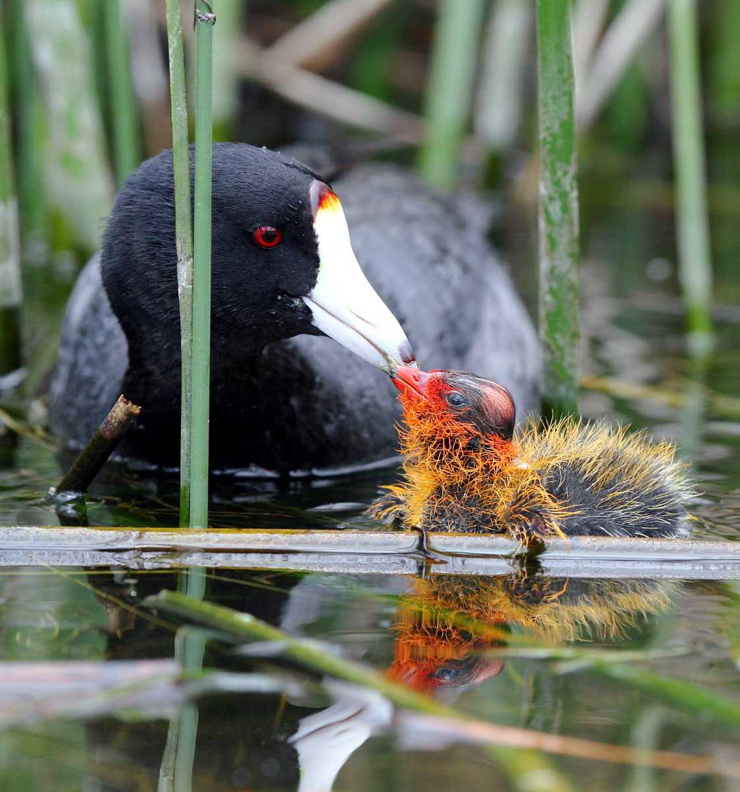

The goal of this worked example is to demonstrate how to combine multiple related datasets and organize data for plotting and analysis. 

To demonstrate how `dplyr` functions work, we will use a dataset from a project on color variation in American coots (*Fulica americana*). This is data comes from [Lyon & Shizuka (2020)](https://www.pnas.org/doi/full/10.1073/pnas.1913615117) in *PNAS*. All of the data for this paper (much more than we will use in this exercise!) is publicly available via Dryad [(here)](https://datadryad.org/stash/dataset/doi:10.5061%2Fdryad.ns1rn8pnv). But to simplify things, I will provide the necessary datasets below. 

First, let's give you a quick background on the study system:


## 1. Background: Extreme juvenile ornamentation in American coots 


American coots (*Fulica americana*), a waterbird of the Rail family. Coots lay a relatively large number of eggs (6-12 eggs) in nests built out of old vegetation on top of water in wetlands across western North America. 

There are at least two very weird thing about coots: 
One weird thing is that they are 'conspecific brood parasites'--i.e., they make their own nests, but they will also opportunistically lay eggs in their neighboring coot nests. Our research has shown that they can, under certain circumstances, tell which eggs and chicks in their nest are parasitic (Lyon 2003; Shizuka & Lyon 2010).

The other very weird thing is that they have **extremely bright ornamental juvenile traits (red beaks, red head, orange plumes around the neck, etc.)** when they hatch. They then lose these traits over the first few weeks of life. By the time they have fledged, they are black and gray with white beaks, and the only color they retain is a small patch or red on their forehead. Birds commonly have bright ornamental traits related to sexual selection, but it is relatively rare to have such bright ornaments as babies (probably because it could make them easy targets for predators).

```{r, out.width="40%", echo=F, fig.align="center", fig.cap="Figure 1: Adult coots are black and gray with a white beak. Baby coots have bright ornamentation ranging from orange to red."}

```

Past work (Lyon et al. 1994) has shown that, if you artificially remove some of these ornaments (i.e., the orange tips of feathers around neck), parents discriminate against these 'dull' chicks and preferentially feed chicks that retain the ornaments.

In Lyon & Shizuka (2020), we investigate the causes and consequences of variation in color (i.e., how 'red' the chicks are) within and between broods. We also link this data to patterns of parental favoritism and survival. 

## 2: The Data

In this study, we monitored nests and eggs until hatching, and then measured color of juvenile ornaments using a spectrometer (which measures reflectance of light at different wavelengths) from ~1,500 chicks. For each chick, we got 3-5 measurements from 5 traits: pate (bald spot on top of their head), frontal shield (fleshy part at the base of the beak), papillae (ornamental feathers surrounding the base of the beak), beak, and feathers surrounding the chin and neck. We have condensed data to several key color metrics, including the 'red chroma' (i.e., amount of light reflected at the red wavelengths: approx 600-700nm) of the feathers around the chin. This is provided in the "ChickColor_extracted.csv" file. 

```{r, echo=F,  fig.align="center", out.width="50%", fig.cap="Figure 2: We took color measurements for 5 different traits: pate, frontal shield, papillae, beak and chin feathers. (From Lyon & Shizuka 2020)"}
knitr::include_graphics("images/cootchick.png")
```


We also have a separate file of relevant (non-color) data for each chick, such "Egg ID", which brood they were released at (the same as the nest the egg was laid in for control treatment, but chicks were swapped across nests in some experiments), the experimental treatment of the brood, the nest it was laid in as an egg (Clutch), the date it was released in the nest, the order in which they hatched in the nest/were released at the nest, the wetland the nest is in, and whether or not the chick is a known brood parasite.

Finally, we also have data for each chick as an egg, including nest, "Egg ID", "Chick ID", the volume of the egg, and the laying sequence of the egg (if known).

Here is the [link to the data .zip file](data/coot_example.zip). Download this file and extract the contents. There should be three .csv files. Save these files in the "data" subfolder within the project folder you are working in.


First, load the packages you need

```{r, message=F}
library(tidyverse)
```

Then import this data to R:

```{r}
eggs=read.csv("data/coot_example/EggMaster.csv")
tibble(eggs)
```

```{r}
chicks=read.csv("data/coot_example/ChickMaster.csv")
tibble(chicks)
```

```{r}
color.dat=read.csv("data/coot_example/chickcolor_extracted.csv")
tibble(color.dat)
```


## 3. Correlations between color traits (Figure 1)

I will select just the columns of the color data that contains the word "chroma". Then, I will rename the variables to add a number in front of the name. This will just help me customize the order of the rows and columns on the matrix that I generate. 
```{r}
chroma.dat=color.dat %>% dplyr::select(contains("_chroma")) %>% 
  rename(`5_pate`=pate_chroma, `4_shield`=shield_chroma, `3_beak`=beak_chroma, `2_papillae`=papillae_chroma, `1_chin`=chin_chroma)
```

set up correlation matrix for plotting
```{r}
cor.m=cor(chroma.dat, use="complete.obs")
cor.m=cor.m[order(rownames(cor.m)),order(rownames(cor.m))] #reorder columns and rows
```

Convert the data in the correlation matrix into a two-column format that ggplot likes.
```{r}
cor.data.frame=data.frame(expand.grid(colnames(cor.m), rownames(cor.m)), value=as.vector(cor.m))
```

generate correlation plots for chroma
```{r}
ggplot(cor.data.frame, aes(x=Var1, y=Var2, fill=value)) +
  geom_tile() +
  scale_fill_gradient2(limits=c(0, 1), low="white", high="red")
```


## 4. Analyze how chick colors differ between broods (Table 1)


### 4.1. Make a global dataset that contains chick color, chick master, and egg data

We are going to use a set of `left_join()` functions to create a global dataset. 

```{r}
all.dat=left_join(chicks, color.dat, by=join_by(new.id==new.id)) %>%
  left_join(., eggs, by=join_by(new.id==Chick.ID)) %>%
  tibble()
```

### 4.2. Conduct PCA to get a color variable 

One problem with having measured a lot of different color variables is that 

Only chick color data variables contain "_" 

```{r}
pca.result=all.dat%>% select(contains("chin"), contains("papillae"), contains("beak")) %>% drop_na() %>% prcomp(.,  center=T, scale=T)
```

You can look at the details of the `prcomp()` function using `?prcomp`. Under "Value" in the help file, you'll see that this function returns a list in which "x" is the rotated data. We can check out a little bit of that matrix:

```{r}
#just look at the "upper left corner" of the PCA results, which is stored in the pca.result object 
pca.result$x[1:10, 1:5]
```

We can extract the first PCA axis as the first column of this object:
```{r}
head(pca.result$x[,1])
```

Now that we know how to get the PC1 variable, we will create a new data subset, which we will call `use.dat` that includes the chick ID, the clutch (i.e., nest) it came from, and the color variables (i.e., all variables that include "_") and the PC1 variable. We want to also convert Clutch into a factor (it is currently classified as Character).

```{r}
use.dat = all.dat %>% 
  select(new.id, Clutch, contains("beak"), contains("papillae"), contains("chin")) %>%
  drop_na() %>%
  mutate(pc1=pca.result$x[,1]) %>%
  mutate(Clutch=factor(Clutch)) 
```

### Table 1

Now, we can use an apply function `sapply()` to run ANOVAs with each color variable as the response variable, and clutch as the predictor variable. 
To do this, we will first define which columns of the data are the color variables (i.e., all variables that include "_" in the name, as well as the one that includes "pc" in the name). Then, we will use the `sapply()` function to run the ANOVA with each variable in turn. 

*Note: One difference between data.frame and tibble is how we call variables using their column name. In dataframe, we would use the single square bracket to index, so we would call the third column as: df$[,1]. In tibble, we use the double square bracket: df[[3]].*

```{r}
color.columns=as.numeric(c(grep("_",colnames(use.dat)), grep("pc", colnames(use.dat))))
aov.results=sapply(color.columns, function(x) summary(aov(use.dat[[x]]~as.factor(use.dat$Clutch))))
```

**For kicks, here is an alternative version using a for loop (result not shown, but it would look the same):**
```{r, eval=F}
color.columns=as.numeric(c(grep("_",colnames(use.dat)), grep("pc", colnames(use.dat))))
aov.results=list()
for (i in 1:length(color.columns)){
  aov.results[[i]]=summary(aov(use.dat[[color.columns[i]]]~as.factor(use.dat$Clutch)))
}
```


Now, we can extract the F values and P values (and calculate P values adjusted for False Discovery Rate) from the `aov.results` object (i.e., list of ANOVA model fits) and organize them into a table. 

```{r}
result.dat=data.frame(trait=names(use.dat)[color.columns], Fvalue=round(sapply(1:length(color.columns), function(x) aov.results[[x]]$`F value`[1]), digits=3), Pvalue=round(sapply(1:length(color.columns), function(x) aov.results[[x]]$`Pr(>F)`[1]), digits=5))
result.dat$p.adjust=p.adjust(result.dat$Pvalue, method="fdr")
result.dat #Table 1
```

## 5. See how chick coloration is affected by hatching sequence 


```{r}
use.dat2=left_join(all.dat, use.dat, by="new.id") %>%
  select(new.id, Brood, Release.Order, is.parasite, pc1) %>%
  mutate(Release.Order=replace(Release.Order, Release.Order>7, 7)) %>%
  drop_na()
```

```{r}
ggplot(use.dat2, aes(x=factor(Release.Order), y=pc1)) +
  geom_boxplot()
```

```{r}
ggplot(use.dat2, aes(x=factor(Release.Order), y=pc1, fill=Release.Order)) +
  geom_boxplot() +
  scale_fill_gradient(low="yellow", high="red")
```

```{r}
sum.dat=use.dat2 %>%
  group_by(Release.Order) %>%
  summarise(mean_se(pc1))
```

```{r}
ggplot(sum.dat, aes(x=Release.Order, y=y)) +
  geom_point(size=5) +
  geom_path() +
  geom_errorbar(aes(ymax=ymax, ymin=ymin), width=0.2) +
  theme_classic()
```
#####