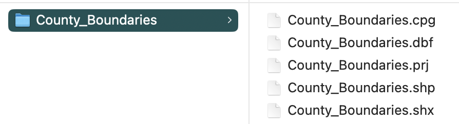

```{r setup, include=FALSE}
knitr::opts_chunk$set(echo = TRUE)
```

This is a very quick intro to several ways to make maps in R. 

**Please note that I am not an expert in cartography or spatial statistics!** There are probably better tutorials out there for this.


## 1. Plot directly from shapefile 

Using sf package to plot a map using a shapefile that you downloaded from somewhere.

### Load packages:

```{r, message=F}
library(tidyverse)
library(sf)
library(tmap)
library(tigris)
```

### Download shapefile & plot: Nebraska example 

Shapefiles for countries, states, counties, etc. are often available on respective agency websites.  

For example, I can download the Nebraska county boundaries shapefile from here:  https://www.nebraskamap.gov/datasets/county-boundaries-2/explore

```{r, echo=F, out.width="50%"}
knitr::include_graphics("images/NE_shp_download.png")
```

Click on "download" and select "Shapefile". Uncompress the .zip file and move the *whole folder* to your data folder. 

**IMPORTANT: When you download a shapefile, you will be downloading a whole folder (or .zip file containing a whole folder) that includes both the .shp file and several other supplemental files. You need to keep all of these together!**

So your .shp file should be saved within a subfolder in your data folder that looks like this:

```{r, echo=F, out.width="50%"}

```

Now you can import the shapefile using `st_read()` function. 

```{r}
ne_shp=st_read("data/NE_County_Boundaries/County_Boundaries.shp")
```

You can see what information is in this dataset using `str()`

```{r}
str(ne_shp)
```

#### `plot()` in sf

You can use the `plot()` function on an sf object. 

If you just use that function, it will plot different maps with all variables that are in the file.

```{r}
plot(ne_shp)
```

If you want to plot the map with one variable, you can use `[]` and indicate which variable you want to plot. 
```{r}
plot(ne_shp["Shape_Area"])
```

If you want to just plot the shapes, you can use `st_geometry()`

```{r}
plot(st_geometry(ne_shp))
```

#### Use ggplot

And it's pretty simple to plot that using the `geom_sf()` function:

```{r}
ggplot() +
  geom_sf(data=ne_shp) 
```

Let's color the state with the Husker colors (colors according to the university brand guide).

```{r}
ggplot() +
  geom_sf(data=ne_shp, fill="#d00000", color="#f5f1e7") +
  theme_bw()
```


### Download shapefile & plot: U.S. example

I downloaded the 2018 US county data from US census bureau: https://www.census.gov/geographies/mapping-files/time-series/geo/carto-boundary-file.html

Again, remember to save the entire folder that you downloaded into your data folder. 


Import the .shp file into R:

```{r}
us_shp=st_read("data/cb_2018_us_county_20m/cb_2018_us_county_20m.shp")
```

Let's try plotting this:

```{r}
ggplot() +
  geom_sf(data=us_shp, fill="goldenrod") +
  theme_bw()
```

You can see that this looks funky because part of the Aleutian Islands crosses the international date line, and it appears on the right-hand side of the map.


There are number of ways to deal with this, but they all seem complicated. Let's just do a quick fix and restrict the x-axis limits:

```{r}
ggplot() +
  geom_sf(data=us_shp, fill="goldenrod") +
  coord_sf(xlim=c(-180,-50)) +
  theme_bw()
```


## 2. Layering information on the map

Now let's add more interesting information on the map. We can do this if we have a dataset that contains information at the same scale as our shapefile--i.e., if we have a shapefile that shows the county boundaries, we can add information at the county level and then display the map with that information. 

Here, I'm going to use county-level data that I download from the U.S. Census Bureau. 
[(at the bottom of this page)](https://www.census.gov/data/tables/time-series/demo/popest/2020s-counties-total.html)

[Here is the direct link to the data](https://www2.census.gov/programs-surveys/popest/datasets/2020-2024/counties/totals/co-est2024-alldata.csv)

"Annual County Resident Population Estimates by Age, Sex, Race, and Hispanic Origin: April 1, 2020 to July 1, 2024 (CC-EST2024-ALLDATA)"
--> select "Nebraska"

Read the county-level data.

```{r}
co_data=read.csv("data/co-est2024-alldata.csv")
head(co_data)
```


### Mapping county data on map of Nebraska


```{r}
ne_full2024=ne_shp %>% mutate(CountyFIPS=as.numeric(CountyFIPS)) %>% left_join(co_data %>% filter(STNAME=="Nebraska"), by=join_by("CountyFIPS"=="COUNTY"))
```

```{r}
ne_full2024
```

```{r}
plot(ne_full2024["POPESTIMATE2024"])
```

```{r}
ggplot() +
  geom_sf(data=ne_full2024, aes(fill=POPESTIMATE2024)) +
  scale_fill_viridis_b() +
  theme_bw()
```

Birth rate in 2024

```{r}
ggplot() +
  geom_sf(data=ne_full2024, aes(fill=RBIRTH2024)) +
  scale_fill_viridis_b() +
  theme_bw()
```

International migration rate in 2024
```{r}
ggplot() +
  geom_sf(data=ne_full2024, aes(fill=RINTERNATIONALMIG2024)) +
  scale_fill_viridis_b() +
  theme_bw()
```

### Use tigris package

```{r}
ne_tig=counties("Nebraska", cb=TRUE)
ne_tig
plot(ne_tig)
```

```{r}
ne_tig2024=ne_tig %>% mutate(COUNTYFP=as.numeric(COUNTYFP)) %>% left_join(co_data %>% filter(STNAME=="Nebraska"), by=join_by("COUNTYFP"=="COUNTY"))
```

```{r}
ggplot() +
  geom_sf(data=ne_tig2024, aes(fill=RINTERNATIONALMIG2024)) +
  scale_fill_viridis_b() +
  theme_bw()
```

### add points

```{r}
ne_cities=data.frame(city=c("Omaha", "Lincoln", "Grand Island"), long=c(-95.94, -96.67, -98.34), lat=c(41.26, 40.8, 40.925 ))


ggplot() +
  geom_sf(data=ne_tig2024) +
  geom_point(data=ne_cities, aes(x=long, y=lat), color="red", size=1.5) +
  geom_text(data=ne_cities, aes(x=long+0.5, y=lat+0.2, label=city)) +
  theme_bw()
```

## tmap package

Use this page for reference: https://r.geocompx.org/adv-map
