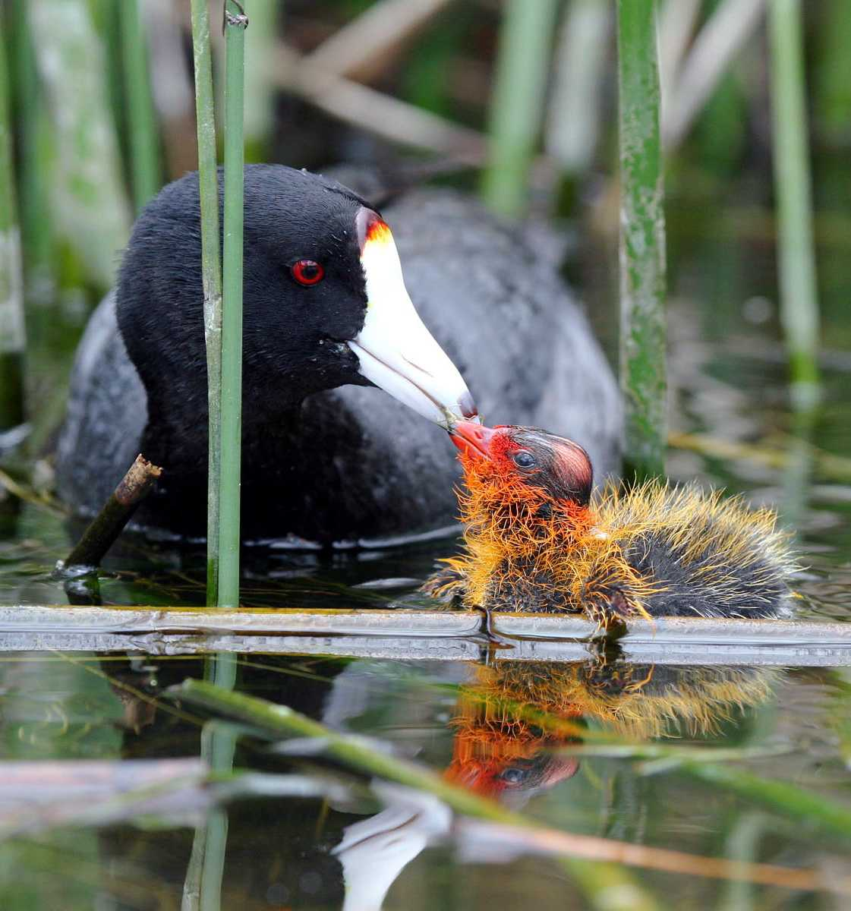
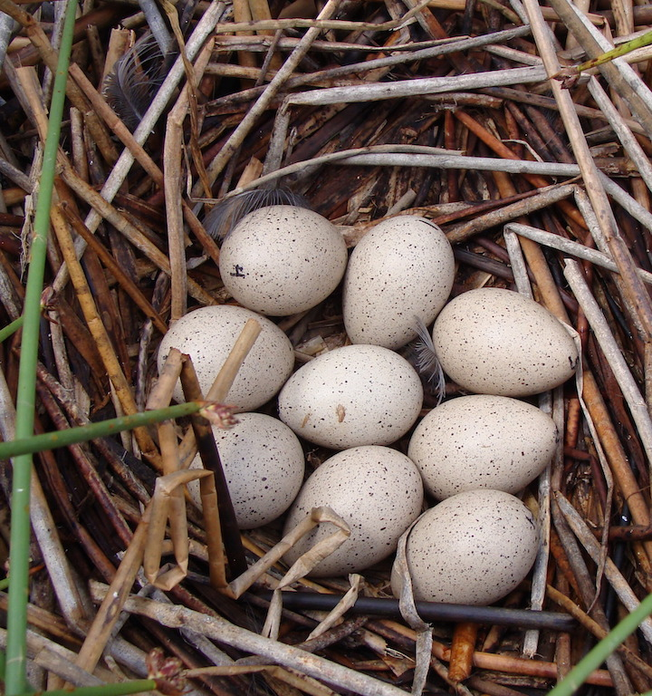

## 1. Intro to the ['tidyverse'](https://www.tidyverse.org/)

```{r, out.width="10%", echo=F}
knitr::include_graphics("images/icons/tidyr.png")
knitr::include_graphics("images/icons/dplyr.png")
knitr::include_graphics("images/icons/stringr.png")
knitr::include_graphics("images/icons/ggplot2.png")
```

Now that we have dipped our feet into plots and stats in R, I think you are getting a better sense of the fact that 'wrangling' or 'manipulating' data is one of the biggest steps to becoming proficient in R and all that it has to offer. 

For example, for any given analysis, you may have to subset data, filter out certain data that don't meet some criteria, focus in on a select set of variables of interest, calculate means, and variance for different groups, etc. etc. 

These tasks are where the packages [dplyr](https://dplyr.tidyverse.org/), [tidyr](https://tidyr.tidyverse.org/) and other packages in the [tidyverse](https://www.tidyverse.org/)--a series of packages designed for all kinds of data tasks. This also includes the popular [ggplot2](https://ggplot2.tidyverse.org/) package for graphics. 

The tidyverse packages are constructed by [Hadley Wickam](http://hadley.nz/). There are several books that cover how to use these packages, including *R for Data Science* [which is available for free as an online book](https://r4ds.had.co.nz/)

```{r, out.width="20%", echo=F}
knitr::include_graphics("images/icons/R_for_Data_Science_cover.png")
```

In this module, we'll be learning some functions from the packages **dplyr** and **tidyr**. 


***

## 2. Basic syntax of 'tidyverse'

## 3. Using `tidyr` to reshape data

## 4. Working with `dplyr`

<br>

### 3.1 Main `dplyr` functions

* `select()` select columns by criteria
* `filter()` filter rows by criteria
* `mutate()`: add new variable using functions
* `summarise()`: calculate summary statistic for a given variable
* `arrange()`: change order of rows
* `group_by()`: run any of above function 'by group' defined using criteria

<br>

###2.2 Pipe Operator (`%>%`)

`dplyr` makes use of the pipe operator `%>%`, which allows you to carry over the output of one function to the next function. This can make series of data manipulation sequences much more efficient. 

<br>

###2.3 Tibble

The output of `dplyr` functions is a "tibble", a special class of data frame. It is largely the same as a data.frame but it has some features (or rather, lack of features) that make for 'defensive coding'. That is, it forces you to avoid dangerous operations, such as changing variable names or types (you have to explicitly do this) or allow "partial matching".

To learn more about tibbles, start [here](https://tibble.tidyverse.org/)


* tibble
* functions that have special syntax -- but once you learn them, it's hard to go back.

***

##3. An example using data on chick color of American coots 


To demonstrate how `dplyr` functions work, we will use a dataset from a project on color variation in American coots (*Fulica americana*), a waterbird of the Rail family. Coots lay a relatively large number of eggs (6-12 eggs) in nests built out of old vegetation on top of water in wetlands across western North America. 

There are at least two very weird thing about coots: 
One weird thing is that they are 'conspecific brood parasites'--i.e., they make their own nests, but they will also opportunistically lay eggs in their neighboring coot nests. Our research has shown that they can, under certain circumstances, tell which eggs and chicks in their nest are parasitic (Lyon 2003; Shizuka & Lyon 2010).

The other very weird thing is that they have **extremely bright ornamental juvenile traits (red beaks, red head, orange plumes around the neck, etc.)** when they hatch. They then lose these traits over the first few weeks of life. By the time they have fledged, they are black and gray with white beaks, and the only color they retain is a small patch or red on their forehead. Birds commonly have bright ornamental traits related to sexual selection, but it is relatively rare to have such bright ornaments as babies (probably because it could make them easy targets for predators).

```{r, out.width="40%", echo=F}



```

Past work (Lyon et al. 1994) has shown that, if you artificially remove some of these ornaments (i.e., the orange tips of feathers around neck), parents discriminate against these 'dull' chicks and preferentially feed chicks that retain the ornaments.

In the present work (NOTE: *this is unpublished data (under review)*), we investigate the causes and consequences of variation in color (i.e., how 'red' the chicks are) within and between broods. To do this, we monitored nests and eggs until hatching, and then measured color of juvenile ornaments using a spectrometer (which measures reflectance of light at different wavelengths) from ~1,500 chicks. We have condensed data to several key color metrics, including the 'red chroma' (i.e., amount of light reflected at the red wavelengths: approx 600-700nm) of the feathers around the chin. We combine this data with various other measures for each chick, including the order in which they were laid as eggs, the size of egg, and the order in which they hatched.

Here is the [link to data](data/chickcolor_Rclass.csv). Save this in your course folder in the "data" subfolder.

Then import this data to R:

```{r}
dat=read.csv("data/chickcolor_Rclass.csv")
head(dat)
```

Let's also load the entire `tidyverse` series of packages
```{r, eval=F, echo=F}
install.packages('tidyverse')
```
```{r}
library('tidyverse')
```

###task 1: filter out parasite chicks and then calculate mean chick color for each brood

```{r}
#old way
dat.a=dat
dat.b=dat.a[which(dat.a$is.parasite==F),]
dat.c=aggregate(dat.b$chin_chroma, by=list(dat.b$nest), mean, na.rm=T)
names(dat.c)=c("nest", "mean.col")
head(dat.c)
```

```{r}
#dplyr way, option 1
x=filter(dat.a, is.parasite==FALSE)
y=group_by(x, nest)
z=summarise(y, mean(chin_chroma))
z
```

```{r}
#dplyr way, with piping
dat %>% filter(is.parasite==FALSE) %>% group_by(nest) %>% summarise(mean.col=mean(chin_chroma))
```


###task 2: standardize each chick's color measure against average of its nest.

```{r}
#old way
dat.a$nest.mean.col=dat.c[match(dat.a$nest, dat.c$nest), 2]
dat.a$std.col=dat.a$chin_chroma-dat.a$nest.mean.col
head(dat.a)
```

```{r}
#with merge()
dat.merge=merge(dat.a, dat.c, by="nest")
head(dat.merge)
```

```{r}
#with dyplr
dat.a=left_join(dat.a, dat.c, by="nest") %>% mutate(std.chick.col=chin_chroma-mean.col)
head(dat.a)
```
#####