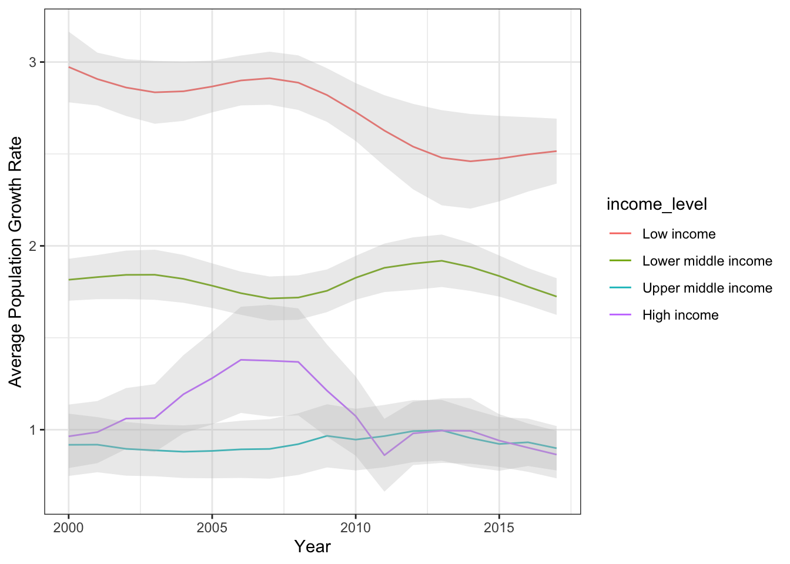

***

#### Things you will learn in this Worked Example

* **Practice wrangling data with *dplyr* and *tidyr* **
* **Learn tricks to download data from public data repositories like the World Bank**
* **More practice with ggplot**
* **A little bit of stats**


We will accomplish these while exploring the (admittedly superficial) patterns in population growth rates across countries. 

**By the end, you'll be able to produce graphs like this:**

```{r, echo=F, out.width="50%"}

knitr::include_graphics("Ex_WorldBank_files/figure-html/growth_income_by_region-1.png")
```

<br>

***

## Set up: load packages

```{r, message=F}
library(wbstats)
library(tidyverse)
```

***

## 1. The Data: Population growth trends across the world

The World Bank actually makes it very easy to download a huge amount of data very easily. You could just go to the [World Bankd Open Data site](https://data.worldbank.org/) and search for data and download them in a few clicks. There are even packages such as `WDI` and `wbstats` that allow you to query and pull data from this site from within R. 

However, for the purposes of this exercise, we will deal with several datasets that are included in the packages we have loaded above.

<br>

###  `world_bank_pop`: Population data from World Bank (2000-2017)
First is the `world_bank_pop` dataset that is included in the `tidyr` package (which is part of the the tidyverse suite). Start by pulling up the help file for the dataset

```{r, eval=F}
?world_bank_pop
```

Let's take a peak at the data, which is in "tibble" format:

```{r}
world_bank_pop
```

Notice that each country is repeated across 4 rows. This is because there are actually 4 different "indicators" for each country, and so each country x indicator combination takes up a row. The rest of the columns are years, from 2000 to 2017. 

Also notice that the numbers in the column names have a backquote, or "`" around them. In R, this allows numbers to be interpreted as text (and column names have to be text). 

So, if you wanted to pull up the "2001" column, this will NOT work...
```{r, eval=F}
world_bank_pop$2001
```

...but this will work
```{r, eval=F}
world_bank_pop$`2001`
```

<br>


***
## 2. Exclude aggregate data to get data for countries only

We are going to start by diving into the `world_bank_pop` dataset. 

Let's take a peek at the dataset again and see what we have...
```{r}
world_bank_pop
```

I want to start by looking at how many unique countries we actually have here.

```{r}
length(unique(world_bank_pop$country)) #this gives us the number of unique values in the "country" column
```

You can see that there are way more "countries" here than there are in the world. As of 2022, there are 193 countries in the United Nations, though if we add soverign states that are not recognized by UN (e.g., Taiwan, Kosovo, etc.), the list is about 206... and there are more if we include disputed territories.

**The reason the World Bank data has even more than that is because some of the "countries" include "aggregates" like "Arab World" or "High-income Countries". **

Unfortunately, the `world_bank_pop` dataset does not include any variables that allow us to differentiate the countries from the aggregates! **However**, we can solve this problem by pulling the metadata for countries from the World Bank. We can do this by using the `wb_countries()` function from the *wbstats* package. 

Let's pull the country metadata and save it as an object called "metadata":

```{r}
metadata=wb_countries()
```

```{r}
metadata
```

```{r}
head(metadata$region)
```
So this column shows us the "Aggregates". 

So, we can use this to filter the metadata to exclude the Aggregate codes. 
```{r}
metadata %>% dplyr::filter(region != "Aggregates")
```

Let's also pare down the data to a few variables we might be interested in, including region and income level:
```{r}
metadata %>% 
  dplyr::filter(region != "Aggregates") %>%
  select(iso3c, iso2c, country, region, income_level)
```

Ok, this looks useful. Let's save it as a data table called `countries`
```{r}
countries=metadata %>% 
  dplyr::filter(region != "Aggregates") %>%
  select(iso3c, iso2c, country.name=country, region, income_level) %>%
  mutate(income_level=factor(income_level, levels=c("Low income", "Lower middle income", "Upper middle income", "High income")))
```

Now, we are going to use the `inner_join()` function to make a version of the world bank population data that is only for actual countries (not aggregates):
```{r}
inner_join(world_bank_pop, countries, by=c("country" = "iso3c"))
```
You can see that the `inner_join()` function worked if you scroll all the way to the right of the output table. 

Let's rearrange the order of the columns using `relocate()` so that we can have all the useful metadata appear first (left-most):

```{r}
inner_join(world_bank_pop, countries, by=c("country" = "iso3c")) %>%
  relocate(country, iso2c, country.name, region, income_level)
```

This looks good. Let's save it as an object we'll call `popdat_countries`
```{r}
popdat_countries=inner_join(world_bank_pop, countries, by=c("country" = "iso3c")) %>%
  relocate(country, iso2c, country.name, region, income_level)

popdat_countries
```


<br>

***

## 3. Which are the world's largest countries (in 2017)?

As mentioned at the beginning, each row of data here is a country x indicator combination, with 4 different indicators. The indicators are:

* SP.POP.GROW = population growth

* SP.POP.TOTL = total population

* SP.URB.GROW = urban population growth

* SP.URB.TOTL = total urban population


So, we will create a data table called `pop_totals` that is just the "total population" data.
```{r}
pop_totals=popdat_countries %>% 
  dplyr::filter(indicator=="SP.POP.TOTL") 

pop_totals
```

From this population size data, let's figure out what is the 90th percentile in population size in 2017. We are going to get this number by doing `pull()` to get the 2017 population sizes as a vector, and use `quantile()` to get the 90th percentile. Save that value as `upper_pop`.

```{r}
upper_pop=pop_totals %>%
  pull(`2017`) %>% 
  quantile(., probs=0.90, na.rm=T) # this allows us to find the value at Nth percentile

upper_pop
```

So, the 90th percentile of population sizes in 2017 is 63,286,844

Now, we can use this 90th percentile value to filter the population size data to just the largest (>= 90th percentile) countries. We will create a one-column tibble called `large_countries()` to save this list of country codes.
```{r}
pop_totals %>% 
  dplyr::filter(`2017` > upper_pop) 
```

Ok, now let's select just the country code, country name and population size of the world's largest countries (90th percentile) and arrange it in descending order using `arrange()`

```{r}
largest_countries=pop_totals %>% 
  dplyr::filter(`2017` > upper_pop) %>% 
  select(country, country.name, `2017`) %>%
  arrange(desc(`2017`))

print(largest_countries, n=22)
```
<br>

***

## 4. How population growth rates have changed across years, by income level of countries

Now, let's create a tibble that contains the population growth data as well as the income level designation for each country. 

I'm also going to remove countries for which we are missing data using `drop_na()`.

```{r}
popdat_countries %>% 
  dplyr::filter(indicator=="SP.POP.GROW")  %>%
  drop_na()
```

Now, we are going to **reshape this data into long-format**. 

To do this, I'm going to first pare down by removing columns we don't need. I'm going to keep "country" because I want the value for each country for each year. I'm also going to keep "income_level" because I'm going to use that to summarise the population growth data later. 
Then, I'm going to use the `pivot_longer()` function to rearrange all of the columns with years as the heading into two columns: one column with the year, and one column with the population growth rate. 

```{r}
popdat_countries %>% 
  dplyr::filter(indicator=="SP.POP.GROW") %>%
  drop_na() %>%
  select(-indicator, -country.name, -iso2c, -region) %>% #pare down the data a bit & pivot longer
  pivot_longer(cols=-c(country, income_level), names_to="year", values_to="growth_rate")
```
Ok, now that we have the data in long format, it is easier to summarize the annual population growth rates across all years by income level. 

To do this, I'm going to `group_by()` income level, and then summarize the data using a nifty `mean_se()` function, which gives me the mean AND the mean +/- standard error. This is a nice function to get the confidence band around the mean.

```{r, message=F}
popdat_countries %>% 
  dplyr::filter(indicator=="SP.POP.GROW") %>%
  drop_na() %>%
  select(-indicator, -country.name, -iso2c, -region) %>% #pare down the data a bit & pivot longer
  pivot_longer(cols=-c(country, income_level), names_to="year", values_to="growth_rate") %>%
  group_by(income_level, year) %>%
  summarise(mean_se(growth_rate)) #calculates mean + standard error of the mean.
```

Ok, this looks good, so I'm going to save that data table as `popgrowth_income`.
```{r, message=F}
popgrowth_income=popdat_countries %>% 
  dplyr::filter(indicator=="SP.POP.GROW") %>%
  drop_na() %>%
  select(-indicator, -country.name, -iso2c, -region) %>% #pare down the data a bit & pivot longer
  pivot_longer(cols=-c(country, income_level), names_to="year", values_to="growth_rate") %>%
  group_by(income_level, year) %>%
  summarise(mean_se(growth_rate)) #calculates mean + standard error of the mean.
```

Now, we have the average (+/- standard error) population growth rate for countries at each income level across each year for 2000 to 2017. Here, the mean is "y" and lower and upper standard error is "ymin" and "ymax", respectively. Let's plot this. Let's start with a simple line graph:

```{r}
ggplot(popgrowth_income, aes(x=as.numeric(year), y=y, group=income_level)) +
  geom_line(aes(color=income_level)) +
  theme_bw()
```

We can make this fancy by adding the confidence band using `geom_ribbon()`, and cleaning up the axis labels:

```{r average_growth_by_income}
ggplot(popgrowth_income, aes(x=as.numeric(year), y=y, group=income_level)) +
  geom_line(aes(color=income_level)) +
  geom_ribbon(aes(ymin=ymin, ymax=ymax), alpha=0.3, fill="gray") +
  theme_bw() +
  ylab("Average Population Growth Rate") +
  xlab("Year")
```

## 5. How does the relationship between population growth rate and income level differ between global regions?

Now, let's look at how income levels have different effects on population growth rates depending on the region of the world. to do this, we have to pick a year to analyze. Let's go with the latest data, 2017.

We can do that simply by going from the original `popdat_countries` (the raw data with the "aggregates" removed), then filtering it to just the data on population growth, then just looking at the 2017 data for each country. We'll also keep the region and income level data. We'll remove rows that have NAs.

```{r}
popdat_countries %>% 
  dplyr::filter(indicator=="SP.POP.GROW") %>%
  select(country, `2017`, region, income_level) %>%
  drop_na()
```

Ok, that looks like what we want, so I'll save it as `popdat_2017`:

```{r}
popdat_2017=popdat_countries %>% 
  dplyr::filter(indicator=="SP.POP.GROW") %>%
  select(country, `2017`, region, income_level) %>%
  drop_na()
``` 

Now we can plot population growth by income level, and use region to create facets. Here, I'm going to use income_level as both the x axis and color because the x-axis label is going to be hard to read.
```{r}
ggplot(popdat_2017, aes(x=income_level, y=`2017`)) +
  geom_boxplot(aes(color=income_level)) +
  facet_wrap(~region, nrow=3)
```

I can see that some regions don't have enough variation in income level to be useful (e.g., North America and South Asia). I can actually filter the data within the ggplot function to remove those:

Lower income countries have higher population growth rate than those with high income in some regions (sub-Saharan Africa), while in others growth rate is bigger for high earners.

```{r growth_income_by_region}
ggplot(popdat_2017 %>% dplyr::filter(region!="North America" & region!="South Asia"), aes(x=income_level, y=`2017`)) +
  geom_boxplot(aes(color=income_level)) +
  facet_wrap(~region, nrow=2) +
  theme_bw() +
  theme(legend.position = "bottom") +
  ylab("Population Growth Rate in 2017")
```

It looks like the relationship between income level and population growth rate indeed changes between regions. For example, in Europe/Central Asia, Latin America/Caribbean, and Sub-Saharan Africa, countries with lower income have higher population growth rate. But the relationship is opposite in the Middle East & North Africa. There, the countries with higher incomes have higher population growth rate. 

How would we test the idea that the relationship between income level and population growth rate depends on the region? One way is to run a linear model including the interaction effect of the two variables:

```{r}
lm.fit=lm(`2017`~region*income_level, data=popdat_2017)

anova(lm.fit)
```


