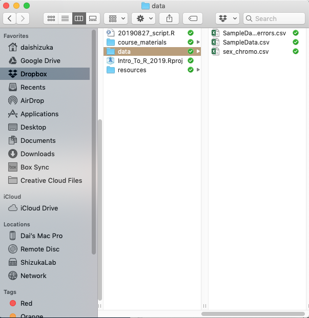
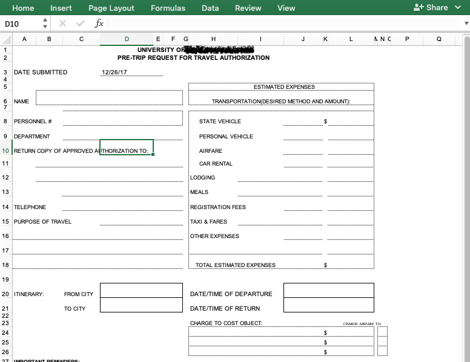
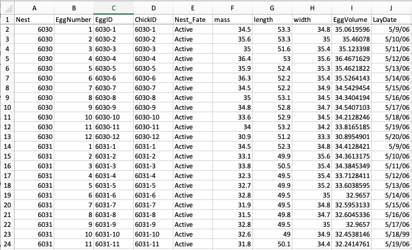
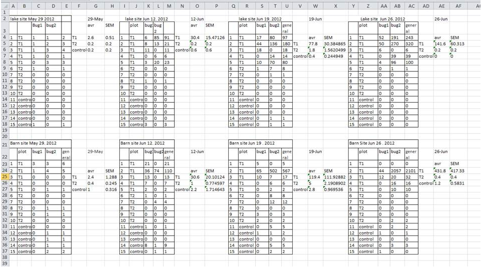
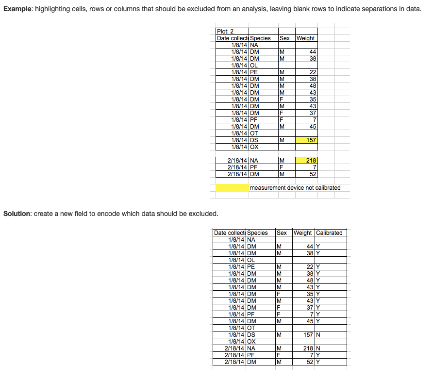

```{r setup, include=FALSE}
library(knitr)
#knitr::opts_chunk$set(out.width="3.5in")
```
## Overview
Most of you are looking to use R for data analysis, which of course requires learning how to import your data into R. This is maybe the big leap for people who are not used to programming.  

To import data into R, you will create an object that points to a dataset somewhere on your computer. R will then import that data as a **dataframe** object ([see Module 2](ObjectTypes.html)). 

***

## 1. Importing Data: Overview

<br>

><span style="color:purple">**Do this before you start this section!**</span>
>
* Click on the following links to download three files: 
>(1) [SampleData.csv](../data/SampleData.csv)
>(2) [SampleData_w_errors.csv](../data/SampleData_w_errors.csv)
>(3) [sex_chromo.csv](../data/sex_chromo.csv)
>* Save these files into a subfolder called "data" inside your working directory (i.e., the folder where you are keeping all of your course materials)
>

### 1.1 File Formats: Use .csv (or .txt)

Many of us manage data by entering them into a spreadsheet using common software like Microsoft Excel. While we have all likely had headaches associated with Excel, it's undeniable that it is still the predominant way to compile our data.  

R can read several file formats, but the popular excel format (.xlsor .xlsx) is NOT one of them (unless you use a specialized package, e.g., `xlsx`). Instead, you will most often convert your excel sheet into one of two formats: ***tab-delimited files (saved as .txt)*** or ***comma-separated-values files (.csv)***. These are simple text files in which each entry is separated by a tab or comma (respectively). The huge advantage of these formats is that they are non-proprietary file formats that can be read by any text editor. One potential drawback is that you cannot keep any type of formatting (like highlighting of cells on a spread sheet) or special characters. 


If you use Excel or any other spreadsheet for data storage, you can easily convert those into one of these formats using `[Save as...]`  

***In this class, I will be using .csv files for almost all data importing tasks.***

***

## 2. Five ways to import data from .csv (or .txt) files

No matter how you import the data, the final goal is the same: assign the imported data as an object. Here, we will assign the data into an object called `dat`. (tip: I would not use "data" as an object name because `data()` is a function name). Try out each of the following methods for importing a sample data set called "SampleData_1.csv".

***

### 2.1. RStudio Project (recommended)

***RStudio Project*** is a convenient way to organize your projects. When you have your folder organized as a **project directory**, this creates a file called "<yourprojectname>.Rproj" in that folder. Then, if you open that file, it automatically sets that folder as the working directory. This makes the job of finding and importing data much easier than it would be otherwise (i.e., step 2).

Here is an image of how I might organize my course folder:
```{r, echo=FALSE, fig.align="center", out.width="75%"}

```

In this case, my data files are inside a subfolder called "data", so the pathname is `data/SampleData.csv`
Using this, I can read in the .csv file using a function called `read.csv()`, with the path name. ***Note that the path name needs to be inside quotes***.

```{r, eval=F}
dat=read.csv("data/SampleData.csv")
```

```{r, eval=T}
dat=read.csv("../data/SampleData.csv")
```


One of the biggest benefits of this method is that the pathname is relative to the folder that the .Rproj file is in, which means that as long as the folder is organized in the same way, you can just transfer all the codes to someone else's computer and it will still work. In contrast, if you are using the full path name, you will always have to edit this for the computer that you are running the code on. This means that, if you simply share the entire folder including the .Rproj file, your collaborator can run your code seamlessly without having to alter the pathname or resetting the working directory.


***

### 2.2. Entering the full path name
You can also use the full path name to import the data. This might be helpful if you are not using Rstudio Projects and/or saving your script in a folder separate from your data. 


***Finding the path to a file***
Here is how to get the path to the .csv file on your computer.

* ***For Windows***, you can get the path name of the file or folder by right-clicking it and click "Copy as Path"
* ***For Mac (or Windows)***, you can look for the file/folder in Finder, and then drag and drop the icon into the "Go to file/function" bar at the top of the RStudio window.  

As an example, say I made folder on my **desktop** called **Rcourse** and inside that folder, I made another folder called **Week_2**. If my data folder is inside that, this would be the path: `/Users/dshizuka/Desktop/Rcourse/Week_2/data`  
In turn, the path to a file inside that folder might be:  `/Users/dshizuka/Desktop/Rcourse/Week_2/data/SampleData.csv`

So in this case, your line of code to import the data would be:

```{r, eval=F}
dat=read.csv("/Users/dshizuka/Desktop/Rcourse/Week_2/data/SampleData.csv")
```

***Alternatively***, you can use `setwd()` to set your working directory, and then enter a simpler path name. This essentially breaks up the process into two lines:

```{r, eval=F}
setwd("/Users/dshizuka/Desktop/Rcourse/Week_2")
dat=read.csv("data/SampleData.csv")
```


***Remember: You will have to change the path inside the lines of code here to be where the file resides in your computer.***


><span style="color:purple">**Difference between options 1 and 2:**</span>
>
>Options 1 and 2 (using RStudio Project and Entering Full Path Name) are essentially the same thing in that you are telling R how to find the file on your computer that you want to import. It's just that RStudio Projects makes this much more straightforward and transferable because the pathname becomes relative to your working directory automatically.

***

### 2.3. Use a url (recommended for data downloadable from the web)

Sometimes, you will be downloading a dataset that is accessible online, from a static website, a github page, a data repository (like Dryad or Figshare), or even a dropbox folder. In fact, if you can get a url of a data file, you can import it directly into R without having to first downloading it to your computer, saving it and then getting a path name. 

For example, if you right-click on the link up above to download the "SampleData.csv" file (under 3.1: Importing Data), you can "copy link address" and get this url:
`https://dshizuka.github.io/RCourse/data/SampleData.csv`

So, you can simply download that file using this url instead of the path name:

```{r}
dat=read.csv("https://dshizuka.github.io/RCourse/data/SampleData.csv")
```

Super useful! But **note:** only use this if you know that the url is going to be stable for a long time! If you need to be able to reproduce your analysis in the long term, it may pay off to download the data and save it on your computer and use Option 1. 

***

### 2.4. Call 'choose file' prompt. 
You can also call a prompt that will let you choose the file. You can then find and choose the file you want to import. This is a convenient and quick way to import data. However, it is limiting because it takes time to click around to find the file, and more importantly, this step is not *reproducible*.
```{r, eval=FALSE}
dat=read.csv(file.choose())
```

***

### 2.5. Using RStudio GUI
In RStudio, select `[File]`--`[Import Dataset]`--`[From CSV...]`
The first time you do this, you may be asked to install the `readr` package. 

**Note:** I actually do NOT recommend using this method for a variety of reasons (irreproducibility, takes time, saves the object as a special format).


***

><span style="color:purple">**Importing from .txt files:**</span>
>
>A more generic function is `read.table()`. This function allows you to read any kind of text file (including .csv files) while specifying the data is delimited. So, for example, you can use this function to import comma-separated files `dat=read.table(file.choose(), sep=",")`, or tab-delimited files `dat=read.table(file.choose(), sep="\t")`. So the `read.table()` function is more flexible in many ways.

***

## 3. Looking at the data


Now that you have the data imported as an object called `dat`, let's look at it! You can do this simply by calling the object:

```{r}
dat
```

This data only has 13 rows, so it's manageable. But sometimes you have a much larger dataset, and you don't really want to see all of it, but you want to check that the correct data was imported. In that case, you can use a function called `head()` which will show you just the first 6 lines of an object. 

```{r}
head(dat)
```

You can also use the `str()` function to get the structure of the data frame, including summary stats for numeric variables:
```{r}
str(dat)
```

***

## 4. Formatting spreadsheets to keep data for analysis

This  part is not necessarily about R. It is about managing your Excel sheet in a way that facilitates data analysis outside of Excel.

Before I start, I highly recommend this free online resource from datacarpentry.org: ["Data Organization in Spreadsheets for Ecologists"](https://datacarpentry.org/spreadsheet-ecology-lesson/)

One of the reasons that many formatting problems arise while keeping data in spreadsheets is that the common software (e.g., Excel) is actually used for many different purposes. For example, people often use excel to generate templates for forms (e.g., purchasing forms). Best practices for those uses of Excel are completely different from what you should do when using spreadsheets for entering data. 

Similarly, you might use spreadsheets with formatting for purposes other than keeping data for analysis (e.g., using it as a way to track progress on a project). The formatting for that kind of use is different than for storing data. 


```{r, echo=FALSE, fig.align="center", fig.cap="Spreadsheets are used for many different purposes, which explains many common formatting mistakes in data. This is a *form* made in Excel. NOT a good example of a data set.", out.width="50%"}

```

***

### 4.1 Basic structure of a spreadsheet

1. First line (Header) are names of variables. Each variable is one column. Do not use values as column names.

2. Each subject (animal, plant, cell, etc.) should have an ID. This is useful if you have multiple spreadsheet where you have different information about the subject--if you have a common ID, you can link together datasets more easily.

3. Each row should be an observation. If you are observing a subject multiple times (e.g., repeated measures design), each observation should be a separate line, with the measurment time/place/trial/etc. as a separate column. 

4. Don't add totals on the last line of the data. Also, avoid calculating group averages, etc. to your data. 

```{r, echo=FALSE, fig.align="center", fig.cap="Example spreadsheet of data on egg size of American Coots", out.width="100%"}

```

<br>

***

### 4.2 Spreadsheet dos and don'ts!

<br>

#### 1. **Don't** keep multiple tables in one sheet
This is one common way people have used excel sheets when your data comes from multiple sources (e.g., multiple plots). It also makes you feel like you have maximum information in the sheet. But in reality, this makes it impossible to do any global analysis. And R cannot read in this type of spreadsheet.

```{r, echo=FALSE, fig.align="center", fig.cap="example from https://datacarpentry.org/spreadsheet-ecology-lesson/02-common-mistakes"}

```


***Solution:*** Just keep one sheet. If you have multiple plots, treatments, etc., make that a column in your data. Example in 4.1.1***

<br>

#### 2. **Don't** include title/metadata/table caption at the top (or bottom) of your data.

*The first row of your dataset should always be your column names (header). Don't add extra information at the top of your dataset. If you need to add extra information about the data, put it in your readme file.

*Similarly, the last line of your dataset should be the last set of observations. Don't include column totals/subtotals, etc. at the end of your dataset. This will cause problems when reading the data into R. 

#### 3. **Don't** use special characters or commas. 

Excel is capable of handling special characters that other software cannot. For example, if you have the 'degree' symbol (C$^\circ$) or 'em dash' (where "--" gets converted to one long dash), these will not be read correctly when you import data in R. Do NOT use these special characters in your data. 

Also, commas cause problems when you are saving data in .csv files because the commas are designated for separating columns. If you like to write notes in your data, just make sure you don't use commas! (e.g., if need be, you could use semi-colons)


***Solution:*** Always think about whether your inputs will be read correctly by R or other stats program. Default to non-proprietary formats. 


<br>

#### 4. **Don't** use formatting (i.e., highlighting) to convey information or make spreadsheets look pretty by merging cells.

This is a common mistake that comes from using Excel as forms. 

If you are using highlighting to indicate some information, it you can almost always just add another column to include that information as another variable (see example figure). Merged cells will make R unable to import the file.

```{r, echo=FALSE, fig.align="center", fig.cap="example from https://datacarpentry.org/spreadsheet-ecology-lesson/02-common-mistakes", out.width="100%"}

```

<br>

#### 5. **Do** use good 'null values'

* **Always put in 0 if the observed vaule is 0** (i.e., don't skip the cell just because it's 0). If you don't it becomes indistinguishable from unknown or unobserved data.

* **Don't use other numbers (e.g., 999 or -999).** This used to be common practice for some stats software. But this can cause problems because it may be inadvertently used in calculations.

* **Don't use other symbols (-, ., ?).** Again, this used to be common practice for some people, but this can cause problems because R won't know how to interpret it.

* ***Good options include:*** 
    + **Blank cells.** But only if you are careful to always put 0 when the correct value is 0.
    + **Consistent, conventional abbreviation (e.g., NA, NULL).** But note that "NA" may be used as abbreviations for other things, like "North America". But if used in a column that is otherwise numeric, R can automatically interpret this as null value.

If you are using consistent null value designations, you can specify these values as null using the `na.string=` argument within the `read.csv()` function. For example,

```{r, eval=F}
dat=read.csv("data/SampleData.csv", na.string=c("NA", "#N/A"))
```
The above code will tell R that cells with either "NA" or "#N/A" should be interpreted as missing data.

<br>

#### 6. **Do** use good column names (variable names)

* Avoid using special characters or spaces in your column names. These will automatically converted to "." when you import to R. Removing spaces or using "_" or "." instead will make your life easier.

* Use relatively short but informative column names. But keep a readme.txt file associated with your data where you store detailed information on how each variable was measured.


<br>

#### 7. **Avoid** keeping summary data along with raw data (i.e., don't make a "group means" column in your dataset). 

This is more of a suggestion than a rule. When you use formulas within Excel to calculate summary values, those formulas do not carry over when you convert the spreadsheet to .csv. This means that if you need to do any recalculations, or if you realize there are any errors in values, those summary values will become outdated. It is much easier (and better) to calculate summary values within R anyway.

***

><span style="color:purple">***Key rule in reproducible research: Try not to mess with raw data! ***</span>
>
>Once you have collected data, it is best to try to keep that raw data ***raw***. If you find coding errors or you need to subset data for your analyses, it is best to do that with R once the data has been imported. This is because data-cleaning in R is reproducible. But once you start messing with raw data, it is way too easy to lose track of what you "fixed" and what you did not. Also, there are times when you later realize that you "fixed" the data incorrectly. If you have done all of that in excel, it is difficult to go back. But if you have done everything in script, everything is reversible. 

***

## 5. Troubleshooting Data Import

Even when you have taken care to follow the above dos and don'ts, you will often have some kind of problem reading in files. One of the big roadblocks to using R is dealing with these bugs. 

#### Some common problems:  

* **File won't import**
    + Are you sure you saved the file as a .csv file? 
    + Is the path and file name correct?
    + Is the path and file name inside quotes?
    
* **I get a weird column that has a bunch of `NA`**
    + You probably have a column in your spreadsheet that has a value in one of the cells that you forgot about.
    
* **I have a weird column at the bottom of my data that is just a bunch of `NA`**
    + You probably have a cell at the bottom of your spreadsheet with "hidden spaces".
    + Fix: In excel, do a "Find and Replace" to replace blank space with some character (e.g., a *) and then go and find and erase those characters.

* **Column is supposed to be numeric but it is showing up as factors.**
    + You probably have a cell value in the column that is non-numeric, e.g., "#N/A" or 'hidden space'
    + Fix: You can specify what kind of characters should be interpreted as `NA` using the `na.string=` argument (see above).


***


## Group Exercise 1: Troubleshoot data import

Step 1: Import the `SampleData_w_errors.csv` file and look at its data structure:

```{r, eval=F}
errdat=read.csv("data/SampleData_w_errors.csv") #assuming your working directory is set to the sample data folder
errdat
```

```{r, eval=T}
errdat=read.csv("../data/SampleData_w_errors.csv") #assuming your working directory is set to the sample data folder
errdat
```
Step 2: Fix the spreadsheet so that you get the following:

* The column called "sex" only has "female" and "male".
* The column called "size" is numeric
* The column called "weight" is numeric
* The column called "X" is removed.

See how to fix these errors in R [here](Fix_Data.html)

***

## Group Exercise 2: Improve my egg measurement data

* Find the dataset called "EggMeasurements_example.csv" in the data folder. This is real data I collected on egg sizes of American Coots (*Fulica americana*) *before* I knew anything about R or programming. 

* Try importing the data to R and also look at the spreadsheet in Excel. 

* **Come up with as many recommendations as possible on how to improve this excel sheet.**

See the answers [here](Fix_Data.html)

