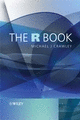

```{r setup, include=FALSE}
knitr::opts_chunk$set(echo = TRUE)
```

The explicit goal of this course was to get you over the hump in getting started with R. You used these new skills to complete an independent project that meets your own research goals for the moment. Hopefully, this course has given you some new skills and the 
  
Now that you have taken this course to get started with R, here are a few tips on things you can do to keep up and keep improving your R skills. 

#### Be confident. You CAN do this! But the road doesn't stop here!

*** 

### 1. Keep building up your skills

**R is a language**, and like any language, you will lose your fluency if you don't use it. 

* **Learn from your (past) self: Annotate your codes so that you don't forget what each line does!** Try to write code so that YOU will understand it 10 years later (trust me, I have had to do this).

* **Make your own "worked examples" of papers in your research area using open-access data.** This takes investment in time & energy, but it will be well worth it for what you will learn + the confidence you will gain. You can look for data in the papers you read--the data are often archived as supplemental materials or archived at data repositories such as [Dryad](https://datadryad.org), [figshare](https://figshare.com/) or [Open Science Framework](https://osf.io/)

* **Join in on the R online learning community.** There are many ways to find a community of people who are learning R and share tips. Importantly, you should *contribute* your codes and tips to these communities!

    + One example is via TidyTuesday ([website here](https://github.com/rfordatascience/tidytuesday)), which is a weekly data science exercise hosted by the `R4DS Online Learning Community`. They post different open access datasets every week (on Tuesday) and encourages people to create and present visualizations or analyses using [#TidyTuesday](https://twitter.com/hashtag/tidytuesday?lang=en). As you participate and look at other people's codes, you will learn new tricks that you never would have come upon otherwise!

    + You can also find a lot of R communities via social media, e.g., twitter: [@R4DScommunity](https://twitter.com/R4DScommunity); [@WeAreRLadies](https://twitter.com/WeAreRLadies)
    
    + Various community blogs that publish R tips and tutorials: e.g., [R-bloggers](https://www.r-bloggers.com/)

***


### 2. Useful (free) books and online resources

```{r, echo=FALSE, fig.align="left", out.width="10%"}
knitr::include_graphics("images/R_for_Data_Science_cover.png")
```

* [R for Data Science](https://r4ds.had.co.nz/index.html) is an online book (though also available in hard copy) written by Hadley Wickham, the architect of the `tidyverse`. But I find that this book has a lot of good content and exercises for learning how to do various tasks in R. 


```{r, echo=FALSE, fig.align="left", out.width="10%"}

```

* ***The R Book*** (Crawley) is available as electronic copy (downloadable as pdf) via the UNL library. Use [this link](https://onlinelibrary-wiley-com.libproxy.unl.edu/doi/book/10.1002/9780470515075) for access (you'll probably need to log in using the library credentials).

***

### 3. Take 'refresher' courses

Although I'm not sure that you necessarily need it, some people are more comfortable with the structure of classes, so you can keep taking refresher courses online. 

* [UNL Holland Computing Center (HCC)](https://hcc.unl.edu/) often hosts *Software Carpentry Workshops* and other workshops. You can find info on past events on their website [here](https://hcc.unl.edu/past-events)

* There are plethra of online resources and courses, such as [datacamp](https://www.datacamp.com/)

* Of course, you can always just refer back to our [course website](https://dshizuka.github.io/RCourse/)
