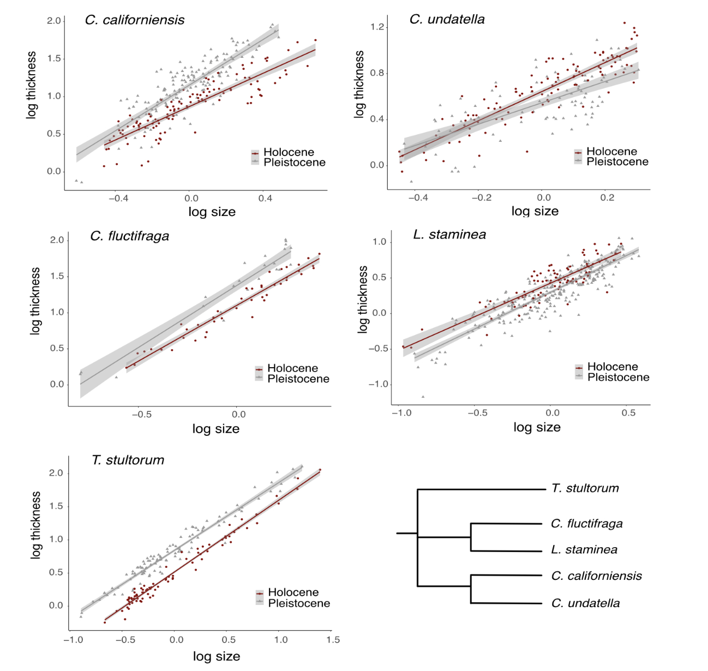

```{r setup, include=FALSE}
knitr::opts_chunk$set(echo = TRUE)
```

## Assignment: Recreate a figure form a published paper (or make it better)

### Intro: 

For this assignment, I want you to do the best you can to recreate a figure from a published paper. 

I've chose a paper called *Temporal trends in allometry of shell calcification in northeastern Pacific venerid bivalves: implications for predicting responses to climate change* by Elizabeth Bullard and Kaustuv Roy, published in Biology Letters in August 2025. 

https://royalsocietypublishing.org/doi/10.1098/rsbl.2025.0181

In this paper, the authors calculate allometric relationships between size and shell thickness for 5 species of bivalves across two different geologic time periods (Pleistocene and Holocene). They find that there are differences in these relationships across geologic time, and that the changes are species specific. 

... which is interesting, but this exercise is not about the scientific finding itself. Instead, I want you to use their data and try reproducing their Figure 3, which looks like this:


```{r}

```

### Download the data:

The raw data for this paper is available for open access through the Dryad data repository: https://datadryad.org/dataset/doi:10.5061/dryad.qrfj6q5st

**However,** Figure 3 plots values that involve slightly complicated calculations for size (log of mean-centered values within each species/time). Since I want to focus here just on the graphics, I have created an appended dataset, which you can download [here]("data/Bullard_Roy_Data_w_log.csv")

```{r}
dat=read.csv("https://dshizuka.github.io/RCourse/data/Bullard_Roy_Data_w_log.csv")
```

```{r}
dat=read.csv("data/Bullard_Roy_Data_w_log.csv")
```

```{r, echo=F, out.width="80%", out.height="150%", message=F}
library(ggplot2)

species.names=c("C. californiensis", "C. fluctifraga" , "C. stultorum", "C. undatella", "C. staminea")

names(species.names)=c("californiensis", "fluctifraga" , "stultorum", "undatella", "staminea")

dat$species=factor(dat$species, levels=c("californiensis", "fluctifraga" , "stultorum", "undatella", "staminea"))

ggplot(dat, aes(x=size_meancentered, y=logthickness, color=Time)) +
  geom_point(pch=19, size=0.5) +
  geom_smooth(method="lm") +
  scale_color_manual(values = c("brown", "darkgray"))+
  scale_shape_manual(values = c(19, 17)) +
  facet_wrap(~species, nrow=3, scales="free", dir="v", labeller=labeller(species=species.names)) +
  theme_classic() +
  ylab("log thickness") +
  xlab("log size")
```
