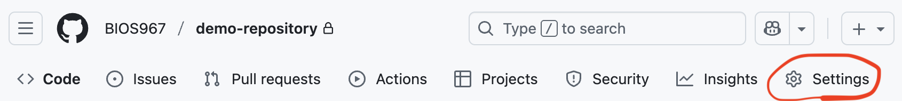
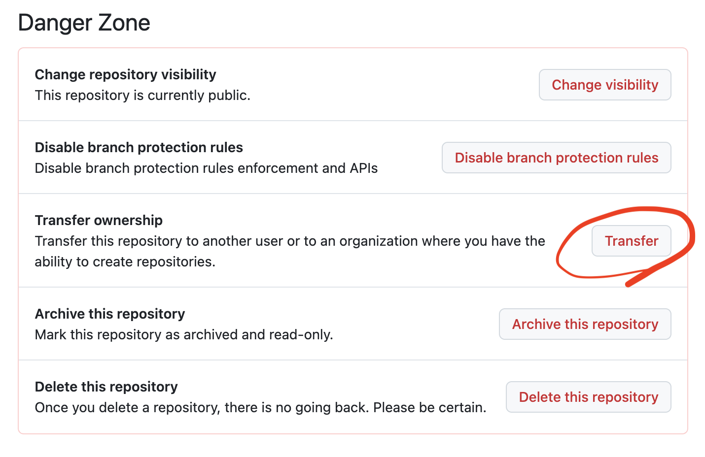
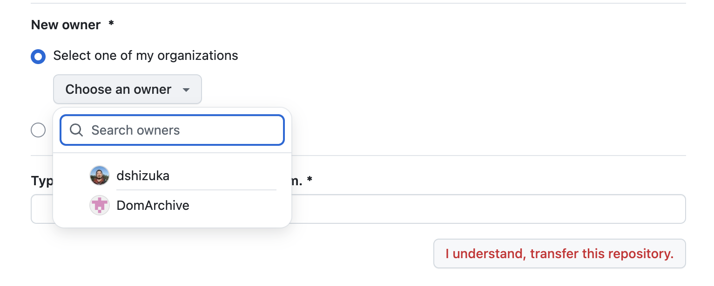

```{r setup, include=FALSE}
knitr::opts_chunk$set(echo = TRUE)
```
***

### You're done with the R course! Now what?

***ONCE YOU HAVE RECEIVED CONFIRMATION THAT YOUR FINAL PROJECT HAS BEEN REVIEWED***, you can transfer ownership out of the "BIOS967" organization on GitHub to your own account. 

This will allow you to continue conducting your research without me continuing to have access to your repository. 

Here is a simple way to transfer ownership of your repository:

*** 

1. Make sure your local and remote directories are synced by pulling and pushing the repo on GitHub Desktop.

2. Go to your GitHub Repository on the GitHub website and click on "settings"

```{r, echo=F, out.width="50%"}

```

3. Scroll down to the "danger zone" and click on "transfer ownership"

```{r, echo=F,  out.width="50%"}

```


4. Scroll down and hit the drop-down menu called "choose an owner" and select your account. Click "I understand, transfer this repository.

```{r, echo=F,  out.width="50%"}

```


5. Follow the directions (you will be asked to type out the repository path to confirm)

6. Delete your local directory (i.e., find your folder on your computer and put it in the trash). 

7. Re-clone the repository from the GitHub website. (*Go to the repository, click on the green "<> Code" button, and click on "Open with GitHub Desktop")